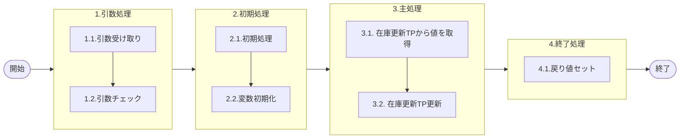

# 0. 表紙

| モジュール名 | プログラムID | プログラム名   |
| ------------ | ------------ | -------------- |
| IC           | LDAS0406     | 在庫更新TP更新 |

| RFC | Version | 更新日     |     更新者     | 更新内容 | 確認日     | 確認者 | 承認日     | 承認者 |
| --- | :-----: | ---------- | :------------: | -------- | ---------- | :----: | ---------- | :----: |
| -   |  1.0.0  | 2025/10/06 | オヘダイチロー | 初版作成 | 2025/XX/XX |  XXX  | 2025/XX/XX |  XXX  |

## 1. 処理概要

### 1.1. 機能概要

本機能は、 在庫更新_トランザクションプールファイル (ld_trn_update_tp) テーブルから値を取得して、データを更新します。

### 1.2. 処理概要フロー



### 1.3. プログラム入出力パラメータ

#### 1.3.1. 引数

| No. | パラメータ論理名       | パラメータ物理名    | 属性    | 備考 |
| --- | ---------------------- | ------------------- | ------- | ---- |
| 1   | TP処理番号             | pn_operation_no     | INTEGER |      |
| 2   | TP処理明細番号         | pn_operation_seq    | INTEGER |      |
| 3   | エラーレベルステータス | ps_err_level_status | VARCHAR |      |
| 4   | カード識別             | ps_card_id          | VARCHAR |      |

#### 1.3.2. 戻り値

| No. | パラメータ論理名 | パラメータ物理名 | 属性    | 備考                   |
| --- | ---------------- | ---------------- | ------- | ---------------------- |
| 1   | 処理ステータス   | rn_status        | INTEGER | 0:NomalEnd/-1:SqlError |
| 2   | SQLコード        | rs_sql_code      | VARCHAR |                        |
| 3   | エラーコード     | rs_err_code      | VARCHAR |                        |
| 4   | エラーメッセージ | rs_err_msg       | VARCHAR |                        |
| 5   | エラー位置       | rs_err_focus     | VARCHAR |                        |

### 1.4. その他制御・要件

| 排他制御 |      |      |
| -------- | ---- | ---- |
| 楽観     | 悲観 | 無し |
| ●       | -    | -    |

| 項目               | 制約・制御・要件など | 記載内容説明                                                     |
| ------------------ | -------------------- | ---------------------------------------------------------------- |
| パフォーマンス要件 | 特になし。           | 特別なパフォーマンス要件がある場合に要件内容とその対処法を記述。 |

### 1.5. 入出力一覧

| No | 入出力対象 | 名称                                    | 物理名称         | C | R  | U  | D | 備考 |
| -- | ---------- | --------------------------------------- | ---------------- | - | -- | -- | - | ---- |
| 1  | テーブル   | 在庫更新_トランザクションプールファイル | ld_trn_update_tp |   | ○ | ○ |   |      |

## 2. 詳細処理

### 2.1. 引数の取得とチェック

特記無し

### 2.2. 初期処理

- カード識別定義とセット

```sql
  変数.カード識別   在庫更新_トランザクションプール.カード識別 % TYPE;

  変数.カード識別 := ' ';
```

- システム日時セット

```sql
　変数.システム日時 := システム日時
```

### 2.3. 主処理

### 2.3.1. 在庫更新_トランザクションプールファイルテーブルから値を取得し、該当データを更新する

1. エラーレベルステータスが空文字の場合
   在庫更新トランザクションプールファイル（ld_trn_update_tp）からカード識別を取得し、変数に代入します。その後、変数に格納されたカード識別が空文字であれば、引数で渡されたカード識別を代入します。

```sql
　IF 引数.エラーレベルステータス = ' ' THEN
        SELECT カード識別 
          INTO STRICT
               変数.カード識別
          FROM 在庫更新_トランザクションプール
         WHERE TP処理番号 = 引数.TP処理番号
           AND TP処理明細番号 = 引数.TP処理明細番号;

        IF 変数.カード識別 = ' ' THEN
            変数.カード識別 = 引数.カード識別;
        END IF;
```

その次に、在庫更新_トランザクションプールファイル（ld_trn_update_tp）テーブルから該当するデータを更新します。

在庫更新_トランザクションプールファイル（ld_trn_update_tp）テーブルから値を習得した後に、
カード識別に変数.カード識別を設定して更新
その他、共通で 更新カウンタ、更新日時、更新PGID を更新

```sql
        UPDATE 在庫更新_トランザクションプール
           SET カード識別 = 変数.カード識別,
               更新カウンタ = 更新カウンタ + 1,  
               更新日時  = 変数.システム日時,
               更新PGID = 'ldas0406'
         WHERE TP処理番号 = 引数.TP処理番号
           AND TP処理明細番号 = 引数.TP処理明細番号;
```

2. エラーレベルが空文字でない場合
   2-1. エラーレベルステータスが "9"  (エラー) 以外の場合
     処理状況 を "1"  (完了) に設定
     エラーレベルステータス を引数値で更新
     その他、共通で 更新カウンタ、更新日時、更新PGID を更新

```sql
      ELSE
        IF  引数.エラーレベルステータス <> '9' THEN
            UPDATE 在庫更新_トランザクションプール
               SET 処理状況 = '1',
                   エラーレベルステータス = 引数.エラーレベルステータス,
                   更新カウンタ = 更新カウンタ + 1,  
                   更新日時 = 変数.システム日時,
                   更新PGID = 'ldas0406'
             WHERE TP処理番号 = 引数.TP処理番号
               AND TP処理明細番号 = 引数.TP処理明細番号;
```

    2-2. エラーレベルステータスが "9" (エラー) の場合
      エラーレベルステータス のみを引数値で更新
      その他、共通で 更新日時, 更新PGID を更新

```sql
       ELSE
            UPDATE 在庫更新_トランザクションプール
               SET エラーレベルステータス = 引数.エラーレベルステータス,
                   更新カウンタ = 更新カウンタ + 1,  
                   更新日時 = ld_sysdatetime,
                   更新PGID = 'ldas0406'
             WHERE TP処理番号 = 引数.TP処理番号
               AND TP処理明細番号 = 引数.TP処理明細番号;
        END IF;
    END IF;
```

※共通の更新日時は更新しない

### 2.4. 終了処理

- 正常終了処理を行う

| No. | 戻り値           | 属性    | 設定値   |
| --- | ---------------- | ------- | -------- |
| 1   | 処理ステータス   | INTEGER | 0        |
| 2   | SQL コード       | VARCHAR | スペース |
| 3   | エラーコード     | VARCHAR | スペース |
| 4   | エラーメッセージ | VARCHAR | スペース |
| 5   | エラー位置       | VARCHAR | スペース |

## 3. 補足説明

### 3.1. 戻り値について

- ステータスについて
  - 0 : Normal End
  - -1 : Abnormal End
  - -2 : PGM エラー

### 3.2. エラー発生時の対応について

- SQL エラーが発生した場合、エラーログを出力して処理終了
  | No. | 戻り値           | 属性    | 設定値     |
  | --- | ---------------- | ------- | ---------- |
  | 1   | 処理ステータス   | INTEGER | -1         |
  | 2   | SQL コード       | VARCHAR | SQLSTATE   |
  | 3   | エラーコード     | VARCHAR | スペース   |
  | 4   | エラーメッセージ | VARCHAR | SQLERRM    |
  | 5   | エラー位置       | VARCHAR | 'LDAS0406' |
