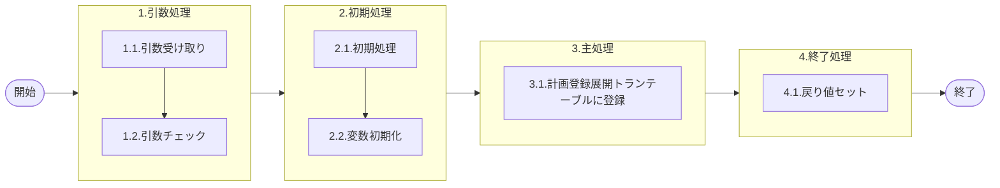

# 0. 表紙

| モジュール名 | プログラムID | プログラム名               |
| ------------ | ------------ | -------------------------- |
| IC           | LDAS0407     | Temp計画登録展開トラン登録 |

| RFC | Version | 更新日     |     更新者     | 更新内容 | 確認日     | 確認者 | 承認日     | 承認者 |
| --- | :-----: | ---------- | :------------: | -------- | ---------- | :----: | ---------- | :----: |
| -   |  1.0.0  | 2025/09/15 | オヘダイチロー | 初版作成 | 2025/XX/XX |  XXX  | 2025/XX/XX |  XXX  |

## 1. 処理概要

### 1.1. 機能概要

本機能は、以下の処理を通じて計画登録展開トラン（le_temp_plan_exp）の登録を行います。

1. 初めに、最新開始日でオーダーステータスを0(内示)もしくは2(確定)にセットする。
2. 最後に、受け取った引数を計画登録展開トラン（le_temp_plan_exp）という一時テーブルにデータを登録する。

### 1.2. 処理概要フロー



### 1.3. プログラム入出力パラメータ

#### 1.3.1. 引数

| No. | パラメータ論理名           | パラメータ物理名               | 属性    | 備考 |
| --- | -------------------------- | ------------------------------ | ------- | ---- |
| 1   | レベル                     | pn_level                       | INTEGER |      |
| 2   | 連番                       | pn_seq                         | INTEGER |      |
| 3   | 内部トランザクションコード | ps_inter_txn                   | VARCAHR |      |
| 4   | ソース                     | ps_source                      | VARCAHR |      |
| 5   | コート                     | ps_code                        | VARCAHR |      |
| 6   | 品目番号                   | ps_itemno                      | VARCAHR |      |
| 7   | 供給者                     | ps_supplier                    | VARCAHR |      |
| 8   | 使用者                     | ps_usercd                      | VARCAHR |      |
| 9   | オーダー番号               | ps_order_no                    | VARCAHR |      |
| 10  | オーダー通し番号           | ps_order_through_no            | VARCAHR |      |
| 11  | オーダー通し番号源泉フラグ | ps_order_through_no_source_flg | VARCAHR |      |
| 12  | 入力元伝票番号             | ps_slip_no                     | VARCAHR |      |
| 13  | 生試処理タイプ             | ps_pilot_condition_type        | VARCAHR |      |
| 14  | 数量                       | pn_qty                         | DECIMAL |      |
| 15  | 着手日                     | ps_start_date                  | VARCAHR |      |
| 16  | 完了日                     | ps_due_date                    | VARCAHR |      |
| 17  | 払出日                     | ps_disburse_date               | VARCAHR |      |
| 18  | 完了日開始時間             | ps_due_begin_time              | VARCAHR |      |
| 19  | 完了日終了時間             | ps_due_end_time                | VARCAHR |      |
| 20  | 理由コード                 | ps_reason_code                 | VARCAHR |      |
| 21  | 繰越数                     | pn_carry_over_qty              | DECIMAL |      |
| 22  | 生試初品区分               | ps_pilot_class                 | VARCAHR |      |
| 23  | 所要量区分                 | ps_rd_class                    | VARCAHR |      |
| 24  | 独立需要送り先区分         | ps_ind_user_class              | VARCAHR |      |
| 25  | 独立需要送り先コード       | ps_ind_user_code               | VARCAHR |      |
| 26  | 費用振替先区分             | ps_transfer_class              | VARCAHR |      |
| 27  | 費用振替先コード           | ps_transfer_code               | VARCAHR |      |
| 28  | 振替理由コード             | ps_transfer_reason_code        | VARCAHR |      |
| 29  | 勘定科目コード             | ps_account_heading             | VARCAHR |      |
| 30  | 目的No                     | ps_budget_no                   | VARCAHR |      |
| 31  | 受払種別コード             | ps_account_code_sales          | VARCAHR |      |
| 32  | 削除日                     | ps_delete_ymd                  | VARCAHR |      |
| 33  | フリーコメント             | ps_remark                      | VARCAHR |      |
| 34  | サービスパーツ特別発注区分 | ps_sp_order_class              | VARCAHR |      |
| 35  | サービスパーツ直納先コード | ps_sp_delivery_code            | VARCAHR |      |
| 36  | サービスパーツディーラーNo | ps_sp_dealer_no                | VARCAHR |      |
| 37  | サービスパーツ受注番号     | ps_sp_order_no                 | VARCAHR |      |
| 38  | オーダーステータス         | ps_order_status                | VARCAHR |      |
| 39  | 品目タイプ                 | ps_item_type                   | VARCAHR |      |
| 40  | ＭＲＰ需要方針コード       | ps_demand_policy_code          | VARCAHR |      |
| 41  | シンクロ管理コード         | ps_synchro_control_code        | VARCAHR |      |
| 42  | 荷姿収容数                 | pn_tote_qty                    | DECIMAL |      |
| 43  | AIRSサイン                 | ps_airs_sign                   | VARCAHR |      |
| 44  | 検査区分                   | ps_inspection_class            | VARCAHR |      |
| 45  | 親品目番号                 | ps_parent_itemno               | VARCAHR |      |
| 46  | 親供給者                   | ps_parent_supplier             | VARCAHR |      |
| 47  | 親使用者                   | ps_parent_usercd               | VARCAHR |      |
| 48  | 構成連番                   | ps_structure_seq               | VARCAHR |      |
| 49  | 構成品サイン               | ps_comp_sign                   | VARCAHR |      |
| 50  | 員数                       | pn_comp_qty                    | DECIMAL |      |
| 51  | ＯＰ率                     | pn_comp_op_percent             | DECIMAL |      |
| 52  | ＴＰ処理番号               | pn_operation_no                | INTEGER |      |
| 53  | ＴＰ処理明細番号           | pn_operation_seq               | INTEGER |      |
| 54  | 入力区分                   | ps_input_class                 | VARCAHR |      |
| 55  | ユーザーID                 | ps_user_id                     | VARCAHR |      |
| 56  | 入力元トランザクション     | ps_input_txn                   | VARCAHR |      |
| 57  | IC工場処理日               | ps_ic_slip_date                | VARCAHR |      |
| 58  | 相手先システム識別         | ps_request_system_code         | VARCAHR |      |
| 59  | グループ会社間受注フラグ   | ps_group_receive_flg           | VARCAHR |      |
| 60  | 最新開始日                 | ps_currentod_edate             | VARCHAR |      |

#### 1.3.2. 戻り値

| No. | パラメータ論理名 | パラメータ物理名 | 属性    | 備考                   |
| --- | ---------------- | ---------------- | ------- | ---------------------- |
| 1   | 処理ステータス   | rn_status        | INTEGER | 0:NomalEnd/-1:SqlError |
| 2   | SQLコード        | rs_sql_code      | VARCHAR |                        |
| 3   | エラーコード     | rs_err_code      | VARCHAR |                        |
| 4   | エラーメッセージ | rs_err_msg       | VARCHAR |                        |
| 5   | エラー位置       | rs_err_focus     | VARCHAR |                        |

### 1.4. その他制御・要件

| 排他制御 |      |      |
| -------- | ---- | ---- |
| 楽観     | 悲観 | 無し |
| 〇       | -    | -    |

### 1.5. 入出力一覧

| No | 入出力対象 | 名称               | 物理名称         | C  | R | U | D | 備考              |
| -- | ---------- | ------------------ | ---------------- | -- | - | - | - | ----------------- |
| 1  | テーブル   | 計画登録展開トラン | le_temp_plan_exp | ○ |   |   |   | (旧)lc_plan_exp_t |

## 2. 詳細処理

### 2.1. 引数の取得とチェック

- オーダーステータスのセット

```sql
IF 引数.オーダーステータス IS NULL THEN
   IF 引数.着手日 <= 引数.最新開始日 THEN
       変数.オーダーステータス := '2';
   ELSE
       変数.オーダーステータス := '0';
   END IF;
ELSE
    変数.オーダーステータス := 引数.オーダーステータス;
END IF;
```

- 条件説明
  - 着手日 ≤ 最新開始日の場合は「確定（'2'）」に設定
  - 着手日 > 最新開始日の場合は「内示（'0'）」に設定
  - 既にオーダーステータスが指定されている場合は、そのまま使用　

### 2.2. 初期処理

特記無し

### 2.3. 主処理

- 計画登録展開トラン（le_temp_plan_exp）テーブルにデータを登録する

```sql
insert into 計画登録展開トランテーブル
   	(レベル,　連番, 
   内部トランザクションコード,　ソース, 
   コート,　品目番号,
   供給者,　使用者,
   オーダー番号,　
   オーダー通し番号,             
   オーダー通し番号源泉フラッグ,　
   入力元伝票番号,                        
   生試処理タイプ, 数量,
   着手日,　完了日,　
   払出日,   
   完了日開始時間, 完了日終了時間,       
   理由コード,   
   繰越数,          
   生試初品区分, 　所要量区分,
   独立需要送り先区分,　独立需要送り先コード,
   費用振替先区分, 費用振替先コード,
   振替理由コード,　勘定科目コード,
   目的No,
   受払種別コード,　削除日,
   フリーコメント,　オーダーステータス,
   サービススパーツ特別発注区分,　サービススパーツ直納先コード,
   サービススパーツディーラーNo,　サービススパーツ受注番号,
   品目タイプ,　MRP需要方針コード,
   シンクロ管理コード,  
   荷姿収容数,　AIRSサイン,
   検査区分,   
   親品目区分,　親供給者,
   親使用者,　構成連番, 
   構成品サイン,　員数,
   OP率,　TP処理番号,
   TP処理明細番号,　入力区分,
   ユーザーID,　入力元トランザクション,
   IC工場処理日,　相手先システム識別,
   グループ会社間受注フラグ,     
   最新開始日)
  VALUES (引数.レベル,　引数.連番, 
   引数.内部トランザクションコード,　引数.ソース,  
   引数.コート,　引数.品目番号,
   引数.供給者,　引数.使用者,
   引数.オーダー番号,　
   引数.オーダー通し番号,             
   引数.オーダー通し番号源泉フラッグ,　
   引数.入力元伝票番号,                        
   引数.生試処理タイプ, 引数.数量,
   引数.着手日,　引数.完了日,　
   引数.払出日,   
   引数.完了日開始時間, 引数.完了日終了時間,       
   引数.理由コード,   
   引数.繰越数,          
   引数.生試初品区分, 　引数.所要量区分,
   引数.独立需要送り先区分,　引数.独立需要送り先コード,
   引数.費用振替先区分, 引数.費用振替先コード,
   引数.振替理由コード,　引数.勘定科目コード,
   引数.目的No,
   引数.受払種別コード,　引数.削除日,
   引数.フリーコメント,　変数.オーダーステータス,
   引数.サービススパーツ特別発注区分,　引数.サービススパーツ直納先コード,
   引数.サービススパーツディーラーNo,　引数.サービススパーツ受注番号,
   引数.品目タイプ,　引数.MRP需要方針コード,
   引数.シンクロ管理コード,   
   引数.荷姿収容数,　引数.AIRSサイン,
   引数.検査区分,   
   引数.親品目区分,　引数.親供給者,
   引数.親使用者,　引数.構成連番, 
   引数.構成品サイン,　引数.員数,
   引数.OP率,　引数.TP処理番号,
   引数.TP処理明細番号,　引数.入力区分,
   引数.ユーザーID,　引数.入力元トランザクション, 
   引数.IC工場処理日,　引数.相手先システム識別,
   引数.グループ会社間受注フラグ,     
   引数.最新開始日);
```

### 2.4. 終了処理

- 正常終了処理を行う

| No. | 戻り値           | 属性    | 設定値   |
| --- | ---------------- | ------- | -------- |
| 1   | 処理ステータス   | INTEGER | 0        |
| 2   | SQL コード       | VARCHAR | スペース |
| 3   | エラーコード     | VARCHAR | スペース |
| 4   | エラーメッセージ | VARCHAR | スペース |
| 5   | エラー位置       | VARCHAR | スペース |

## 3. 補足説明

### 3.1. 戻り値について

- ステータスについて
  - 0 : Normal End
  - -1 : Abnormal End
  - -2 : PGM エラー

### 3.2. エラー発生時の対応について

- SQL エラーが発生した場合、エラーログを出力して処理終了| No. | 戻り値           | 属性    | 設定値   |
  | --- | ---------------- | ------- | -------- |
  | 1   | 処理ステータス   | INTEGER | -1       |
  | 2   | SQL コード       | VARCHAR | SQLSTATE |
  | 3   | エラーコード     | VARCHAR | スペース |
  | 4   | エラーメッセージ | VARCHAR | SQLERRM  |
  | 5   | エラー位置       | VARCHAR | LDAS0414 |
