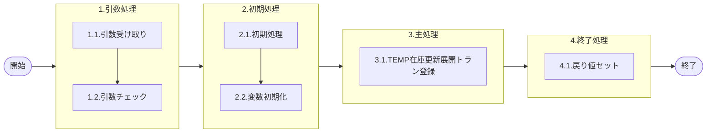

# 0. 表紙

| モジュール名 | プログラムID | プログラム名 |
| --- | --- | --- |
| IC | LDAS0408 | Temp在庫更新展開トラン登録 |


| RFC        | Version | 更新日      | 更新者 | 更新内容 | 確認日 | 確認者 | 承認日     | 承認者 |
| ---------- | :-----: | ----------- | :----: | -------- | ------ | :----: | ---------- | :----: |
| - |  1.0.0  | 2025/9/16 |  オヘダイチロー  | 初版作成   | 2025/XX/XX  |  XXX  | 2025/XX/XX |  XXX  |

## 1. 処理概要

### 1.1. 機能概要

本機能は、TEMP在庫更新展開トラン（ld_temp_update_exp）テーブルにデータを登録する処理である。

### 1.2. 処理概要フロー

### 1.3. プログラム入出力パラメータ

#### 1.3.1. 引数

| No. | パラメータ論理名 | パラメータ物理名 | 属性 | 備考 |
| --- | --- | --- | --- | --- |
| 1 | レベル | pn_level | INTEGER |  |
| 2 | 展開シーケンス番号 | pn_seq | INTEGER |  |
| 3 | 内部トランザクションコード | ps_inter_txn | VARCHAR |  |
| 4 | ソースコード | ps_source | VARCHAR |  |
| 5 | 処理コード | ps_code | VARCHAR |  |
| 6 | 品目番号 | ps_itemno | VARCHAR |  |
| 7 | 供給者 | ps_supplier | VARCHAR |  |
| 8 | 使用者 | ps_usercd | VARCHAR |  |
| 9 | 着手/払出日 | ps_st_db_date | VARCHAR |  |
| 10 | オーダー番号 | ps_order_no | VARCHAR |  |
| 11 | カード識別 | ps_card_id | VARCHAR |  |
| 12 | 照合番号 | ps_slip_no | VARCHAR |  |
| 13 | 数量 | pn_qty | DECIMAL |  |
| 14 | 起票日 | ps_input_date | VARCHAR |  |
| 15 | 理由コード | ps_reason_code | VARCHAR |  |
| 16 | 責任職場/メーカ区分 | ps_rp_shop_class | VARCHAR |  |
| 17 | 責任職場/メーカ | ps_rp_shop_code | VARCHAR |  |
| 18 | 組立ライン | ps_assy_line_code | VARCHAR |  |
| 19 | 金額 | pn_amount | DECIMAL |  |
| 20 | 移動先使用者 | ps_mv_usercd | VARCHAR |  |
| 21 | 独立重要送り先区分 | ps_ind_user_class | VARCHAR |  |
| 22 | 独立重要送り先コード | ps_ind_user_code | VARCHAR |  |
| 23 | 費用振替先区分 | ps_transfer_class | VARCHAR |  |
| 24 | 費用振替先コード | ps_transfer_code | VARCHAR |  |
| 25 | 勘定科目コード | ps_account_heading | VARCHAR |  |
| 26 | 目的No | ps_budget_no | VARCHAR |  |
| 27 | 受払種別コード | ps_account_code_sales | VARCHAR |  |
| 28 | 仕掛サイン | ps_in_process_sign | VARCHAR |  |
| 29 | オーダーステータス | ps_order_status | VARCHAR |  |
| 30 | 品目タイプ | ps_item_type | VARCHAR |  |
| 31 | 品目クラス | ps_item_class | VARCHAR |  |
| 32 | MRP需要方針コード | ps_demand_policy_code | VARCHAR |  |
| 33 | AIRSサイン | ps_airs_sign | VARCHAR |  |
| 34 | 変動安全在庫数 | pn_float_safety_stock_qty | DECIMAL |  |
| 35 | 担当課 | ps_org_section_mrp | VARCHAR |  |
| 36 | 担当者 | ps_org_person_mrp | VARCHAR |  |
| 37 | 親品目番号 | ps_parent_itemno | VARCHAR |  |
| 38 | 親供給者 | ps_parent_supplier | VARCHAR |  |
| 39 | 親使用者 | ps_parent_usercd | VARCHAR |  |
| 40 | 構成連番 | ps_structure_seq | VARCHAR |  |
| 41 | 親着手日 | ps_parent_start_date | VARCHAR |  |
| 42 | フリーコメント | ps_remark | VARCHAR |  |
| 43 | TP処理番号 | pn_operation_no | INTEGER |  |
| 44 | TP処理明細番号 | pn_operation_seq | INTEGER |  |
| 45 | 入力ユーザーID | ps_input_user_id | VARCHAR |  |
| 46 | IC工場処理日 | ps_ic_slip_date | VARCHAR |  |
| 47 | 入庫不足許容率 | pn_in_sh_accept_percent | DECIMAL |  |
| 48 | 入庫過剰許容率 | pn_in_ov_accept_percent | DECIMAL |  |
| 49 | 出庫不足許容率 | pn_out_sh_accept_percent | DECIMAL |  |
| 50 | 出庫過剰許容率 | pn_out_ov_accept_percent | DECIMAL |  |
| 51 | 構成LT用工程番号 | ps_strc_lt_proc_no | VARCHAR |  |

#### 1.3.2. 戻り値

| No. | パラメータ論理名 | パラメータ物理名 | 属性 | 備考 |
| --- | --- | --- | --- | --- |
| 1 | 処理ステータス | rn_status | INTEGER | 0:正常終了,-1,-2:異常終了 |
| 2 | SQLコード | rs_sql_code | VARCHAR |  |
| 2 | エラーコード | rs_err_code | VARCHAR |  |
| 4 | エラーメッセージ | rs_err_msg | VARCHAR |  |
| 5 | エラー位置 | rs_err_focus | VARCHAR |  |

### 1.4. その他制御・要件

| 排他制御 |  |  |
| --- | --- | --- |
| 楽観 | 悲観 | 無し |
| ● | - | - |

| 項目 | 制約・制御・要件など | 記載内容説明 |
| --- | --- | --- |
| パフォーマンス要件 | 特になし。 | 特別なパフォーマンス要件がある場合に要件内容とその対処法を記述。|
### 1.5. 入出力一覧

| No | 入出力対象 | 名称 | 物理名称 | C | R | U | D | 備考 |
| --- | --- | --- | --- | --- | --- | --- | --- | --- |
| 1 | テーブル | TEMP在庫更新展開トラン | ld_temp_update_exp | ○ |  |  |  |  |


## 2. 詳細処理

### 2.1. 引数の取得とチェック
特記無し

### 2.2. 初期処理
特記無し

### 2.3. 主処理
- TEMP在庫更新展開トラン（ld_temp_update_exp）テーブルにデータを登録する
```sql
INSERT INTO TEMP在庫更新展開トラン
           (レベル,　展開シーケンス番号,
            内部トランザクションコード, 　ソースコード,
            処理コード,　品目番号,
            供給者,　使用者,
            着手/払出日,　オーダー番号,
            カード識別,　照合番号,
            数量, 起票日,
            理由コード,　責任職場/メーカ区分,
            責任職場/メーカ,　組立ライン,
            金額,　移動先使用者,
            独立重要送り先区分,　独立重要送り先,
            費用振替先区分,　費用振替先コード,
            勘定科目コード,
            目的No,　受払種別コード,
            仕掛サイン,　オーダーステータス,
            品目タイプ,　品目クラス,
            MRP需要方針コード,
            AIRSサイン,　変動安全在庫数,
            担当課,　担当者、
            親品目番号, 親供給者,　
            親使用者, 構成連番,　
            親着手日, フリーコメント,
            TP処理番号,　TP処理明細番号,
            入力ユーザーID,　IC工場処理日,　
            入庫不足許容率, 入庫過剰許容率,　
            出庫不足許容率, 出庫過剰許容率, 
            構成LT用工程番号)
    VALUES (引数.レベル,　引数.展開シーケンス番号,
            引数.内部トランザクションコード, 　引数.ソースコード,
            引数.処理コード,　引数.品目番号,
            引数.供給者,　引数.使用者,
            引数.着手/払出日,　引数.オーダー番号,
            引数.カード識別,　引数.照合番号,
            引数.数量, 引数.起票日,
            引数.理由コード,　引数.責任職場/メーカ区分,
            引数.責任職場/メーカ,　引数.組立ライン,
            引数.金額,　引数.移動先使用者,
            引数.独立重要送り先区分,　引数.独立重要送り先,
            引数.費用振替先区分,　引数.費用振替先コード,
            引数.勘定科目コード,
            引数.目的No,　引数.受払種別コード,
            引数.仕掛サイン,　引数.オーダーステータス,
            引数.品目タイプ,　引数.品目クラス,
            引数.MRP需要方針コード,
            引数.AIRSサイン,　引数.変動安全在庫数,
            引数.担当課,　引数.担当者、
            引数.親品目番号, 引数.親供給者,　
            引数.親使用者, 引数.構成連番,　
            引数.親着手日, 引数.フリーコメント,
            引数.TP処理番号,　引数.TP処理明細番号,
            引数.入力ユーザーID,　引数.IC工場処理日,　
            引数.入庫不足許容率, 引数.入庫過剰許容率,　
            引数.出庫不足許容率, 引数.出庫過剰許容率, 
            引数.構成LT用工程番号);
```

### 2.4. 終了処理

- 正常終了処理を行う

| No.| 戻り値           | 属性 | 設定値   |
| ---| ---------------- | ------ |-------- |
| 1 | 処理ステータス   | INTEGER | 0 |
| 2 | SQL コード       | VARCHAR | スペース |
| 3 | エラーコード     |  VARCHAR | スペース |
| 4 | エラーメッセージ |  VARCHAR | スペース |  
| 5 | エラー位置      |  VARCHAR | スペース |


## 3. 補足説明

### 3.1. 戻り値について

- ステータスについて
  - 0 : Normal End
  - -1 : Abnormal End
  - -2 : PGM エラー

### 3.2. エラー発生時の対応について
- SQL エラーが発生した場合、エラーログを出力して処理終了
  | No. | 戻り値           | 属性    | 設定値   |
  | --- | ---------------- | ------- | -------- |
  | 1   | 処理ステータス   | INTEGER | -1       |
  | 2   | SQL コード       | VARCHAR | SQLSTATE |
  | 3   | エラーコード     | VARCHAR | スペース |
  | 4   | エラーメッセージ | VARCHAR | SQLERRM  |
  | 5   | エラー位置       | VARCHAR | LDAS0414 |