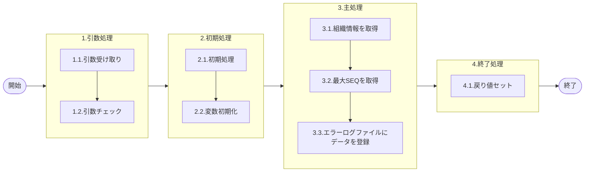

# 0. 表紙

| モジュール名 | プログラムID | プログラム名   |
| ------------ | ------------ | -------------- |
| IC           | LDAS0409     | エラーログ登録 |

| RFC | Version | 更新日     |     更新者     | 更新内容 | 確認日     | 確認者 | 承認日     | 承認者 |
| --- | :-----: | ---------- | :------------: | -------- | ---------- | :----: | ---------- | :----: |
| -   |  1.0.0  | 2025/09/19 | オヘダイチロー | 初版作成 | 2025/XX/XX |  XXX  | 2025/XX/XX |  XXX  |

## 1. 処理概要

### 1.1. 機能概要

本機能は、以下の処理を通じてエラーログの登録を行います。

1. 初めに、GIMACエリアマスタ（la_area_master）テーブルより、使用者側の担当課および担当者に関する情報を取得します。
2. 次に、エラーログファイル（ld_trn_err_log）テーブルから、既存レコードの最大SEQ (連番) を取得し、新規登録用の連番を決定します。
3. 最後に、エラーログファイル（ld_trn_err_log）テーブルにデータを登録します。

### 1.2. 処理概要フロー



### 1.3. プログラム入出力パラメータ

#### 1.3.1. 引数

| No. | パラメータ論理名           | パラメータ物理名        | 属性    | 備考                                     |
| --- | -------------------------- | ----------------------- | ------- | ---------------------------------------- |
| 1   | 作成区分                   | ps_create_class         | VARCAHR |                                          |
| 2   | 入力ユーザーＩＤ           | ps_input_user_id        | VARCAHR |                                          |
| 3   | エラーコード               | ps_err_code             | VARCAHR |                                          |
| 4   | 処理識別                   | ps_operation_id         | VARCAHR |                                          |
| 5   | 変更区分                   | ps_control_class        | VARCAHR |                                          |
| 6   | エラーレベルステータス     | ps_err_level_status     | VARCAHR |                                          |
| 7   | 受信ＩＤ                   | ps_receive_id           | VARCAHR |                                          |
| 8   | 相手先システム識別         | ps_request_system_cd    | VARCAHR |                                          |
| 9   | 入力元トランザクション     | ps_input_txn            | VARCAHR |                                          |
| 10  | エラー発生処理ＩＤ         | ps_prg_id               | VARCAHR |                                          |
| 11  | リスト出力フラグ           | ps_list_flg             | VARCHAR |                                          |
| 12  | 品目番号                   | ps_itemno               | VARCAHR |                                          |
| 13  | 供給者                     | ps_supplier             | VARCAHR |                                          |
| 14  | 使用者                     | ps_usercd               | VARCAHR |                                          |
| 15  | 着手／払出日               | ps_st_db_date           | VARCHAR |                                          |
| 16  | オーダー番号               | ps_order_no             | VARCAHR |                                          |
| 17  | カード識別                 | ps_card_id              | VARCHAR | 出荷明細番号　もしくは　納品者番号が入る |
| 18  | 伝票番号                   | ps_slip_no              | VARCAHR |                                          |
| 19  | 引落区分                   | ps_hold_on_hand_flag    | VARCAHR | 0：「良品在庫」、1：「保留在庫」         |
| 20  | 数量                       | pn_qty                  | DECIMAL |                                          |
| 21  | 起票日                     | ps_input_date           | VARCHAR |                                          |
| 22  | 着手日                     | ps_start_date           | VARCHAR |                                          |
| 23  | 納入日                     | ps_due_date             | VARCHAR |                                          |
| 24  | 払出日                     | ps_disburse_date        | VARCHAR |                                          |
| 25  | 理由コード（発注理由）     | ps_reason_code          | VARCHAR |                                          |
| 26  | 責任工程                   | ps_rp_process           | VARCHAR |                                          |
| 27  | 責任職場／メーカー区分     | ps_rp_shop_class        | VARCHAR |                                          |
| 28  | 責任職場／メーカー         | ps_rp_shop_code         | VARCHAR |                                          |
| 29  | 組立ライン                 | ps_assy_line_code       | VARCHAR |                                          |
| 30  | 組立順序番号               | ps_assy_seq             | VARCHAR |                                          |
| 31  | 金額                       | pn_amount               | DECIMAL |                                          |
| 32  | 移動先使用者               | ps_mv_usercd            | VARCHAR |                                          |
| 33  | 費用振替先区分             | ps_transfer_class       | VARCHAR |                                          |
| 34  | 費用振替先コード           | ps_transfer_code        | VARCHAR |                                          |
| 35  | 生試処理タイプ             | ps_pilot_condition_type | VARCHAR |                                          |
| 36  | 完了開始時間               | ps_due_begin_time       | VARCHAR |                                          |
| 37  | 完了終了時間               | ps_due_end_time         | VARCHAR |                                          |
| 38  | 繰越調整数                 | pn_carry_over_qty       | DECIMAL |                                          |
| 39  | 生試初品区分               | ps_pilot_class          | VARCHAR |                                          |
| 40  | 所要量区分                 | ps_rd_class             | VARCHAR |                                          |
| 41  | 独立需要送り先区分         | ps_ind_user_class       | VARCHAR |                                          |
| 42  | 独立需要送り先コード       | ps_ind_user_code        | VARCHAR |                                          |
| 43  | 振替理由コード             | ps_transfer_reason_code | VARCHAR |                                          |
| 44  | 勘定科目コード             | ps_account_heading      | VARCHAR |                                          |
| 45  | 目的No                     | ps_budget_no            | VARCHAR |                                          |
| 46  | 受払種別コード             | ps_account_code_sales   | VARCHAR |                                          |
| 47  | 仕掛サイン                 | ps_in_process_sign      | VARCHAR |                                          |
| 48  | インボイスNo               | ps_invoice_no           | VARCHAR |                                          |
| 49  | B/LNo                      | ps_bl_no                | VARCHAR |                                          |
| 50  | ケースNo                   | ps_case_no              | VARCHAR |                                          |
| 51  | ケースマークオーダ番号     | ps_case_mark_order_no   | VARCHAR |                                          |
| 52  | 削除日付                   | ps_delete_ymd           | VARCHAR |                                          |
| 53  | フリーコメント             | ps_remark               | VARCHAR |                                          |
| 54  | サービスパーツ特別発注区分 | ps_sp_order_class       | VARCHAR |                                          |
| 55  | サービスパーツ直納先コード | ps_sp_delivery_code     | VARCHAR |                                          |
| 56  | サービスパーツディーラNO   | ps_sp_dealer_no         | VARCHAR |                                          |
| 57  | サービスパーツ受注番号     | ps_sp_order_no          | VARCHAR |                                          |
| 58  | エラーレベル品目番号       | ps_err_itemno           | VARCHAR |                                          |
| 59  | エラーレベル供給者         | ps_err_supplier         | VARCHAR |                                          |
| 60  | エラーレベル使用者         | ps_err_usercd           | VARCHAR |                                          |
| 61  | エラーレベル数量           | pn_err_qty              | DECIMAL |                                          |
| 62  | エラーレベル着手日         | ps_err_start_date       | VARCHAR |                                          |
| 63  | エラーレベル納入日         | ps_err_due_date         | VARCHAR |                                          |
| 64  | エラーレベル払出日         | ps_err_disburse_date    | VARCHAR |                                          |
| 65  | G-SDMオーダー番号          | ps_gsdm_order_no        | VARCHAR |                                          |
| 66  | 外売品フラグ               | ps_external_sales_flg   | VARCHAR |                                          |
| 67  | HU-ID                      | ps_handling_unit_id     | VARCHAR |                                          |
| 68  | 構成LT用工程番号           | ps_strc_lt_proc_no      | VARCHAR |                                          |
| 69  | 原価用品目番号             | ps_cc_itemno            | VARCHAR |                                          |
| 70  | 原価用供給者               | ps_cc_supplier          | VARCHAR |                                          |
| 71  | 原価用使用者               | ps_cc_usercd            | VARCHAR |                                          |
| 72  | 原価用オーダー番号         | ps_cc_order_no          | VARCHAR |                                          |

#### 1.3.2. 戻り値

| No. | パラメータ論理名 | パラメータ物理名 | 属性    | 備考 |
| --- | ---------------- | ---------------- | ------- | ---- |
| 1   | 処理ステータス   | rn_status        | INTEGER |      |
| 2   | SQLコード        | rs_sql_code      | VARCHAR |      |
| 3   | エラーコード     | rs_err_code      | VARCHAR |      |
| 4   | エラーメッセージ | rs_err_msg       | VARCHAR |      |
| 5   | エラー位置       | rs_err_focus     | VARCHAR |      |

### 1.4. その他制御・要件

| 排他制御 |      |      |
| -------- | ---- | ---- |
| 楽観     | 悲観 | 無し |
| ●       | -    | -    |

| 項目               | 制約・制御・要件など | 記載内容説明                                                     |
| ------------------ | -------------------- | ---------------------------------------------------------------- |
| パフォーマンス要件 | 特になし。           | 特別なパフォーマンス要件がある場合に要件内容とその対処法を記述。 |

### 1.5. 入出力一覧

| No | 入出力対象 | 名称               | 物理名称          | C  | R  | U | D | 備考           |
| -- | ---------- | ------------------ | ----------------- | -- | -- | - | - | -------------- |
| 1  | テーブル   | GIMACエリアマスタ  | la_area_master    |    | ○ |   |   | (旧)組織マスタ |
| 2  | テーブル   | SUマスタ           | la_area_master_su |    | ○ |   |   |                |
| 3  | テーブル   | エラーログファイル | ld_trn_err_log    | ○ |    |   |   |                |

## 2. 詳細処理

### 2.1. 引数の取得とチェック

特記無し

### 2.2. 初期処理

2.2.1 変数初期化

- システム日時セット

```sql
変数.システム日時 := システム日時;
```

### 2.3. 主処理

### 2.3.1. 組織情報を取得

GIMACエリアマスタ（la_area_master）テーブルより、使用者側の担当課および担当者に関する情報を取得します。

1. GIMACエリアマスタテーブルとSUマスタの結合テーブルに対して、指定された条件に一致するレコードの件数を探します。
2. 件数が 1件以上あれば、同じ条件の中で 使用者側の担当課および担当者に関する情報を取得します。
3. 件数が0件であれば、次の処理へ進む。

```sql
if EXIST(                                                      -- 1. GIMACエリアマスタテーブルとSUマスタの結合テーブルに対して、指定された条件に一致するレコードの件数を探します。
        SELECT 1
          FROM GIMACエリアマスタ A,
               SUマスタ B
          WHERE A.エリアコード = B.エリアコード
          AND B.SUコード = 引数.使用者;
)THEN
       SELECT 担当課, 担当者                                    --2. 件数が 1件以上あれば、同じ条件の中で 使用者側の担当課および担当者に関する情報を取得します。
          INTO 変数.使用者側担当課, 変数.使用者側担当者
          FROM GIMACエリアマスタ A,
               SUマスタ B
          WHERE A.エリアコード = B.エリアコード
          AND B.SUコード = 引数.使用者;
```

カウントからif Existに変更

### 2.3.2. 最大SEQを取得

エラーログファイル（ld_trn_err_log）テーブルより、 連番の最大値を取得します。

1. エラーログファイルテーブルに対して、指定された条件に一致するレコードの件数を探します。
2. 件数が 1件以上あれば、同じ条件の中で 連番(seq) の最大値を取得し、それに 1を加えた値を次の連番とします。
3. 件数が 0件であれば、連番(seq) を 1 に設定します。

```sql
    if EXIST(　　　　　　　　　　　　　　　　　　　　　-- 1.エラーログファイルテーブルに対して、指定された条件に一致するレコードの件数を探します。
        SELECT 1
          FROM エラーログファイル
          WHERE エラー発生日時 = 変数.エラー発生日時;　--2.2.1. 変数初期化を参照
    )THEN
        SELECT MAX(連番) INTO STRICT 変数.連番       --2. 件数が 1件以上あれば、同じ条件の中で 連番(seq) の最大値を取得し、それに 1を加えた値を次の連番とします
          FROM エラーログファイル
         WHERE エラー発生日時 = 変数.システム日時;　--2.2.1. 変数初期化を参照
        変数.連番 := 変数.連番 + 1;
    ELSE
        変数.連番 := 1;　-- 3.件数が 0件であれば、連番(seq) を 1 に設定
    END IF;
```

カウントからif Existに変更

### 2.3.3. エラーログファイルにデータを登録

```sql
INSERT INTO エラーログファイル
        (エラー発生日時,
         連番,　
         作成区分, 入力ユーザーID,　
         エラーコード, 処理識別,　
         変更区分, エラーレベルステータス,　
         受信ID, 相手先システム識別, 
         入力元トランザクション, エラー発生処理ID, 
         リスト出力フラグ,　
         品目番号, 供給者,　
         使用者, 着手/払出日, 
         使用者側担当課, 
         使用者側担当者, 
         オーダー番号, カード識別   
         伝票番号,　引落区分
         数量, 起票日,
         着手日, 納入日,   
         払出日, 理由コード (発注理由),
         責任行程, 責任職場／メーカー区分,
         責任職場／メーカー, 組立ライン,
         組立順序番号, 金額,
         移動先使用者、
         費用振替先区分, 費用振替先コード,
         生試処理タイプ, 完了開始時間,
         完了終了時間, 繰越調整数,
         生試初品区分, 所要量区分,
         独立需要送り先区分, 独立需要送り先コード,
         振替理由コード, 勘定科目コード,
         目的No, 受払種別コード,
         仕掛サイン, インボイスNo,
         B/L No, ケースNo, 
         ケースマークオーダ番号, 削除日付, 
         フリーコメント, サービスパーツ特別発注区分,
         サービスパーツ直納先コード, サービスパーツディーラーNO, 
         サービスパーツ受注番号, エラーレベル品目番号, 
         エラーレベル供給者, エラーレベル使用者, 
         エラーレベル数量, エラーレベル着手日, 
         エラーレベル納入日, エラーレベル払出日, 
         G-SDMオーダー番号, 外売品フラグ, 
         HU-ID, 構成LT用工程番号, 
         原価用品目番号, 原価用供給者, 
         原価用使用者, 原価用オーダー番号)
        VALUES
        (変数.システム日時,              　　　 --2.2.1. 変数初期化を参照
         エラーログファイル.連番,                 --2.3.2. 最大SEQを取得 参照
         引数.作成区分, 引数.入力ユーザーID,　
         引数.エラーコード, 引数.処理識別,　
         引数.変更区分, 引数.エラーレベルステータス,　
         引数.受信ID, 引数.相手先システム識別, 
         引数.入力元トランザクション, 引数.エラー発生処理ID, 
         引数.リスト出力フラグ,　
         引数.品目番号, 引数.供給者,　
         引数.使用者, 引数.着手/払出日, 
         GIMACエリアマスタ.使用者側担当課,         --2.3.1. 組織情報を取得を参照
         GIMACエリアマスタ.使用者側担当者,         --2.3.1. 組織情報を取得を参照
         引数.オーダー番号, 引数.カード識別   
         引数.伝票番号,　引数.引落区分
         引数.数量, 引数.起票日,
         引数.着手日, 引数.納入日,   
         引数.払出日, 引数.理由コード (発注理由),
         引数.責任行程, 引数.責任職場／メーカー区分,
         引数.責任職場／メーカー, 引数.組立ライン,
         引数.組立順序番号, 引数.金額,
         引数.移動先使用者、
         引数.費用振替先区分, 引数.費用振替先コード,
         引数.生試処理タイプ, 引数.完了開始時間,
         引数.完了終了時間, 引数.繰越調整数,
         引数.生試初品区分, 引数.所要量区分,
         引数.独立需要送り先区分, 引数.独立需要送り先コード,
         引数.振替理由コード, 引数.勘定科目コード,
         引数.目的No, 引数.受払種別コード,
         引数.仕掛サイン, 引数.インボイスNo,
         引数.B/L No, 引数.ケースNo, 
         引数.ケースマークオーダ番号, 引数.削除日付, 
         引数.フリーコメント, 引数.サービスパーツ特別発注区分,
         引数.サービスパーツ直納先コード, 引数.サービスパーツディーラーNO, 
         引数.サービスパーツ受注番号, 引数.エラーレベル品目番号, 
         引数.エラーレベル供給者, 引数.エラーレベル使用者, 
         引数.エラーレベル数量, 引数.エラーレベル着手日, 
         引数.エラーレベル納入日, 引数.エラーレベル払出日, 
         引数.G-SDMオーダー番号, 引数.外売品フラグ, 
         引数.HU-ID, 引数.構成LT用工程番号, 
         引数.原価用品目番号, 引数.原価用供給者, 
         引数.原価用使用者, 引数.原価用オーダー番号);

```

### 2.4. 終了処理

- 正常終了処理を行う

| No. | 戻り値           | 属性    | 設定値   |
| --- | ---------------- | ------- | -------- |
| 1   | 処理ステータス   | INTEGER | 0        |
| 2   | SQL コード       | VARCHAR | スペース |
| 3   | エラーコード     | VARCHAR | スペース |
| 4   | エラーメッセージ | VARCHAR | スペース |
| 5   | エラー位置       | VARCHAR | スペース |

## 3. 補足説明

### 3.1. 戻り値について

- ステータスについて
  - 0 : Normal End
  - -1 : Abnormal End
  - -2 : PGM エラー

### 3.2. エラー発生時の対応について

- SQL エラーが発生した場合、エラーログを出力して処理終了| No. | 戻り値           | 属性    | 設定値   |
  | --- | ---------------- | ------- | -------- |
  | 1   | 処理ステータス   | INTEGER | -1       |
  | 2   | SQL コード       | VARCHAR | SQLSTATE |
  | 3   | エラーコード     | VARCHAR | スペース |
  | 4   | エラーメッセージ | VARCHAR | SQLERRM  |
  | 5   | エラー位置       | VARCHAR | LDAS0414 |

### 3.3. 備考

- 2.3.1. 組織情報を取得 と 2.3.2. 最大SEQを取得 のSQL文をカウントから if EXIST に変更した。
