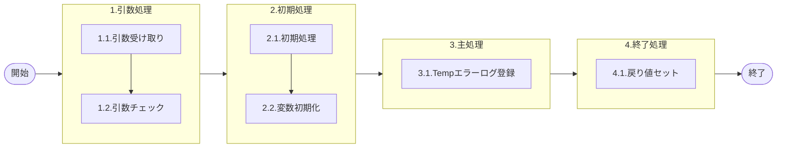

# 0. 表紙

| モジュール名 | プログラムID | プログラム名       |
| ------------ | ------------ | ------------------ |
| IC           | LDAS0410     | Tempエラーログ登録 |

| RFC | Version | 更新日     |     更新者     | 更新内容 | 確認日     | 確認者 | 承認日     | 承認者 |
| --- | :-----: | ---------- | :------------: | -------- | ---------- | :----: | ---------- | :----: |
| -   |  1.0.0  | 2025/09/19 | オヘダイチロー | 初版作成 | 2025/XX/XX |  XXX  | 2025/XX/XX |  XXX  |

## 1. 処理概要

### 1.1. 機能概要

本機能は、受け取った引数をTempエラーログ (ld_temp_err_log) という一時テーブルにデータを登録する処理である。

### 1.2. 処理概要フロー



### 1.3. プログラム入出力パラメータ

#### 1.3.1. 引数

| No. | パラメータ論理名 | パラメータ物理名     | 属性    | 備考                   |
| --- | ---------------- | -------------------- | ------- | ---------------------- |
| 1   | エラーレベル     | ps_err_level         | VARCHAR | 0:通常 1:警告 9:エラー |
| 2   | エラーコード     | ps_err_code          | VARCHAR |                        |
| 3   | プログラムID     | ps_prg_id            | VARCHAR |                        |
| 4   | 品目番号         | ps_err_itemno        | VARCHAR |                        |
| 5   | 供給者           | ps_err_supplier      | VARCHAR |                        |
| 6   | 使用者           | ps_err_usercd        | VARCHAR |                        |
| 7   | 数量             | pn_err_qty           | DECIMAL |                        |
| 8   | 着手日           | ps_err_start_date    | VARCHAR |                        |
| 9   | 納入日           | ps_err_due_date      | VARCHAR |                        |
| 10  | 払出日           | ps_err_disburse_date | VARCHAR |                        |

#### 1.3.2. 戻り値

| No. | パラメータ論理名 | パラメータ物理名 | 属性    | 備考 |
| --- | ---------------- | ---------------- | ------- | ---- |
| 1   | 処理ステータス   | rn_status        | INTEGER |      |
| 2   | SQLコード        | rs_sql_code      | VARCHAR |      |
| 3   | エラーコード     | rs_err_code      | VARCHAR |      |
| 4   | エラーメッセージ | rs_err_msg       | VARCHAR |      |
| 5   | エラー位置       | rs_err_focus     | VARCHAR |      |

### 1.4. その他制御・要件

| 排他制御 |      |      |
| -------- | ---- | ---- |
| 楽観     | 悲観 | 無し |
| ●       | -    | -    |

| 項目               | 制約・制御・要件など | 記載内容説明                                                     |
| ------------------ | -------------------- | ---------------------------------------------------------------- |
| パフォーマンス要件 | 特になし。           | 特別なパフォーマンス要件がある場合に要件内容とその対処法を記述。 |

### 1.5. 入出力一覧

| No | 入出力対象 | 名称           | 物理名称        | C  | R | U | D | 備考 |
| -- | ---------- | -------------- | --------------- | -- | - | - | - | ---- |
| 1  | テーブル   | Tempエラーログ | ld_temp_err_log | ○ |   |   |   |      |

## 2. 詳細処理

### 2.1. 引数の取得とチェック

特記無し

### 2.2. 初期処理

特記無し

### 2.3. 主処理

- Tempエラーログ（ld_temp_err_log）テーブルにデータを登録する

```sql
insert into Tempエラーログ
        values( 引数.エラーレベル, 引数.エラーコード, 引数.プログラムID,
                引数.品目番号, 引数.供給者, 引数.使用者,
                引数.数量, 引数.着手日, 引数.納入日,
                引数.払出日);
```

### 2.4. 終了処理

- 正常終了処理を行う

| No. | 戻り値           | 属性    | 設定値   |
| --- | ---------------- | ------- | -------- |
| 1   | 処理ステータス   | INTEGER | 0        |
| 2   | SQL コード       | VARCHAR | スペース |
| 3   | エラーコード     | VARCHAR | スペース |
| 4   | エラーメッセージ | VARCHAR | スペース |
| 5   | エラー位置       | VARCHAR | スペース |

## 3. 補足説明

### 3.1. 戻り値について

- ステータスについて
  - 0 : Normal End
  - -1 : Abnormal End
  - -2 : PGM エラー

### 3.2. エラー発生時の対応について

- SQL エラーが発生した場合、エラーログを出力して処理終了| No. | 戻り値           | 属性    | 設定値   |
  | --- | ---------------- | ------- | -------- |
  | 1   | 処理ステータス   | INTEGER | -1       |
  | 2   | SQL コード       | VARCHAR | SQLSTATE |
  | 3   | エラーコード     | VARCHAR | スペース |
  | 4   | エラーメッセージ | VARCHAR | SQLERRM  |
  | 5   | エラー位置       | VARCHAR | LDAS0414 |
