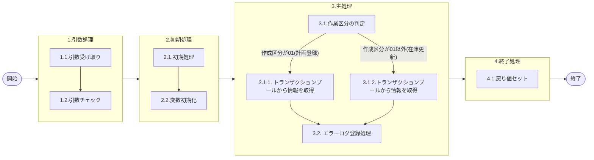

# 0. 表紙

| モジュール名 | プログラムID | プログラム名         |
| ------------ | ------------ | -------------------- |
| IC           | LDAS0411     | エラーログ登録(警告) |

| RFC | Version | 更新日     |     更新者     | 更新内容 | 確認日     | 確認者 | 承認日     | 承認者 |
| --- | :-----: | ---------- | :------------: | -------- | ---------- | :----: | ---------- | :----: |
| -   |  1.0.0  | 2025/09/23 | オヘダイチロー | 初版作成 | 2025/XX/XX |  XXX  | 2025/XX/XX |  XXX  |

## 1. 処理概要

### 1.1. 機能概要

本機能は、以下の処理を通じて警告のエラーログの登録を行います。

1. 初めに、作成区分の値に応じて 計画登録_トランザクションプール (le_trn_planning_tp)　テーブル または 在庫更新_トランザクションプール (ld_trn_update_tp) テーブルから情報を取得します。
2. 最後に、エラーログ登録 (LDAS0409) にデータを登録する。

### 1.2. 処理概要フロー



### 1.3. プログラム入出力パラメータ

#### 1.3.1. 引数

| No. | パラメータ論理名 | パラメータ物理名 | 属性    | 備考                                                                         |
| --- | ---------------- | ---------------- | ------- | ---------------------------------------------------------------------------- |
| 1   | 作成区分         | ps_create_class  | VARCHAR | 01:計画登録処理02:在庫更新処理11:外部データ取込処理99:バリデーションチェック |
| 2   | TP処理番号       | pn_operation_no  | INTEGER |                                                                              |
| 3   | TP処理明細番号   | pn_operation_seq | INTEGER |                                                                              |
| 4   | 入力区分         | ps_input_class   | VARCHAR | 1:画面入力 2:外部I/F 3:先行生産独立所要量削除データ                          |

#### 1.3.2. 戻り値

| No. | パラメータ論理名 | パラメータ物理名 | 属性    | 備考 |
| --- | ---------------- | ---------------- | ------- | ---- |
| 1   | 処理ステータス   | rn_status        | INTEGER |      |
| 2   | SQLコード        | rs_sql_code      | VARCHAR |      |
| 3   | エラーコード     | rs_err_code      | VARCHAR |      |
| 4   | エラーメッセージ | rs_err_msg       | VARCHAR |      |
| 5   | エラー位置       | rs_err_focus     | VARCHAR |      |

### 1.4. その他制御・要件

| 排他制御 |      |      |
| -------- | ---- | ---- |
| 楽観     | 悲観 | 無し |
| ●       | -    | -    |

| 項目               | 制約・制御・要件など | 記載内容説明                                                     |
| ------------------ | -------------------- | ---------------------------------------------------------------- |
| パフォーマンス要件 | 特になし。           | 特別なパフォーマンス要件がある場合に要件内容とその対処法を記述。 |

### 1.5. 入出力一覧

| No | 入出力対象 | 名称                                    | 物理名称           | C | R  | U | D | 備考 |
| -- | ---------- | --------------------------------------- | ------------------ | - | -- | - | - | ---- |
| 1  | テーブル   | 計画登録_トランザクションプールファイル | le_trn_planning_tp |   | ○ |   |   |      |
| 2  | テーブル   | 在庫更新_トランザクションプールファイル | ld_trn_update_tp   |   | ○ |   |   |      |
| 3  | テーブル   | Tempエラーログ                          | ld_temp_err_log    |   | ○ |   |   |      |

## 2. 詳細処理

### 2.1. 引数の取得とチェック

特記無し

### 2.2. 初期処理

リスト出力フラグセット

0 (未出力) を代入する

```sql
変数.リスト出力フラグ := 0;
```

### 2.3. 主処理

### 2.3.1. トランザクションプールから情報を取得

1. 作業区分 = 01 (計画登録処理) の場合

   計画登録_トランザクションプールファイル (le_trn_planning_tp) から情報を取得する。

```sql
IF 引数.作成区分 = '01' THEN
SELECT 入力ユーザーID, 処理識別,
       変更区分, エラーレベルステータス,
       受信ID, 相手先システム識別,
       入力元トランザクション, 品目番号,
       供給者, 使用者,
       オーダー番号, 照合番号, 
       数量, 着手日,
       完了日, 払出日,
       理由コード, 費用振替先区分,
       費用振替先コード, 生試処理タイプ,
       完了開始時間, 完了終了時間,
       繰越数, 生試初品区分,
       所要量区分, 独立需要送り先区分,
       独立需要送りコード, 振替理由コード,
       勘定科目コード, 目的No,
       受払種別コード, 削除日付,
       フリーコメント, サービスパーツ特別発注区分,
       サービスパーツ直納先コード, サービスパーツディーラーNo,
       サービスパーツ受注番号, G-SDMオーダー番号
INTO STRICT
       変数.入力ユーザーID, 変数.処理識別,
       変数.変更区分, 変数.エラーレベルステータス,
       変数.受信ID, 変数.相手先システム識別,
       変数.入力元トランザクション, 変数.品目番号,
       変数.供給者, 変数.使用者,
       変数.オーダー番号, 変数.照合番号, 
       変数.数量, 変数.着手日,
       変数.完了日, 変数.払出日,
       変数.理由コード, 変数.費用振替先区分,
       変数.費用振替先コード, 変数.生試処理タイプ,
       変数.完了開始時間, 変数.完了終了時間,
       変数.繰越数, 変数.生試初品区分,
       変数.所要量区分, 変数.独立需要送り先区分,
       変数.独立需要送りコード, 変数.振替理由コード,
       変数.勘定科目コード, 変数.目的No,
       変数.受払種別コード, 変数.削除日付,
       変数.フリーコメント, 変数.サービスパーツ特別発注区分,
       変数.サービスパーツ直納先コード, 変数.サービスパーツディーラーNo,
       変数.サービスパーツ受注番号, 変数.G-SDMオーダー番号
 FROM 計画登録_トランザクションプールファイル
WHERE TP処理番号 = 引数.TP処理番号
  AND TP処理明細番号 = 引数.TP処理明細番号
  AND 入力区分 = 引数.入力区分
```

2. 作業区分 <> 01 (在庫更新処理) の場合

   在庫更新_トランザクションプールファイル (ld_trn_update_tp) から情報を取得する。

```sql
 ELSE
 SELECT 入力ユーザーID, 処理識別,
        変更区分, エラーレベルステータス,
        受信ID, 相手先システム識別,
        品目番号, 供給者,
        使用者, 着手/払出日,
        オーダー番号, カード識別,
        照合番号, 引落区分,
        数量, 起票日,
        理由コード, 責任行程,
        責任職場／メーカー区分, 責任職場／メーカー,
        組立ライン, 組立順序番号,
        金額, 移動先使用者,
        費用振替先区分, 費用振替先コード,
        勘定科目コード, 目的No,
        受払種別コード, 仕掛サイン,
        インボイスNo, B/L No,
        ケースNo, ケースマークオーダ番号,
        フリーコメント, G-SDMオーダー番号,
        外売品フラグ, HU-ID,
        構成LT用工程番号, 原価用品目番号,
        原価用供給者, 原価用使用者,
        原価用オーダー番号
    INTO STRICT
        変数.入力ユーザーID, 変数.処理識別,
        変数.変更区分, 変数.エラーレベルステータス,
        変数.受信ID, 変数.相手先システム識別,
        変数.品目番号, 変数.供給者,
        変数.使用者, 変数.着手/払出日,
        変数.オーダー番号, 変数.カード識別,
        変数.照合番号, 変数.引落区分,
        変数.数量, 変数.起票日,
        変数.理由コード, 変数.責任行程,
        変数.責任職場／メーカー区分, 変数.責任職場／メーカー,
        変数.組立ライン, 変数.組立順序番号,
        変数.金額, 変数.移動先使用者,
        変数.費用振替先区分, 変数.費用振替先コード,
        変数.勘定科目コード, 変数.目的No,
        変数.受払種別コード, 変数.仕掛サイン,
        変数.インボイスNo, 変数.B/L No,
        変数.ケースNo, 変数.ケースマークオーダ番号,
        変数.フリーコメント, 変数.G-SDMオーダー番号,
        変数.外売品フラグ, 変数.HU-ID,
        変数.構成LT用工程番号, 変数.原価用品目番号,
        変数.原価用供給者, 変数.原価用使用者,
        変数.原価用オーダー番号
   FROM 在庫更新_トランザクションプールファイル
  WHERE TP処理番号  = 引数.TP処理番号
    AND TP処理明細番号 = 引数.TP処理明細番号;

END IF;
```

### 2.3.2. エラーログ登録に登録する

1. Tempエラーログ（ld_temp_err_log）に格納されたエラー情報のうち、エラーレベルが "1" (警告) のレコードを抽出し、1件ずつループ処理を行います。

```sql
FOR レコード IN
        SELECT エラーコード, エラー発生処理ID, エラー品目番号, エラー供給者, エラー使用者, エラー数量, 
               エラー着手日, エラー納入日, エラー払出日
          FROM  Tempエラーログ
         WHERE エラーレベル = '1' LOOP
```

2. エラーログ登録のストアドプロシージャ（LDAS0904）を呼び出し、引数として、あらかじめ定義された変数とレコード変数を渡します。

```sql
        SELECT * 
          INTO STRICT
               変数.処理ステータス,    変数.SQLコード,
               変数.エラーコード,     変数.エラーメッセージ,
               変数.エラー位置
        FROM ldas4090(変数.作成区分, 変数.入力ユーザーID,　
                      レコード.エラーコード, 変数.処理識別,　
                      変数.変更区分, 変数.エラーレベルステータス,　
                      変数.受信ID, 変数.相手先システム識別, 
                      変数.入力元トランザクション, レコード.エラー発生処理ID, 
                      変数.リスト出力フラグ,　　 -- 2.2 初期処理 参照
                      変数.品目番号, 変数.供給者,　
                      変数.使用者, 変数.着手/払出日, 
                      変数.オーダー番号, 変数.カード識別   
                      変数.伝票番号,　変数.引落区分
                      変数.数量, 変数.起票日,
                      変数.着手日, 変数.完了日,   
                      変数.払出日, 変数.理由コード (発注理由),
                      変数.責任行程, 変数.責任職場／メーカー区分,
                      変数.責任職場／メーカー, 変数.組立ライン,
                      変数.組立順序番号, 変数.金額,
                      変数.移動先使用者、
                      変数.費用振替先区分, 変数.費用振替先コード,
                      変数.生試処理タイプ, 変数.完了開始時間,
                      変数.完了終了時間, 変数.繰越調整数,
                      変数.生試初品区分, 変数.所要量区分,
                      変数.独立需要送り先区分, 変数.独立需要送り先コード,
                      変数.振替理由コード, 変数.勘定科目コード,
                      変数.目的No, 変数.受払種別コード,
                      変数.仕掛サイン, 変数.インボイスNo,
                      変数.B/L No, 変数.ケースNo, 
                      変数.ケースマークオーダ番号, 変数.削除日付, 
                      変数.フリーコメント, 変数.サービスパーツ特別発注区分,
                      変数.サービスパーツ直納先コード, 変数.サービスパーツディーラーNO, 
                      変数.サービスパーツ受注番号, レコード.エラーレベル品目番号, 
                      レコード.エラーレベル供給者, レコード.エラーレベル使用者, 
                      レコード.エラーレベル数量, レコード.エラーレベル着手日, 
                      レコード.エラーレベル納入日, レコード.エラーレベル払出日, 
                      変数.G-SDMオーダー番号, 変数.外売品フラグ, 
                      変数.HU-ID, 変数.構成LT用工程番号, 
                      変数.原価用品目番号, 変数.原価用供給者, 
                      変数.原価用使用者, 変数.原価用オーダー番号
                      )
```

3. ループ内で、処理ステータスの値が "0"  (正常) 以外である場合は、例外（エラー）を発生させて処理を中断します。

```sql
 IF 変数.処理ステータス <> 0 THEN
            RAISE EXCEPTION '';
        END IF;

    END LOOP;
```

### 2.4. 終了処理

- 正常終了処理を行う

| No. | 戻り値           | 属性    | 設定値   |
| --- | ---------------- | ------- | -------- |
| 1   | 処理ステータス   | INTEGER | 0        |
| 2   | SQL コード       | VARCHAR | スペース |
| 3   | エラーコード     | VARCHAR | スペース |
| 4   | エラーメッセージ | VARCHAR | スペース |
| 5   | エラー位置       | VARCHAR | スペース |

## 3. 補足説明

### 3.1. 戻り値について

- ステータスについて
  - 0 : Normal End
  - -1 : Abnormal End
  - -2 : PGM エラー

### 3.2. エラー発生時の対応について

- RAISE EXCEPTIONでエラーを起こした場合、エラーログを出力して処理終了
  | No. | 戻り値           | 属性    | 設定値                |
  | --- | ---------------- | ------- | --------------------- |
  | 1   | 処理ステータス   | INTEGER | 変数.処理ステータス   |
  | 2   | SQL コード       | VARCHAR | 変数.SQLコード        |
  | 3   | エラーコード     | VARCHAR | 変数.エラーコード     |
  | 4   | エラーメッセージ | VARCHAR | 変数.エラーメッセージ |
  | 5   | エラー位置       | VARCHAR | LDAS0411              |

- SQL エラーが発生した場合、エラーログを出力して処理終了
  | No. | 戻り値           | 属性    | 設定値   |
  | --- | ---------------- | ------- | -------- |
  | 1   | 処理ステータス   | INTEGER | -1       |
  | 2   | SQL コード       | VARCHAR | SQLSTATE |
  | 3   | エラーコード     | VARCHAR | スペース |
  | 4   | エラーメッセージ | VARCHAR | SQLERRM  |
  | 5   | エラー位置       | VARCHAR | LDAS0411 |
