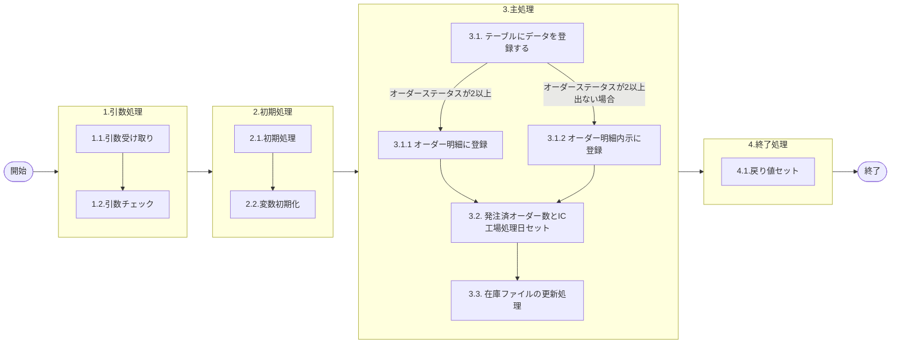

# 0. 表紙

| モジュール名 | プログラムID | プログラム名     |
| ------------ | ------------ | ---------------- |
| IC           | LDAS0413     | オーダー明細登録 |

| RFC | Version | 更新日     |     更新者     | 更新内容 | 確認日     | 確認者 | 承認日     | 承認者 |
| --- | :-----: | ---------- | :------------: | -------- | ---------- | :----: | ---------- | :----: |
| -   |  1.0.0  | 2025/09/22 | オヘダイチロー | 初版作成 | 2025/XX/XX |  XXX  | 2025/XX/XX |  XXX  |

## 1. 処理概要

### 1.1. 機能概要

本機能は、以下の手順を通じて、オーダーステータスの値に応じたテーブルへデータを登録する。

1. 「オーダーステータス = 0 (内示) 」の場合、IC工場処理日をオーダー確定日に代入する。
2. オーダーステータスの値に応じて、オーダー明細 (le_trn_order)テーブルまたは、オーダー明細内示 (le_trn_order_forecast)　テーブルにデータを登録する。
3. 発注済オーダー数とIC工場処理日セットを行う
4. 在庫ファイル更新 (LDAS0431) の更新処理を行う。

### 1.2. 処理概要フロー



### 1.3. プログラム入出力パラメータ

#### 1.3.1. 引数

| No. | パラメータ論理名           | パラメータ物理名               | 属性    | 備考                                                                       |
| --- | -------------------------- | ------------------------------ | ------- | -------------------------------------------------------------------------- |
| 1   | 品目番号                   | ps_itemno                      | VARCHAR |                                                                            |
| 2   | 供給者                     | ps_supplier                    | VARCHAR |                                                                            |
| 3   | 使用者                     | ps_usercd                      | VARCHAR |                                                                            |
| 4   | オーダー番号               | ps_order_no                    | VARCHAR |                                                                            |
| 5   | オーダー通し番号           | ps_order_through_no            | VARCHAR |                                                                            |
| 6   | オーダー通し番号源泉フラグ | ps_order_through_no_source_flg | VARCHAR |                                                                            |
| 7   | 着手日                     | ps_start_date                  | VARCHAR |                                                                            |
| 8   | 完了日                     | ps_due_date                    | VARCHAR |                                                                            |
| 9   | 払出日                     | ps_disburse_date               | VARCHAR |                                                                            |
| 10  | 発注時着手日               | ps_rls_start_date              | VARCHAR |                                                                            |
| 11  | 完了開始時間               | ps_due_end_time                | VARCHAR | 形式: hhmm                                                                 |
| 12  | 完了終了時間               | ps_disburse_begin_time         | VARCHAR | 形式: hhmm                                                                 |
| 13  | 着手シフト番号             | ps_due_shift_no                | VARCHAR |                                                                            |
| 14  | 完了シフト番号             | ps_disburse_shift_no           | VARCHAR |                                                                            |
| 15  | 払出シフト番号             | ps_line_no                     | VARCHAR |                                                                            |
| 16  | オーダーステータス         | ps_order_status                | VARCHAR | 0:内示  2:確定 9:完了 ※凍結ステータス削除                                |
| 19  | オーダー数                 | pn_order_qty                   | DECIMAL |                                                                            |
| 20  | 調整前オーダー数           | pn_before_adjust_order_qty     | DECIMAL | SCPLAN結果のオーダー数画面から登録した場合はオーダー数と同じ数量を設定する |
| 21  | 分割指示数                 | pn_split_inst_qty              | DECIMAL |                                                                            |
| 26  | 外部計画区分               | ps_external_plan_class         | VARCHAR | 外部計画サインを設定                                                       |
| 27  | 壁立ちオーダーフラグ       | ps_last_period_order_flg       | VARCHAR | 0:それ以外 1:壁立ちオーダー                                                |
| 28  | ＭＲＰ需要方針コード       | ps_demand_policy_code          | VARCHAR |                                                                            |
| 29  | シンクロ管理コード         | ps_synchro_control_code        | VARCHAR |                                                                            |
| 30  | ＡＩＲＳサイン             | ps_airs_sign                   | VARCHAR |                                                                            |
| 31  | 出荷連絡サイン             | ps_shipping_notice_sign        | VARCHAR |                                                                            |
| 32  | シフト分割数               | ps_shift_division_no           | VARCHAR |                                                                            |
| 33  | シフトパターン番号         | ps_shift_pattern_no            | VARCHAR |                                                                            |
| 34  | 理由コード                 | ps_reason_code                 | VARCHAR |                                                                            |
| 35  | 入力元トランザクション     | ps_input_txn                   | VARCHAR |                                                                            |
| 33  | 伝票番号                   | ps_slip_no                     | VARCHAR |                                                                            |
| 37  | フリーコメント             | ps_remark                      | VARCHAR |                                                                            |
| 38  | 相手先システム識別         | ps_request_system_code         | VARCHAR |                                                                            |
| 40  | ＴＰ処理番号               | pn_operation_no                | INTEGER |                                                                            |
| 41  | ＴＰ処理明細番号           | pn_operation_seq               | INTEGER |                                                                            |
| 42  | 投入数                     | pn_throw_qty                   | DECIMAL |                                                                            |
| 43  | G-SDMオーダー番号          | ps_gsdm_order_no               | VARCHAR |                                                                            |
| 44  | 外売品フラグ               | ps_external_sales_flg          | VARCHAR |                                                                            |
| 45  | 直送先コード               | ps_direct_rec_code             | VARCHAR |                                                                            |
| 48  | 登録担当                   | ps_register_person             | VARCHAR |                                                                            |
| 48  | 繰越数                     | pn_carry_over_qty              | DECIMAL |                                                                            |
| 48  | IC工場処理日               | ps_ic_slip_date                | VARCHAR |                                                                            |

#### 1.3.2. 戻り値

| No. | パラメータ論理名 | パラメータ物理名 | 属性    | 備考                                    |
| --- | ---------------- | ---------------- | ------- | --------------------------------------- |
| 1   | 処理ステータス   | rn_status        | INTEGER | 0:正常終了,-1:SQLエラー終了,-2:異常終了 |
| 2   | SQLコード        | rs_sql_code      | VARCHAR |                                         |
| 3   | エラーコード     | rs_err_code      | VARCHAR |                                         |
| 4   | エラーメッセージ | rs_err_msg       | VARCHAR |                                         |
| 5   | エラー位置       | r_err_focus      | VARCHAR |                                         |

### 1.4. その他制御・要件

| 排他制御 |      |      |
| -------- | ---- | ---- |
| 楽観     | 悲観 | 無し |
| ●       | -    | -    |

| 項目               | 制約・制御・要件など | 記載内容説明                                                     |
| ------------------ | -------------------- | ---------------------------------------------------------------- |
| パフォーマンス要件 | 特になし。           | 特別なパフォーマンス要件がある場合に要件内容とその対処法を記述。 |

### 1.5. 入出力一覧

| No | 入出力対象 | 名称             | 物理名称              | C  | R | U | D | 備考 |
| -- | ---------- | ---------------- | --------------------- | -- | - | - | - | ---- |
| 1  | テーブル   | オーダー明細     | le_trn_order          | ○ |   |   |   |      |
| 2  | テーブル   | オーダー明細内示 | le_trn_order_forecast | ○ |   |   |   |      |

## 2. 詳細処理

### 2.1. 引数の取得とチェック

特記無し

### 2.2. 初期処理

- システム日時のセット

```sql
変数.システム日時 := システム日時
```

- オーダー確定日のセット

```sql
IF 引数.オーダーステータス = '2' THEN
        変数.オーダー確定日 := 引数.IC工場処理日;
    END IF;
```

- 条件
  - オーダーステータス = 2 (確定) の場合、引数.IC工場処理日 を オーダー確定日 に設定する。
  - それ以外の場合は、処理をスキップし次の処理へ進む

### 2.3. 主処理

### 2.3.1 オーダー明細 (le_trn_order)　もしくは、オーダー明細内示 (le_trn_order_forecast) にデータを登録する

1. オーダーステータスが2 (確定) 以上だった場合

オーダー明細にデータを登録する

```sql
IF 引数.オーダーステータス >= '2' THEN
        INSERT INTO オーダー明細
            (品目番号, 供給者,
            使用者, オーダー番号,
            通し番号, 通し番号源泉フラグ,
            着手日, 完了日, 払出日,
            発注時着手日, 完了開始時間,
            完了終了時間, 着手シフト番号,
            完了シフト番号, 払出シフト番号,
            オーダーステータス, 生試初品区分,,
            オーダー確定日, オーダー数,
            調整前オーダー数, 分割指示数,
            入庫数, 仕損数,
            オーダー残数, 入庫日,
            外部計画区分, 壁立ちオーダーフラグ,
            ＭＲＰ需要方針コード, シンクロ管理コード,
            ＡＩＲＳサイン, 出荷連絡サイン,
            シフト分割数, シフトパターン番号,
            理由コード, 入力元トランザクション,
            入力元照合番号, フリーコメント,
            相手先システム識別, 現品票作成ステータス,
            ＴＰ処理番号, ＴＰ処理明細番号,
            投入数, G-SDMオーダー番号,
            外売品フラグ, 直送先コード,
            MRP更新日, 削除日,
            更新カウンタ, 登録日時,
            登録者, 登録PGID,
            更新日時, 更新者,
            更新PGID)
        VALUES
            (引数.品目番号, 引数.供給者,
            引数.使用者, 引数.オーダー番号,
            引数.通し番号, 通し番号源泉フラグ,
            引数.着手日, 引数.完了日, 引数.払出日,
            引数.発注時着手日, 引数.完了開始時間,
            引数.完了終了時間, 引数.着手シフト番号,
            引数.完了シフト番号, 引数.払出シフト番号,
            引数.オーダーステータス, 引数.生試初品区分,,
            変数.オーダー確定日, 引数.オーダー数,　　　--2.2 初期処理　参照
            引数.調整前オーダー数, 引数.分割指示数,
            0, 0,
            0, 0,
            引数.外部計画区分, 引数.壁立ちオーダーフラグ,
            引数.ＭＲＰ需要方針コード, 引数.シンクロ管理コード,
            引数.ＡＩＲＳサイン, 引数.出荷連絡サイン,
            引数.シフト分割数, 引数.シフトパターン番号,
            引数.理由コード, 引数.入力元トランザクション,
            引数.伝票番号, 引数.フリーコメント,
            引数.相手先システム識別, ' ',
            引数.ＴＰ処理番号, 引数.ＴＰ処理明細番号,
            引数.投入数, 引数.G-SDMオーダー番号,
            引数.外売品フラグ, 引数.直送先コード,
            ' ', ' ',
            0, 変数.システム日時,
            引数.登録担当, 'lcbs4130'
             変数.システム日時, 引数.登録担当,
             'lcbs4130');
```

2. オーダーステータスが'2' (確定) 以上でない場合

オーダー明細内示にデータを登録する

```sql
ELSE
        INSERT INTO オーダー明細内示
            (品目番号, 供給者,
            使用者, オーダー番号,
            通し番号, 通し番号源泉フラグ,
            着手日, 完了日, 払出日,
            発注時着手日, 完了開始時間,
            完了終了時間, 着手シフト番号,
            完了シフト番号, 払出シフト番号,
            オーダーステータス, 生試初品区分,,
            オーダー確定日, オーダー数,
            調整前オーダー数, 分割指示数,
            入庫数, 仕損数,
            オーダー残数, 入庫日,
            外部計画区分, 壁立ちオーダーフラグ,
            ＭＲＰ需要方針コード, シンクロ管理コード,
            ＡＩＲＳサイン, 出荷連絡サイン,
            シフト分割数, シフトパターン番号,
            理由コード, 入力元トランザクション,
            入力元照合番号, フリーコメント,
            相手先システム識別, 現品票作成ステータス,
            ＴＰ処理番号, ＴＰ処理明細番号,
            投入数, G-SDMオーダー番号,
            外売品フラグ, 直送先コード,
            MRP更新日, 削除日,
            更新カウンタ, 登録日時,
            登録者, 登録PGID,
            更新日時, 更新者,
            更新PGID)
        VALUES
            (引数.品目番号, 引数.供給者,
            引数.使用者, 引数.オーダー番号,
            引数.通し番号, 通し番号源泉フラグ,
            引数.着手日, 引数.完了日, 引数.払出日,
            引数.発注時着手日, 引数.完了開始時間,
            引数.完了終了時間, 引数.着手シフト番号,
            引数.完了シフト番号, 引数.払出シフト番号,
            引数.オーダーステータス, 引数.生試初品区分,,
            変数.オーダー確定日, 引数.オーダー数,　　　--2.2 初期処理　参照
            引数.調整前オーダー数, 引数.分割指示数,
            0, 0,
            0, 0,
            引数.外部計画区分, 引数.壁立ちオーダーフラグ,
            引数.ＭＲＰ需要方針コード, 引数.シンクロ管理コード,
            引数.ＡＩＲＳサイン, 引数.出荷連絡サイン,
            引数.シフト分割数, 引数.シフトパターン番号,
            引数.理由コード, 引数.入力元トランザクション,
            引数.伝票番号, 引数.フリーコメント,
            引数.相手先システム識別, ' ',
            引数.ＴＰ処理番号, 引数.ＴＰ処理明細番号,
            引数.投入数, 引数.G-SDMオーダー番号,
            引数.外売品フラグ, 引数.直送先コード,
            ' ', ' ',
            0, 変数.システム日時,
            引数.登録担当, 'ldas0413'
             変数.システム日時, 引数.登録担当,
             'ldas0413');
    END IF;
```

### 2.3.2 発注済オーダー数とIC工場処理日セット

1. 発注済オーダー数セット

オーダーステータスが "2" (確定)である、または繰越数が 0 以外の場合に条件を満たし、処理が実行されます。
この条件のうち、オーダーステータスが "2" (確定)の場合には、発注済オーダー数にオーダー数を設定します。

```sql
      IF 引数.オーダーステータス = '2' OR 引数.繰越数 <> 0 THEN
        IF 引数.オーダーステータス = '2' THEN
            変数.発注済オーダー数 := 引数.オーダー数;
        END IF;
```

2. IC工場処理日セット

引数の繰越数が 0 でない場合、変数 IC工場処理日 に引数の IC工場処理日 を設定します。
それ以外の場合は、IC工場処理日 を NULL にリセットします。

```sql
      IF 引数.繰越数 <> 0 THEN
          変数.IC工場処理日 := 引数.IC工場処理日;
      ELSE
          変数.IC工場処理日 := NULL;
      END IF;
```

### 2.3.4 在庫ファイル更新 (LDAS0431) を呼び出す

```sql
         SELECT * 
          INTO STRICT
               変数.処理ステータス, 変数.SQLコード,
               変数.エラーコード,     変数.エラーメッセージ,
               変数.エラー位置, 変数.手持在庫数
          FROM ldas0431(引数.登録担当, 引数.品目番号, 引数.供給者, 引数.使用者, 0, 0, 引数.オーダー数, 0, 0, 引数.繰越数, 0, 0, 0, スペース, 変数.工場処理日, NULL, 0, 0, 0);
```

　処理ステータス が "-1" (SQLエラー終了)の場合、処理ステータスとエラーコードに変数を設定し、例外を発生させて処理を中断する。

```sql
         IF 変数.処理ステータス  = -1 THEN      --  < SQL ERROR >
            処理ステータス := 変数.処理ステータス;
            エラーコード := 　変数.エラーコード;
            エラー位置 := 'LDAS0413';
            RAISE EXCEPTION '';
          END IF;
```

### 2.4. 終了処理

- 正常終了処理を行う

| No. | 戻り値           | 属性    | 設定値   |
| --- | ---------------- | ------- | -------- |
| 1   | 処理ステータス   | INTEGER | 0        |
| 2   | SQL コード       | VARCHAR | スペース |
| 3   | エラーコード     | VARCHAR | スペース |
| 4   | エラーメッセージ | VARCHAR | スペース |
| 5   | エラー位置       | VARCHAR | スペース |

## 3. 補足説明

### 3.1. 戻り値について

- ステータスについて
  - 0 : Normal End
  - -1 : Abnormal End
  - -2 : PGM エラー

### 3.2. エラー発生時の対応について

- RAISE EXCEPTIONのエラーが発生した場合、処理終了
- SQL エラーが発生した場合、エラーログを出力して処理終了
  
  | No. | 戻り値           | 属性    | 設定値   |
  | --- | ---------------- | ------- | -------- |
  | 1   | 処理ステータス   | INTEGER | -1       |
  | 2   | SQL コード       | VARCHAR | SQLSTATE |
  | 3   | エラーコード     | VARCHAR | スペース |
  | 4   | エラーメッセージ | VARCHAR | SQLERRM  |
  | 5   | エラー位置       | VARCHAR | LDAS0413 |

### 3.3. 備考

- PYMACからの変更点
  　在庫ファイル更新 (LDAS0431) に渡すパラメータ
  GYMAC
  前回棚卸実施日 := NULL
  最新日 := IC工場処理日

  PYMAC
  前回棚卸実施日 := IC工場処理日
  最新日 := NULL
