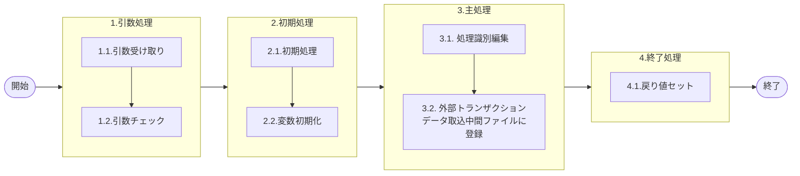

# 0. 表紙

| モジュール名 | プログラムID | プログラム名                   |
| ------------ | ------------ | ------------------------------ |
| IC           | LDAS0415     | 外部データ取込中間ファイル登録 |

| RFC | Version | 更新日     |     更新者     | 更新内容 | 確認日     | 確認者 | 承認日     | 承認者 |
| --- | :-----: | ---------- | :------------: | -------- | ---------- | :----: | ---------- | :----: |
| -   |  1.0.0  | 2025/09/25 | オヘダイチロー | 初版作成 | 2025/XX/XX |  XXX  | 2025/XX/XX |  XXX  |

## 1. 処理概要

### 1.1. 機能概要

本機能では、処理識別を編集した後、外部トランザクションデータ取込中間ファイル (ld_trn_ext_data_import_file) テーブルに引数のデータを登録します。

### 1.2. 処理概要フロー



### 1.3. プログラム入出力パラメータ

#### 1.3.1. 引数

| No. | パラメータ論理名           | パラメータ物理名        | 属性    | 備考                                     |
| --- | -------------------------- | ----------------------- | ------- | ---------------------------------------- |
| 1   | 受信ＩＤ                   | ps_receive_id           | VARCHAR |                                          |
| 2   | バッチ取込プログラム       | ps_batch_imp_pgm        | VARCHAR |                                          |
| 3   | 連番                       | pn_seq                  | INTEGER |                                          |
| 4   | 処理識別                   | ps_operation_id         | VARCHAR |                                          |
| 5   | 品目番号                   | ps_itemno               | VARCHAR |                                          |
| 6   | 供給者                     | ps_supplier             | VARCHAR |                                          |
| 7   | 使用者                     | ps_usercd               | VARCHAR |                                          |
| 8   | オーダー番号               | ps_order_no             | VARCHAR |                                          |
| 9   | 通し番号                   | ps_through_no           | VARCHAR |                                          |
| 10  | カード識別                 | ps_card_id              | VARCHAR |                                          |
| 11  | 照合番号                   | ps_slip_no              | VARCHAR |                                          |
| 12  | 生試処理タイプ             | ps_pilot_condition_type | VARCHAR |                                          |
| 13  | 数量                       | pn_qty                  | DECIMAL |                                          |
| 14  | 繰越調整数                 | pn_carry_over_qty       | DECIMAL |                                          |
| 15  | 着手日                     | ps_start_date           | VARCHAR |                                          |
| 16  | 完了日                     | ps_due_date             | VARCHAR |                                          |
| 17  | 完了開始時間               | ps_delivery_start_time  | VARCHAR |                                          |
| 18  | 完了終了時間               | ps_delivery_due_time    | VARCHAR |                                          |
| 19  | 払出日                     | ps_disburse_date        | VARCHAR |                                          |
| 20  | 起票日                     | ps_input_date           | VARCHAR |                                          |
| 21  | 生試初品区分               | ps_pilot_class          | VARCHAR |                                          |
| 22  | 理由コード                 | ps_reason_code          | VARCHAR |                                          |
| 23  | 責任工程                   | ps_rp_process           | VARCHAR |                                          |
| 24  | 責任職場／メーカー区分     | ps_rp_shop_class        | VARCHAR |                                          |
| 25  | 責任職場／メーカー         | ps_rp_shop_code         | VARCHAR |                                          |
| 26  | 組立ライン                 | ps_assy_line_code       | VARCHAR |                                          |
| 27  | 組立順序番号               | ps_assy_seq             | VARCHAR |                                          |
| 28  | 金額                       | pn_amount               | DECIMAL |                                          |
| 29  | 所要量区分                 | ps_rd_class             | VARCHAR |                                          |
| 30  | 先行所要量削除日付         | ps_ind_delete_ymd       | VARCHAR |                                          |
| 31  | 独立需要送り先区分         | ps_ind_user_class       | VARCHAR |                                          |
| 32  | 独立需要送り先コード       | ps_ind_user_code        | VARCHAR |                                          |
| 33  | 移動先供給者               | ps_mv_supplier          | VARCHAR |                                          |
| 33  | 移動先使用者               | ps_mv_usercd            | VARCHAR |                                          |
| 34  | 費用振替先区分             | ps_transfer_class       | VARCHAR | 1：SUコード、2:原価センター、3：受払種別 |
| 35  | 費用振替先コード           | ps_transfer_code        | VARCHAR | 2:原価センターの時１０桁                 |
| 36  | 振替理由コード             | ps_transfer_reason_code | VARCHAR |                                          |
| 37  | 勘定科目コード             | ps_account_heading      | VARCHAR |                                          |
| 38  | 目的No                     | ps_budget_no            | VARCHAR |                                          |
| 39  | 受払種別コード             | ps_account_code_sales   | VARCHAR |                                          |
| 40  | 仕掛サイン                 | ps_in_process_sign      | VARCHAR |                                          |
| 41  | 相手先システム識別         | ps_request_system_code  | VARCHAR |                                          |
| 42  | 入力元トランザクション     | ps_input_txn            | VARCHAR |                                          |
| 43  | 分割分子                   | pn_numerator            | INTEGER |                                          |
| 44  | 分割分母                   | pn_denominator          | INTEGER |                                          |
| 45  | サービスパーツ特別発注区分 | ps_sp_order_class       | VARCHAR |                                          |
| 46  | サービスパーツ直納先コード | ps_sp_delivery_code     | VARCHAR |                                          |
| 47  | サービスパーツディーラーNO | ps_sp_dealer_no         | VARCHAR |                                          |
| 48  | サービスパーツ受注番号     | ps_sp_order_no          | VARCHAR |                                          |
| 49  | 旧打切りサイン             | ps_discontinus_sigh     | VARCHAR |                                          |
| 50  | G-SDMオーダー番号          | ps_gsdm_order_no        | VARCHAR |                                          |
| 51  | 外売品フラグ               | ps_external_sales_flg   | VARCHAR |                                          |
| 52  | グループ会社間受注フラグ   | ps_group_receive_flg    | VARCHAR |                                          |
| 53  | 構成LT用工程番号           | ps_strc_lt_proc_no      | VARCHAR |                                          |
| 54  | 原価用品目番号             | ps_cc_itemno            | VARCHAR |                                          |
| 55  | 原価用供給者               | ps_cc_supplier          | VARCHAR |                                          |
| 56  | 原価用使用者               | ps_cc_usercd            | VARCHAR |                                          |
| 57  | 原価用オーダー番号         | ps_cc_order_no          | VARCHAR |                                          |
| 58  | 入力ユーザーID             | ps_input_user_id        | VARCHAR |                                          |

#### 1.3.2. 戻り値

| No. | パラメータ論理名 | パラメータ物理名 | 属性    | 備考 |
| --- | ---------------- | ---------------- | ------- | ---- |
| 1   | 処理ステータス   | rn_status        | INTEGER |      |
| 2   | SQLコード        | rs_sql_code      | VARCHAR |      |
| 3   | エラーコード     | rs_err_code      | VARCHAR |      |
| 4   | エラーメッセージ | rs_err_msg       | VARCHAR |      |
| 5   | エラー位置       | rs_err_focus     | VARCHAR |      |

### 1.4. その他制御・要件

| 排他制御 |      |      |
| -------- | ---- | ---- |
| 楽観     | 悲観 | 無し |
| ●       | -    | -    |

| 項目               | 制約・制御・要件など | 記載内容説明                                                     |
| ------------------ | -------------------- | ---------------------------------------------------------------- |
| パフォーマンス要件 | 特になし。           | 特別なパフォーマンス要件がある場合に要件内容とその対処法を記述。 |

### 1.5. 入出力一覧

| No | 入出力対象 | 名称                                       | 物理名称                    | C  | R | U | D | 備考 |
| -- | ---------- | ------------------------------------------ | --------------------------- | -- | - | - | - | ---- |
| 1  | テーブル   | 外部トランザクションデータ取込中間ファイル | ld_trn_ext_data_import_file | ○ |   |   |   |      |

## 2. 詳細処理

### 2.1. 引数の取得とチェック

特記無し

### 2.2. 初期処理

- システム日時のセット

```sql
変数.システム日時 := システム日時
```

### 2.3. 主処理

### 2.3.1. 処理識別編集

処理識別が 'LD14' かつ、供給者と使用者が同じ場合は、処理識別を 'LD44' に変更する。
それ以外の場合は、引数の処理識別をそのまま使う。

```sql
    IF (引数.処理識別 = 'LD14' AND 引数.供給者 = 引数.使用者) THEN
        変数.処理識別 := 'LD44';
    ELSE
        変数.処理識別 := 引数.処理識別;
    END IF;
```

### 2.3.2. 外部トランザクションデータ取込中間ファイルに登録

```sql
INSERT INTO 外部トランザクションデータ取込中間ファイル
               (受信ID, 処理済フラグ, 
               バッチ取込プログラム,
               登録日時, 連番,
               処理識別, 品目番号,
               供給者, 使用者,
               オーダー番号, 通し番号,
               カード識別, 照合番号,
               生試処理タイプ, 数量,
               繰越調整数, 着手日,
               完了日, 完了開始時間,
               完了終了時間, 払出日,
               起票日, 生試初区分,
               理由コード, 責任行程,
               責任職場／メーカー区分, 責任職場／メーカー,
               組立ライン, 組立順序番号,
               金額, 所要量区分,
               先行所要量削除日付, 独立需要送り先区分,
               独立需要送り先コード, 移動先供給者,
               移動先使用者, 費用振替先区分,
               費用振替先コード, 振替理由コード,
               勘定科目コード, 目的No,
               受払種別コード, 仕掛サイン,
               相手先システム識別, 入力元トランザクション,
               分割分子, 分割分母,
               サービスパーツ特別発注区分, サービスパーツ直納先コード,
               サービスパーツディーラーNO, サービスパーツ受注番号,
               旧打切りサイン, G-SDMオーダー番号,
               外売品フラグ, グループ会社間受注フラグ,
               構成LT用工程番号, 原価用品目番号,
               原価用供給者, 原価用使用者,
               原価用オーダー番号,更新カウンタ,
               登録日時, 引数.入力ユーザーID,
               登録PGID, 更新日時,
               引数.入力ユーザーID, 更新PGID)
         VALUES(引数.受信ID, 0, 
               引数.バッチ取込プログラム,
               変数.システム日時, 引数.連番,
               変数.処理識別, 引数.品目番号,
               引数.供給者, 引数.使用者,
               引数.オーダー番号, 引数.通し番号,
               引数.カード識別, 引数.照合番号,
               引数.生試処理タイプ, 引数.数量,
               引数.繰越調整数, 引数.着手日,
               引数.完了日, 引数.完了開始時間,
               引数.完了終了時間, 引数.払出日,
               引数.起票日, 引数.生試初区分,
               引数.理由コード, 引数.責任行程,
               引数.責任職場／メーカー区分, 引数.責任職場／メーカー,
               引数.組立ライン, 引数.組立順序番号,
               引数.金額, 引数.所要量区分,
               引数.先行所要量削除日付, 引数.独立需要送り先区分,
               引数.独立需要送り先コード, 引数.移動先供給者,
               引数.移動先使用者, 引数.費用振替先区分,
               引数.費用振替先コード, 引数.振替理由コード,
               引数.勘定科目コード, 引数.目的No,
               引数.受払種別コード, 仕掛サイン,
               引数.相手先システム識別, 引数.入力元トランザクション,
               引数.分割分子, 引数.分割分母,
               引数.サービスパーツ特別発注区分, 引数.サービスパーツ直納先コード,
               引数.サービスパーツディーラーNO, 引数.サービスパーツ受注番号,
               引数.旧打切りサイン, 引数.G-SDMオーダー番号,
               引数.外売品フラグ, 引数.グループ会社間受注フラグ,
               引数.構成LT用工程番号, 引数.原価用品目番号,
               引数.原価用供給者, 引数.原価用使用者,
               引数.原価用オーダー番号, 0,
               変数.システム日時, 引数.入力ユーザーID,
               'ldas0415', 変数.システム日時,
               引数.入力ユーザーID, 'ldas0415');
```

### 2.4. 終了処理

- 正常終了処理を行う

| No. | 戻り値           | 属性    | 設定値   |
| --- | ---------------- | ------- | -------- |
| 1   | 処理ステータス   | INTEGER | 0        |
| 2   | SQL コード       | VARCHAR | スペース |
| 3   | エラーコード     | VARCHAR | スペース |
| 4   | エラーメッセージ | VARCHAR | スペース |
| 5   | エラー位置       | VARCHAR | スペース |

## 3. 補足説明

### 3.1. 戻り値について

- ステータスについて
  - 0 : Normal End
  - -1 : Abnormal End
  - -2 : PGM エラー

### 3.2. エラー発生時の対応について

- SQL エラーが発生した場合、エラーログを出力して処理終了
  | No. | 戻り値           | 属性    | 設定値   |
  | --- | ---------------- | ------- | -------- |
  | 1   | 処理ステータス   | INTEGER | -1       |
  | 2   | SQL コード       | VARCHAR | SQLSTATE |
  | 3   | エラーコード     | VARCHAR | スペース |
  | 4   | エラーメッセージ | VARCHAR | SQLERRM  |
  | 5   | エラー位置       | VARCHAR | LDAS0415 |
