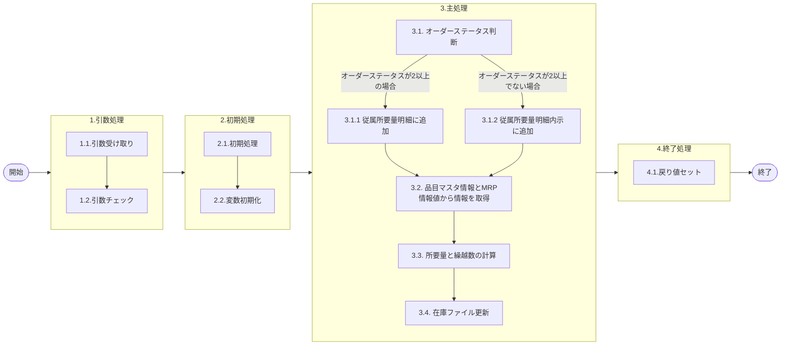

# 0. 表紙

| モジュール名 | プログラムID | プログラム名       |
| ------------ | ------------ | ------------------ |
| IC           | LDAS0416     | 従属所要量明細登録 |

| RFC | Version | 更新日     |     更新者     | 更新内容 | 確認日     | 確認者 | 承認日     | 承認者 |
| --- | :-----: | ---------- | :------------: | -------- | ---------- | :----: | ---------- | :----: |
| -   |  1.0.0  | 2025/09/25 | オヘダイチロー | 初版作成 | 2025/XX/XX |  XXX  | 2025/XX/XX |  XXX  |

## 1. 処理概要

### 1.1. 機能概要

本機能は、以下の処理を通じて従属所要量明細登録を行います。

1. オーダーステータスを判定する

- ステータスが"2" (確定) 以上の場合、従属所要量明細に追加する
- ステータスが"2" (確定)以上でない場合、従属所要量明細内示に追加する

2. オーダーステータスが"2"(確定)の場合, 品目マスタ情報 (la_itemmast) テーブル, MRP情報 (le_mst_mrp_information) テーブルから情報を取得します。
3. 所要量と繰越数の計算を行います
4. 在庫ファイル更新 (LDAS0431) を実行します。

オーダーステータスが"2"(確定)の時, 品目マスタ情報取得、MRP情報値取得、在庫ファイル更新SPを実行する

### 1.2. 処理概要フロー



### 1.3. プログラム入出力パラメータ

#### 1.3.1. 引数

| No. | パラメータ論理名                     | パラメータ物理名                     | 属性    | 備考                           |
| --- | ------------------------------------ | ------------------------------------ | ------- | ------------------------------ |
| 1   | 親品目番号                           | ps_parent_itemno                     | VARCHAR |                                |
| 2   | 親供給者                             | ps_parent_supplier                   | VARCHAR |                                |
| 3   | 親使用者                             | ps_parent_usercd                     | VARCHAR |                                |
| 4   | オーダー番号                         | ps_order_no                          | VARCHAR |                                |
| 5   | 子品目番号                           | ps_comp_itemno                       | VARCHAR |                                |
| 6   | 子供給者                             | ps_comp_supplier                     | VARCHAR |                                |
| 7   | 子使用者                             | ps_comp_usercd                       | VARCHAR |                                |
| 8   | 構成連番                             | ps_structure_seq                     | VARCHAR |                                |
| 9   | オーダー通し番号                     | ps_order_through_no                  | VARCHAR |                                |
| 10  | オーダー通し番号源泉フラグ           | ps_order_through_no_source_flg       | VARCHAR |                                |
| 11  | 着手日                               | ps_start_date                        | VARCHAR |                                |
| 12  | 着手日シフト番号                     | ps_start_shift_no                    | VARCHAR |                                |
| 13  | 発注時着手日                         | ps_rls_start_date                    | VARCHAR |                                |
| 14  | 構成LTオンセット後着手日             | ps_strc_lt_onset_start_date          | VARCHAR |                                |
| 15  | 構成LTオンセット後着手時間シフト番号 | ps_strc_lt_onset_start_time_shift_no | VARCHAR |                                |
| 16  | オーダーステータス                   | ps_order_status                      | VARCHAR |                                |
| 17  | 生試初品区分                         | ps_pilot_class                       | VARCHAR | 2:生試　3:量産初品　4:単品生試 |
| 18  | 所要数                               | pn_required_qty                      | DECIMAL |                                |
| 19  | 出庫数                               | pn_ship_qty                          | DECIMAL |                                |
| 20  | 品目タイプ                           | ps_item_type                         | VARCHAR |                                |
| 21  | 構成品タイプ                         | ps_comp_type                         | VARCHAR |                                |
| 22  | 構成品サイン                         | ps_comp_sign                         | VARCHAR |                                |
| 23  | 所要量出庫管理コード                 | ps_req_issue_control                 | VARCHAR |                                |
| 24  | 員数                                 | pn_comp_qty                          | DECIMAL |                                |
| 25  | 員数タイプ                           | ps_comp_qty_type                     | VARCHAR |                                |
| 26  | 構成LT用工程番号                     | ps_strc_lt_proc_no                   | DECIMAL |                                |
| 27  | ＯＰ率                               | pn_comp_op_percent                   | VARCHAR |                                |
| 28  | 入力ユーザーID                       | pn_input_user_id                     | VARCHAR |                                |

#### 1.3.2. 戻り値

| No. | パラメータ論理名 | パラメータ物理名 | 属性    | 備考                   |
| --- | ---------------- | ---------------- | ------- | ---------------------- |
| 1   | 処理ステータス   | rn_status        | INTEGER | 0:NormalEnd-1:SQLError |
| 2   | SQLコード        | rs_sql_code      | VARCHAR |                        |
| 3   | エラーコード     | rs_err_code      | VARCHAR |                        |
| 4   | エラーメッセージ | rs_err_msg       | VARCHAR |                        |
| 5   | エラー位置       | rs_err_focus     | VARCHAR |                        |

### 1.4. その他制御・要件

| 排他制御 |      |      |
| -------- | ---- | ---- |
| 楽観     | 悲観 | 無し |
| ●       | -    | -    |

| 項目               | 制約・制御・要件など | 記載内容説明                                                     |
| ------------------ | -------------------- | ---------------------------------------------------------------- |
| パフォーマンス要件 | 特になし。           | 特別なパフォーマンス要件がある場合に要件内容とその対処法を記述。 |

### 1.5. 入出力一覧

| No | 入出力対象 | 名称                   | 物理名称           | C  | R  | U | D | 備考 |
| -- | ---------- | ---------------------- | ------------------ | -- | -- | - | - | ---- |
| 1  | テーブル   | le_trn_drd             | 従属所要量明細     | ○ |    |   |   |      |
| 2  | テーブル   | le_trn_drd_forecast    | 従属所要量明細内示 | ○ |    |   |   |      |
| 3  | テーブル   | la_itemmast            | 品目マスタ         |    | ○ |   |   |      |
| 4  | テーブル   | le_mst_mrp_information | MRP情報値          |    | ○ |   |   |      |
| 5  | 共通関数   | LDAS0431               | 在庫ファイル更新   |    |    |   |   |      |

## 2. 詳細処理

### 2.1. 引数の取得とチェック

特記無し

### 2.2. 初期処理

- システム日時の値セット

```sql
変数.システム日時 := システム日時
```

- 出庫数の値セット

```sql
    IF 引数.出庫数 IS NULL THEN
        変数.出庫数 := 0;
    ELSE
        変数.出庫数 := 引数.出庫数;
    END IF;
```

### 2.3. 主処理

### 2.3.1 従属所要量明細もしくは、従属所要量明細内示に登録

オーダーステータスの判別により、分岐します。

1. オーダーステータスが "2" (確定) 以上だった場合

　従属所要量明細 (le_trn_drd) テーブルに追加する

```sql
　IF 引数.オーダーステータス >= '2' THEN
        INSERT INTO 従属所要量明細(
            親品目番号, 親供給者,
　　　　　　 親使用者, オーダー番号.
            子品目番号, 子供給者,
            子使用者, 構成連番,
            通し番号 通し番号源泉フラグ,
            着手日, 着手日シフト番号,
            発注時着手日, 構成LTオンセット後着手日,
            構成LTオンセット後着手時間シフト番号,
            オーダーステータス, 生試初品区分,
            所要数, 出庫数,
            品目タイプ, 構成品タイプ,
            構成品サイン, 所要量出庫管理コード,
            員数, 員数タイプ,
            構成LT用工程番号, ＯＰ率,
            MRP更新日, 削除日,
            更新カウンタ, 登録日時,
            登録者, 登録PGID,
            更新日時, 更新者,
            更新PGID)
        VALUES (引数.親品目番号, 引数.親供給者,
　　　　　　 引数.親使用者, 引数.オーダー番号.
            引数.子品目番号, 引数.子供給者,
            引数.子使用者, 引数.構成連番,
            引数.オーダー通し番号 引数.オーダー通し番号源泉フラグ,
            引数.着手日, 引数.着手日シフト番号,
            引数.発注時着手日, 引数.構成LTオンセット後着手日,
            引数.構成LTオンセット後着手時間シフト番号,
            引数.オーダーステータス, 引数.生試初品区分,
            引数.所要数, 変数.出庫数,
            引数.品目タイプ, 引数.構成品タイプ,
            引数.構成品サイン, 引数.所要量出庫管理コード,
            引数.員数, 引数.員数タイプ,
            引数.構成LT用工程番号, 引数.ＯＰ率,
            ' ', ' ',
            0, 変数.システム日時,
            引数.入力ユーザーID, 'LDAS0416',
            変数.システム日時,  引数.入力ユーザーID,
            'LDAS0416');
```

2. オーダーステータスが "2" (確定) 以上でない場合

　従属所要量明細内示 (le_trn_drd_forecast) テーブルに追加する

```sql
ELSE
        INSERT INTO 従属所要量明細内示(
            親品目番号, 親供給者,
　　　　　　 親使用者, オーダー番号.
            子品目番号, 子供給者,
            子使用者, 構成連番,
            通し番号 通し番号源泉フラグ,
            着手日, 着手日シフト番号,
            発注時着手日, 構成LTオンセット後着手日,
            構成LTオンセット後着手時間シフト番号,
            オーダーステータス, 生試初品区分,
            所要数, 出庫数,
            品目タイプ, 構成品タイプ,
            構成品サイン, 所要量出庫管理コード,
            員数, 員数タイプ,
            構成LT用工程番号, ＯＰ率,
            MRP更新日, 削除日,
            更新カウンタ, 登録日時,
            登録者, 登録PGID,
            更新日時, 更新者,
            更新PGID)
        VALUES (引数.親品目番号, 引数.親供給者,
　　　　　　 引数.親使用者, 引数.オーダー番号.
            引数.子品目番号, 引数.子供給者,
            引数.子使用者, 引数.構成連番,
            引数.オーダー通し番号 引数.オーダー通し番号源泉フラグ,
            引数.着手日, 引数.着手日シフト番号,
            引数.発注時着手日, 引数.構成LTオンセット後着手日,
            引数.構成LTオンセット後着手時間シフト番号,
            引数.オーダーステータス, 引数.生試初品区分,
            引数.所要数, 変数.出庫数,
            引数.品目タイプ, 引数.構成品タイプ,
            引数.構成品サイン, 引数.所要量出庫管理コード,
            引数.員数, 引数.員数タイプ,
            引数.構成LT用工程番号, 引数.ＯＰ率,
            ' ', ' ',
            0, 変数.システム日時,
            引数.入力ユーザーID, 'LDAS0416',
            変数.システム日時,  引数.入力ユーザーID,
            'LDAS0416');
    END IF;
```

### 2.3.2 品目マスタ情報とMRP情報値から情報を取得

1. オーダーステータスが "2" (確定)の場合

- 品目マスタテーブルから検索する

対象の条件に対する品目マスタ (la_itemmast) テーブルのデータが既に存在するかをチェックする。

```sql
      if EXIST(
        SELECT 1
          FROM 品目マスタ
         WHERE 品目番号 = 引数.品目番号
           AND 供給者 = 引数.供給者
           AND 使用者 = 引数.使用者;)THEN
```

存在する場合は、品目マスタ (la_itemmast) テーブルから品目ステータスを検索する

存在しない場合は、変数.品目ステータスにスペースを代入する

```sql
            SELECT 品目ステータス
              INTO STRICT 変数.品目ステータス
              FROM 品目マスタ
             WHERE 品目番号 = 引数.品目番号
           　　AND 供給者 = 引数.供給者
          　　 AND 使用者 = 引数.使用者;
        ELSE
            変数.品目ステータス := ' ';
        END IF;
```

- MRP情報値 (le_mst_mrp_information) テーブルから検索する

対象の条件に対するMRP情報値 (le_mst_mrp_information) テーブルのデータが既に存在するかをチェックする。

```sql
      if EXIST(
        SELECT 1
          FROM MRP情報値
         WHERE 品目番号 = 引数.品目番号
           AND 供給者 = 引数.供給者
           AND 使用者 = 引数.使用者;)THEN
```

存在する場合は、MRP情報値 (le_mst_mrp_information) テーブルからMRP需要方針コードを検索する

存在しない場合は、変数.MRP需要方針コードにスペースを代入する

```sql
            SELECT MRP需要方針コード
              INTO STRICT 変数.MRP需要方針コード
              FROM MRP情報値
             WHERE 品目番号 = 引数.品目番号
           　　AND 供給者 = 引数.供給者
          　　 AND 使用者 = 引数.使用者;
          ELSE
            変数.MRP需要方針コード := ' ';
        END IF;
```

### 2.3.3　所要量計算と繰越数セット

この処理は、所要量から出庫数を引いて、残りの所要量を求めた後、
構成品サインが（'-'）で、所要量が "0" 以上の場合は、所要量を "0" にする

構成品サインが（'-'）以外で、所要量が "0" 以下の場合は、所要量を "0" にする

最後に、繰越数にNULLを代入する

```sql
        変数.所要量 := 引数.所要数 - 変数.出庫数;

        IF 引数.構成品サイン = '-' AND 変数.所要量 > 0 THEN
            変数.所要量 := 0;
        END IF;

        IF 引数.構成品サイン <> '-' AND 変数.所要量 < 0 THEN
            変数.所要量 := 0;
        END IF;

        変数.繰越数 = NULL;
```

繰越数は、在庫ファイル更新でNULLを0に変換している
条件による分岐後の処理が同じため、IF文を削除

### 2.3.4 在庫ファイル更新

この処理は、
所要量が"0"以外、または 繰越数 NULL ではない場合に、

在庫ファイル更新 (ldas0431) を呼び出して実行する。

処理の結果、処理ステータスが"-1" (SQLエラー終了) であれば、例外を発生させて処理を中断しています。

```sql
        IF 変数.所要量 <> 0 OR 変数.繰越数 IS NOT NULL THEN
            SELECT * 
              INTO STRICT
                   変数.処理ステータス, 変数.SQLコード,
                   変数.エラーコード, 変数.エラーメッセージ,
                   変数.エラー位置, 変数.手持在庫数
              FROM ldas0431(引数.入力ユーザーID,
                            引数.子品目番号, 引数.子供給者, 引数.子使用者,
                            0, '0', 0, 0, 変数.所要量, 0, 変数.繰越数, 0,
                            '0', ' ', ' ', NULL, '0', '0', '0');

            IF 変数.物理ステータス  = -1 THEN
                RAISE EXCEPTION '';
            END IF;
        END IF;
```

### 2.4. 終了処理

- 正常終了処理を行う

| No. | 戻り値           | 属性    | 設定値   |
| --- | ---------------- | ------- | -------- |
| 1   | 処理ステータス   | INTEGER | 0        |
| 2   | SQL コード       | VARCHAR | スペース |
| 3   | エラーコード     | VARCHAR | スペース |
| 4   | エラーメッセージ | VARCHAR | スペース |
| 5   | エラー位置       | VARCHAR | スペース |

## 3. 補足説明

### 3.1. 戻り値について

- ステータスについて
  - 0 : Normal End
  - -1 : Abnormal End
  - -2 : PGM エラー

### 3.2. エラー発生時の対応について

- RAISE EXCEPTIONのエラーが発生した場合、エラーログを出力して処理終了
  | No. | 戻り値           | 属性    | 設定値                |
  | --- | ---------------- | ------- | --------------------- |
  | 1   | 処理ステータス   | INTEGER | 変数.処理ステータス   |
  | 2   | SQL コード       | VARCHAR | 変数.SQL コード       |
  | 3   | エラーコード     | VARCHAR | 変数.エラーコード     |
  | 4   | エラーメッセージ | VARCHAR | 変数.エラーメッセージ |
  | 5   | エラー位置       | VARCHAR | 変数.エラー位置       |
- SQL エラーが発生した場合、エラーログを出力して処理終了
  | No. | 戻り値           | 属性    | 設定値   |
  | --- | ---------------- | ------- | -------- |
  | 1   | 処理ステータス   | INTEGER | -1       |
  | 2   | SQL コード       | VARCHAR | SQLSTATE |
  | 3   | エラーコード     | VARCHAR | スペース |
  | 4   | エラーメッセージ | VARCHAR | SQLERRM  |
  | 5   | エラー位置       | VARCHAR | LDAS0416 |

### 3.3. 備考

- 2.3.2 品目マスタ情報とMRP情報値から情報を取得のSQL文をカウントから if EXIST に変更した。
- 戻り値を変更 (SPステータス, ISAMコード, PGステータス)
- 基本設計では繰越数を9999999999.99999に設定しているが、NULLに変更
- 基本設計では繰越数をIF文で分岐していたが、条件による分岐後の処理が同じため、IF文削除
