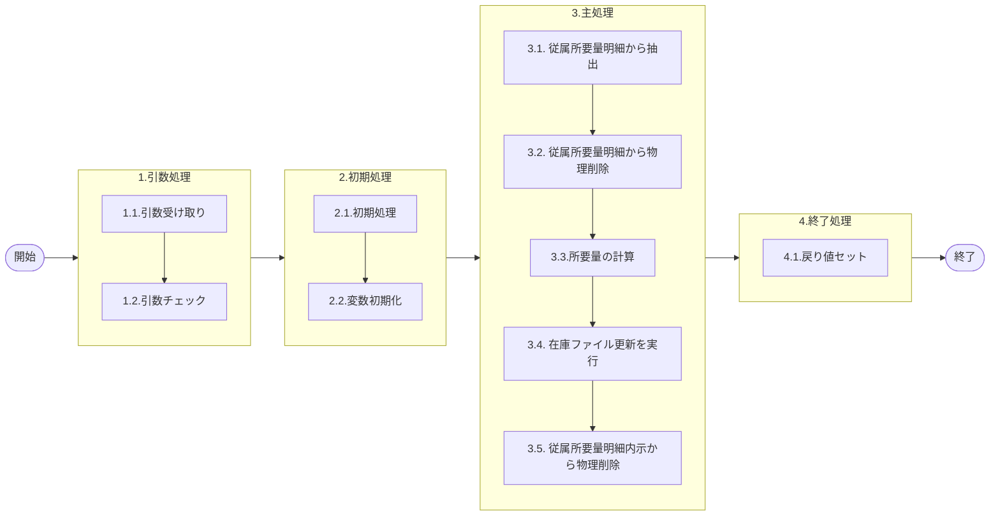

# 0. 表紙

| モジュール名 | プログラムID | プログラム名       |
| ------------ | ------------ | ------------------ |
| IC           | LDAS0417     | 従属所要量明細削除 |

| RFC | Version | 更新日     |     更新者     | 更新内容 | 確認日     | 確認者 | 承認日     | 承認者 |
| --- | :-----: | ---------- | :------------: | -------- | ---------- | :----: | ---------- | :----: |
| -   |  1.0.0  | 2025/09/26 | オヘダイチロー | 初版作成 | 2025/XX/XX |  XXX  | 2025/XX/XX |  XXX  |

## 1. 処理概要

### 1.1. 機能概要

本機能は、以下の処理を通じて従属所要量明細 (le_trn_drd) と従属所要量明細内示 (le_trn_drd_forecast) から値を削除します。

1. 処理の最初に、従属所要量明細 (le_trn_drd) テーブルから必要な情報を取得します。
2. データを取得したため、明細テーブルから該当データを物理削除する。
3. 次に、オーダーステータスが "2" (確定) の場合,所要量の計算を行い、在庫ファイル更新 (LDAS0431) を実行します。
4. 最後に、従属所要量明細内示 (le_trn_drd_forecast) テーブルから該当データを物理削除し、処理を完了する。

### 1.2. 処理概要フロー



### 1.3. プログラム入出力パラメータ

#### 1.3.1. 引数

| No. | パラメータ論理名 | パラメータ物理名   | 属性    | 備考 |
| --- | ---------------- | ------------------ | ------- | ---- |
| 1   | 親品目番号       | ps_parent_itemno   | VARCHAR |      |
| 2   | 親供給者         | ps_parent_supplier | VARCHAR |      |
| 3   | 親使用者         | ps_parent_usercd   | VARCHAR |      |
| 4   | オーダー番号     | ps_order_no        | VARCHAR |      |
| 5   | 子品目番号       | ps_comp_itemno     | VARCHAR |      |
| 6   | 子供給者         | ps_comp_supplier   | VARCHAR |      |
| 7   | 子使用者         | ps_comp_usercd     | VARCHAR |      |
| 8   | 構成連番         | ps_structure_seq   | VARCHAR |      |
| 9   | ユーザーID       | ps_user_id         | VARCHAR |      |
| 10  | IC工場処理日     | ps_ic_slip_date    | VARCHAR |      |

#### 1.3.2. 戻り値

| No. | パラメータ論理名 | パラメータ物理名 | 属性    | 備考                   |
| --- | ---------------- | ---------------- | ------- | ---------------------- |
| 1   | 処理ステータス   | rn_status        | INTEGER | 0:NormalEnd-1:SQLError |
| 2   | SQLコード        | rs_sql_code      | VARCAHR |                        |
| 3   | エラーコード     | rs_err_code      | VARCAHR |                        |
| 4   | エラーメッセージ | rs_err_msg       | VARCAHR |                        |
| 5   | エラー位置       | rs_err_focus     | VARCAHR |                        |

### 1.4. その他制御・要件

| 排他制御 |      |      |
| -------- | ---- | ---- |
| 楽観     | 悲観 | 無し |
| ●       | -    | -    |

| 項目               | 制約・制御・要件など | 記載内容説明 |
| ------------------ | -------------------- | ------------ |
| パフォーマンス要件 | 特になし。           |              |

### 1.5. 入出力一覧

| No | 入出力対象 | 名称               | 物理名称            | C | R  | U | D  | 備考 |
| -- | ---------- | ------------------ | ------------------- | - | -- | - | -- | ---- |
| 1  | テーブル   | 従属所要量明細     | le_trn_drd          |   | ○ |   | ○ |      |
| 2  | テーブル   | 従属所要量明細内示 | le_trn_drd_forecast |   | ○ |   | ○ |      |
| 3  | 共通関数   | LDAS0431:在庫ファイル更新   |                     |   |    |   |    |      |

## 2. 詳細処理

### 2.1. 引数の取得とチェック

特記なし

### 2.2. 初期処理

特記なし

### 2.3. 主処理

### 2.3.1 従属所要量明細から値を抽出と該当データを削除

1. 従属所要量明細テーブルの存在チェック

対象の条件に対する従属所要量明細 (le_trn_drd) テーブルのデータが既に存在するかをチェックする。

```sql
  if EXIST(
    SELECT 1
      FROM 従属所要量明細
     WHERE 親品目番号 = 親品目番号
       AND 親供給者 = 親供給者
       AND 親使用者 = 親使用者
       AND オーダ番号 = オーダ番号
       AND 子品目番号 = 子品目番号
       AND 子供給者 = 子供給者
       AND 子使用者 = 子使用者 
       AND 構成連番 = 構成連番;)THEN
```

2. 従属所要量明細テーブルから抽出

存在する場合は、従属所要量明細 (le_trn_drd) テーブルから値を抽出する

```sql
        SELECT オーダーステータス, 所要数, 
               出庫数, 構成品サイン
          INTO STRICT
               変数.オーダーステータス, 変数.所要数, 
               変数.出庫数, 変数.構成品サイン
          FROM 従属所要量明細
         WHERE 親品目番号 = 親品目番号
       　　AND 親供給者 = 親供給者
       　　AND 親使用者 = 親使用者
       　　AND オーダ番号 = オーダ番号
       　　AND 子品目番号 = 子品目番号
       　　AND 子供給者 = 子供給者
       　　AND 子使用者 = 子使用者 
       　　AND 構成連番 = 構成連番;
```

3. 従属所要量明細テーブルから該当するデータを削除

必要な値を抽出したため、従属所要量明細 (le_trn_drd) テーブルから該当するデータを削除する

```sql
   DELETE FROM 従属所要量明細
         WHERE 親品目番号 = 親品目番号
       　　AND 親供給者 = 親供給者
       　　AND 親使用者 = 親使用者
       　　AND オーダ番号 = オーダ番号
       　　AND 子品目番号 = 子品目番号
       　　AND 子供給者 = 子供給者
       　　AND 子使用者 = 子使用者 
       　　AND 構成連番 = 構成連番;
```

### 2.3.2 在庫ファイル更新を実行

1. 所要量を計算

オーダーステータスが "2"  (確定) だった場合、

所要量から出庫数を引いて、残りの所要量を求めた後、
構成品サインが（'-'）で、所要量が "0" 以上の場合は、所要量を "0" にして、
構成品サインが（'-'）以外で、所要量が "0" 以下の場合は、所要量を "0" にする

最後に、所要量に "-1" をかける

```sql
 IF  変数.オーダーステータス= '2' THEN
            変数.所要量 := 変数.所要数 - 変数.出庫数;

            IF 変数.構成品サイン = '-' AND 変数.所要量 > 0 THEN
                変数.所要量 := 0;
            END IF;

            IF 変数.構成品サイン <> '-' AND 変数.所要量 < 0 THEN
                変数.所要量 := 0;
            END IF;

            変数.所要量 = 変数.所要量 * -1;
```

2. 在庫ファイル更新 (LDAS0431) を実行
   在庫ファイル更新 (ldas0431) を呼び出して実行する。

処理の結果、処理ステータスが"-1" (SQLエラー終了) であれば、例外を発生させて処理を中断しています。

```sql
            SELECT * 
              INTO STRICT
                    変数.処理ステータス, 変数.SQLコード,
                   変数.エラーコード, 変数.エラーメッセージ,
                   変数.エラー位置, 変数.手持在庫数
              FROM ldas0431(引数入力ユーザーID, 引数.子品目番号,
                            引数.子供給者, 引数.子使用者, 0, '0', 0, 0,
                            変数.所要量, 0, NULL, 0, '0', ' ', ' ',
                            NULL, '0', '0', '0');

            IF 変数.物理ステータス  = -1 THEN 
                RAISE EXCEPTION '';
            END IF;

        END IF;
```

### 2.3.3. 従属所要量明細内示から該当データを削除

1. 従属所要量明細内示テーブルの存在チェック

対象の条件に対する従属所要量明細内示 (le_trn_drd_forecast) テーブルのデータが既に存在するかをチェックする。

```sql
  if EXIST(
    SELECT 1
      FROM 従属所要量明細内示
     WHERE 親品目番号 = 親品目番号
       AND 親供給者 = 親供給者
       AND 親使用者 = 親使用者
       AND オーダ番号 = オーダ番号
       AND 子品目番号 = 子品目番号
       AND 子供給者 = 子供給者
       AND 子使用者 = 子使用者 
       AND 構成連番 = 構成連番;)THEN
```

2. 従属所要量明細テーブルから該当するデータを削除

従属所要量明細内示 (le_trn_drd_forecast) テーブルから該当するデータを削除する

```sql
   DELETE FROM 従属所要量明細内示
         WHERE 親品目番号 = 親品目番号
       　　AND 親供給者 = 親供給者
       　　AND 親使用者 = 親使用者
       　　AND オーダ番号 = オーダ番号
       　　AND 子品目番号 = 子品目番号
       　　AND 子供給者 = 子供給者
       　　AND 子使用者 = 子使用者 
       　　AND 構成連番 = 構成連番;
```

### 2.4. 終了処理

- 正常終了処理を行う

| No. | 戻り値           | 属性    | 設定値   |
| --- | ---------------- | ------- | -------- |
| 1   | 処理ステータス   | INTEGER | 0        |
| 2   | SQL コード       | VARCHAR | スペース |
| 3   | エラーコード     | VARCHAR | スペース |
| 4   | エラーメッセージ | VARCHAR | スペース |
| 5   | エラー位置       | VARCHAR | スペース |

## 3. 補足説明

### 3.1. 戻り値について

- ステータスについて
  - 0 : Normal End
  - -1 : Abnormal End
  - -2 : PGM エラー

### 3.2. エラー発生時の対応について

- RAISE EXCEPTIONのエラーが発生した場合、エラーログを出力して処理終了
  
  | No. | 戻り値           | 属性    | 設定値                |
  | --- | ---------------- | ------- | --------------------- |
  | 1   | 処理ステータス   | INTEGER | 変数.処理ステータス   |
  | 2   | SQL コード       | VARCHAR | 変数.SQL コード       |
  | 3   | エラーコード     | VARCHAR | 変数.エラーコード     |
  | 4   | エラーメッセージ | VARCHAR | 変数.エラーメッセージ |
  | 5   | エラー位置       | VARCHAR | 変数.エラー位置       |

- SQL エラーが発生した場合、エラーログを出力して処理終了
  
  | No. | 戻り値           | 属性    | 設定値   |
  | --- | ---------------- | ------- | -------- |
  | 1   | 処理ステータス   | INTEGER | -1       |
  | 2   | SQL コード       | VARCHAR | SQLSTATE |
  | 3   | エラーコード     | VARCHAR | スペース |
  | 4   | エラーメッセージ | VARCHAR | SQLERRM  |
  | 5   | エラー位置       | VARCHAR | LDAS0417 |

  ### 3.3. 備考
- 従属所要量明細テーブルの存在チェックのSQL文をカウントから if EXIST に変更した。
