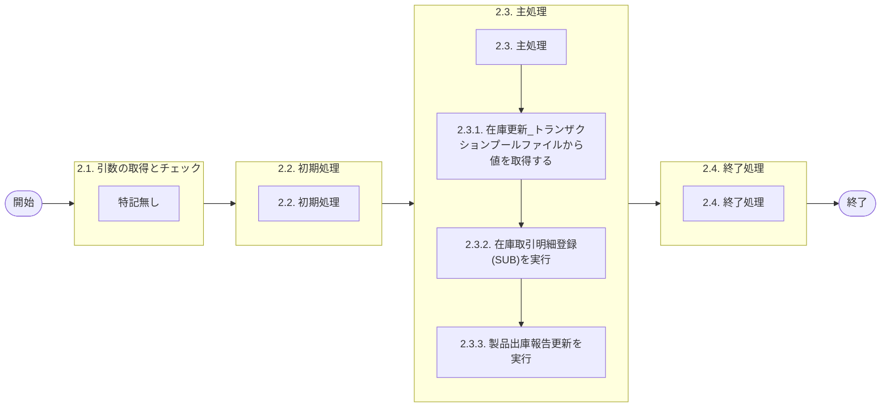

# 0. 表紙

| モジュール名 | プログラムID | プログラム名     |
| ------------ | ------------ | ---------------- |
| IC           | LDAS0423     | 在庫取引明細登録 |

| RFC | Version | 更新日     |     更新者     | 更新内容 | 確認日     | 確認者 | 承認日     | 承認者 |
| --- | :-----: | ---------- | :------------: | -------- | ---------- | :----: | ---------- | :----: |
| -   |  1.0.0  | 2025/10/07 | オヘダイチロー | 初版作成 | 2025/XX/XX |  XXX  | 2025/XX/XX |  XXX  |

## 1. 処理概要

### 1.1. 機能概要

本機能は、以下の処理を通じて在庫取引明細 (ld_trn_trans) テーブルにデータを登録を行います。

1. 在庫更新_トランザクションプールファイル (ld_trn_update_t) テーブルから値を取得する
2. 在庫取引明細登録(SUB) (LDAS0424) を呼び出し、在庫取引明細 (ld_trn_trans) テーブルにデータを登録を行います。
3. 製品完成報告用カードを出力する場合、製品出庫報告更新 (LDAS2027) を呼び出します。

### 1.2. 処理概要フロー



### 1.3. プログラム入出力パラメータ

#### 1.3.1. 引数

| No. | パラメータ論理名           | パラメータ物理名        | 属性    | 備考 |
| --- | -------------------------- | ----------------------- | ------- | ---- |
| 1   | TP処理番号                 | pn_operation_no         | INTEGER |      |
| 2   | TP処理明細番号             | pn_operation_seq        | INTEGER |      |
| 3   | TP処理枝番                 | pn_operation_brn        | INTEGER |      |
| 4   | IC工場処理日               | ps_ic_slip_date         | VARCHAR |      |
| 5   | 品目番号                   | ps_itemno               | VARCHAR |      |
| 6   | 供給者                     | ps_supplier             | VARCHAR |      |
| 7   | 使用者                     | ps_usercd               | VARCHAR |      |
| 8   | 内部トランザクションコード | ps_inter_txn            | VARCHAR |      |
| 9   | ソースコード               | ps_source               | VARCHAR |      |
| 10  | 処理コード                 | ps_code                 | VARCHAR |      |
| 11  | 入庫数                     | pn_in_qty               | DECIMAL |      |
| 12  | 出庫数                     | pn_out_qty              | DECIMAL |      |
| 13  | 手持在庫数                 | pn_oh_qty               | DECIMAL |      |
| 14  | 担当課                     | ps_org_section_mrp      | VARCHAR |      |
| 15  | 担当者                     | ps_org_person_mrp       | VARCHAR |      |
| 16  | 品目タイプ                 | ps_item_type            | VARCHAR |      |
| 17  | AIRSサイン                 | ps_airs_sign            | VARCHAR |      |
| 18  | オーダー番号               | ps_order_no             | VARCHAR |      |
| 19  | オーダー/所要数            | pn_order_qty            | DECIMAL |      |
| 20  | 納入日                     | ps_due_date             | VARCHAR |      |
| 21  | 親品目番号                 | ps_parent_itemno        | VARCHAR |      |
| 22  | 親供給者                   | ps_parent_supplier      | VARCHAR |      |
| 23  | 親使用者                   | ps_parent_usercd        | VARCHAR |      |
| 24  | 独立需要送り先区分         | ps_ind_user_class       | VARCHAR |      |
| 25  | 独立需要送り先コード       | ps_ind_user_code        | VARCHAR |      |
| 26  | 生試初品区分               | ps_pilot_class          | VARCHAR |      |
| 27  | フリーコメント             | ps_remark               | VARCHAR |      |
| 28  | 相手先システム識別         | ps_request_system_code  | VARCHAR |      |
| 29  | 費用振替先区分             | ps_transfer_class       | VARCHAR |      |
| 30  | 費用振替先コード           | ps_transfer_code        | VARCHAR |      |
| 31  | 勘定科目コード             | ps_account_heading      | VARCHAR |      |
| 32  | 目的No                     | ps_budget_no            | VARCHAR |      |
| 33  | 受払種別コード             | ps_account_code_sales   | VARCHAR |      |
| 34  | 振替理由コード             | ps_transfer_reason_code | VARCHAR |      |

#### 1.3.2. 戻り値

| No. | パラメータ論理名 | パラメータ物理名 | 属性    | 備考 |
| --- | ---------------- | ---------------- | ------- | ---- |
| 1   | 処理ステータス   | rn_status        | INTEGER |      |
| 2   | SQLコード        | rs_sql_code      | VARCHAR |      |
| 3   | エラーコード     | rs_err_code      | VARCHAR |      |
| 4   | エラーメッセージ | rs_err_msg       | VARCHAR |      |
| 5   | エラー位置       | rs_err_focus     | VARCHAR |      |
| 6   | 展開枝番         | rn_exp_brn       | INTEGER |      |

### 1.4. その他制御・要件

| 排他制御 |      |      |
| -------- | ---- | ---- |
| 楽観     | 悲観 | 無し |
| ●       | -    | -    |

| 項目               | 制約・制御・要件など | 記載内容説明                                                     |
| ------------------ | -------------------- | ---------------------------------------------------------------- |
| パフォーマンス要件 | 特になし。           | 特別なパフォーマンス要件がある場合に要件内容とその対処法を記述。 |

### 1.5. 入出力一覧

| No | 入出力対象 | 名称                                    | 物理名称              | ID       | C | R  | U | D | 備考 |
| -- | ---------- | --------------------------------------- | --------------------- | -------- | - | -- | - | - | ---- |
| 1  | テーブル   | 在庫更新_トランザクションプールファイル | ld_trn_update_tp      |          | - | ○ | - | - |      |
| 2  | テーブル   | 機能オプションパラメータ                | lz_function_parameter |          | - | ○ | - | - |      |
| 3  | テーブル   | 品目共通                                | la_itemcomn           |          | - | ○ | - | - |      |
| 4  | 共通関数   | 在庫取引明細登録(SUB)                   |                       | LDAS0424 |   |    |   |   |      |
| 5  | 共通関数   | 製品出庫報告更新                        |                       | LDAS2027 |   |    |   |   |      |

## 2. 詳細処理

### 2.1. 引数の取得とチェック

特記なし

### 2.2. 初期処理

- 展開枝番 (戻り値) の値セット

```sql
  rn_exp_brn := pn_operation_brn ＋ 1;  -- 展開枝番 := TP処理枝番 ＋ 1
```

### 2.3. 主処理

### 2.3.1. 在庫更新_トランザクションプールファイルから値を取得する

在庫更新_トランザクションプールファイル（ld_trn_update_tp）テーブルから必要な値を取得します。

1. 在庫更新_トランザクションプールファイル（ld_trn_update_tp）テーブルに対して、指定された条件に一致するレコードの件数を探します。

```sql
if EXISTS(SELECT 1
      FROM ld_trn_update_tp
     WHERE operation_no = pn_operation_no          --TP処理番号
       AND operation_seq = pn_operation_seq;)THEN  --TP処理明細番号
```

2. 件数が 1件以上あれば、同じ条件の中で 必要な値を取得します。

```sql
   SELECT input_user_id, 　--入力ユーザーID
          operation_id,  　--処理識別
          control_class,  　--変更区分
          itemno,  　--品目番号
          supplier,  　--供給者
          usercd,   --使用者
          order_no,  　--オーダー番号
          card_id,  　--カード識別
          vendor_code, 　-- ベンダーコード
          slip_no,    --照合番号
          qty,  　--数量
          input_date,  　--起票日
          reason_code,  　--理由コード
          rp_process,  　--責任工程
          rp_shop_class, 　--責任職場/メーカー区分
          rp_shop_code, 　--責任職場/メーカー
          assy_line, 　--組立ライン
          assy_seq,  　--組立順序番号
          amount, 　--金額
          mv_usercd,  　--移動先使用者
          transfer_class, 　--費用振替先区分
          transfer_code,  　--費用振替先コード
          account_heading, 　--勘定科目コード
          budget_no, 　--目的No
          account_code_sales, 　--受払種別コード
          in_process_sign,  　--仕掛サイン
          invoice_no, 　--インボイスNo
          bl_no,  　--B/LNo
          case_no, 　--ケースNo
          case_mark_order_no,  　--ケースマークオーダ番号
          gsdm_order_no, 　--G-SDMオーダー番号
          external_sales_flg,  　--外売品フラグ
          handling_unit_id, 　--HU-ID
          strc_lt_proc_no,  　--構成LT用工程番号
          cc_itemno, 　--原価用品目番号
          cc_supplier,  　--原価用供給者
          cc_usercd, 　--原価用使用者
          cc_order_no 　--原価用オーダー番号
      INTO STRICT
          ls_input_user_id, 
          ls_input_operation_id,  
          ls_input_control_class,  
          ls_input_itemno,  　
          ls_input_supplier,  
          ls_input_usercd,  
          ls_input_order_no,  
          ls_input_card_id,  　
          ls_input_vendor_code, 
          ls_input_slip_no,   
          ln_input_qty,  
          ls_input_date,  
          ls_input_reason_code,  
          ls_input_rp_process,  
          ls_input_rp_shop_class, 
          ls_input_rp_shop_code, 
          ls_input_assy_line, 
          ls_input_assy_seq,  
          ln_input_amount, 　
          ls_input_mv_usercd,  　
          ls_input_transfer_class, 　
          ls_input_transfer_code,  　
          ls_input_account_heading,
          ls_input_budget_no, 　
          ls_input_account_code_sales, 　
          ls_input_in_process_sign,  
          ls_invoice_no, 　
          ls_bl_no,  
          ls_case_no, 
          ls_case_mark_order_no,  
          ls_gsdm_order_no, 　
          ls_external_sales_flg,  　
          ls_handling_unit_id, 　
          ls_strc_lt_proc_no,  
          ls_cc_itemno, 　
          ls_cc_supplier,  
          ls_cc_usercd, 
          ls_cc_order_no 　
      FROM ld_trn_update_tp
     WHERE operation_no = pn_operation_no      --TP処理番号
       AND operation_seq = pn_operation_seq;   --TP処理明細番号
```

3. 件数が0件であれば、
   処理ステータスに "-2" (異常終了)
   エラーコードに 'ld.E.LDP10011'
   エラーメッセージ: 処理内部にて引数値エラーが発生しました  システム管理者に連絡してください
   エラー位置に 'LDAS0423'　を設定し、例外（エラー）を発生させて処理を中断します。

```sql
  ELSE
        rn_status := -2;  --処理ステータス
        rs_err_code := 'ld.E.LDP10011';  --エラーコード
        rs_err_msg := '処理内部にて引数値エラーが発生しました  システム管理者に連絡してください';
        rs_err_focus := 'LDAS0423';  --エラー位置
        RAISE EXCEPTION '';
  END IF;
```

### 2.3.2. 在庫取引明細登録(SUB)を実行

1. 在庫調整の判別

   内部トランザクションコードが '63' ( 在庫調整 (+) ) の場合は、
   入力処理識別に 'LD78'(在庫調整)
   入力変更区分に '1' (在庫増) を設定する

   内部トランザクションコードが '64' ( 在庫調整 (-) )の場合は、
   入力処理識別に 'LD78'(在庫調整)
   入力変更区分に '2' (在庫減) を設定する

```sql
    IF ps_inter_txn = '63' THEN　--内部トランザクションコード
        ls_input_operation_id 　:= 'LD78';  --入力処理識別
        ls_input_control_class  := '1';  --入力変更区分
    ELSE IF ps_inter_txn = '64' THEN
        ls_input_operation_id   := 'LD78'; 
        ls_input_control_class  := '2';
    END IF;
```

2. 在庫取引明細テーブルにデータを登録

   在庫取引明細登録(SUB) (LDAS0424) を呼び出し、
   引数と在庫更新_トランザクションプールファイル (ld_trn_update_t) テーブルから
   取得した値をパラメータとして渡す。

```sql
    SELECT * 
      INTO STRICT
           ln_sub_sp_status, --処理ステータス
           ls_sub_sql_code, --SQLコード
           ls_sub_err_code,  --エラーコード
           ls_sub_err_msg, --エラーメッセージ
           ls_sub_err_focus --エラー位置
      FROM ldas0424(pn_operation_no, 　--TP処理番号
                    pn_operation_seq,　--TP処理明細番号
                    pn_operation_brn,  　--TP処理枝番
                    ps_ic_slip_date,  　--IC工場処理日
           　　　　　ps_itemno,  　--品目番号
                    ps_supplier,  　--供給者
                    ps_usercd,  　--使用者
                    ps_inter_txn,  　--内部トランザクションコード
                    ps_source,  　--ソースコード
                    ps_code,  　--処理コード
                    ls_input_operation_id,  --入力処理識別
                    ls_input_control_class,   -- 入力変更区分
                    '0',  --IA処理済みサイン
                    '0',  --受領データ作成済サイン
                    ls_input_date,  --起票日
                    pn_in_qty,  　--入庫数
                    pn_out_qty, 　-- 出庫数
                    pn_oh_qty,  　--手持在庫数
                    ps_org_section_mrp,  　--担当課
                    ps_org_person_mrp,  　--担当者
                    ps_item_type,  　--品目タイプ
                    ps_airs_sign, 　-- AIRSサイン
                    ps_order_no, 　-- オーダー番号
                    pn_order_qty,   　-- オーダー/所要数
                    ps_due_date,   　-- 納入日
                    ps_parent_itemno,   　-- 親品目番号
                    ps_parent_supplier,   　--親供給者 
                    ps_parent_usercd,  　--親使用者 
                    ps_ind_user_class, 　--独立需要送り先区分  
                    ps_ind_user_code, 　-- 独立需要送り先コード 
                    ps_pilot_class, 　--生試初品区分  
                    ps_remark, 　--フリーコメント  
                    ps_request_system_code, 　-- 相手先システム識別 
                    ps_transfer_class,  　--費用振替先区分 
                    s_transfer_code, 　--費用振替先コード  
                    ps_account_heading, 　--勘定科目コード  
                    ps_budget_no, 　--目的No  
                    ps_account_code_sales, 　--受払種別コード 
                    ps_transfer_reason_code, 　--振替理由コード  
                    ls_input_itemno,  --入力品目番号
                    ls_input_supplier,  --入力供給者
                    ls_input_usercd,  --入力使用者  
                    ls_input_order_no,  --入力オーダ番号  
                    ls_input_card_id,  --入力カード識別 
                    ls_input_vendor_code,  --入力ベンダーコード  
                    ls_input_slip_no,  --入力照合番号  
                    ln_input_qty,  --入力数量  
                    ls_input_reason_code,  --入力理由コード  
                    ls_input_rp_process,  --入力責任工程  
                    ls_input_rp_shop_class,  --入力責任職場／メーカー区分  
                    ls_input_rp_shop_code,  --入力責任職場／メーカー  
                    ls_input_assy_line,  --入力組立ライン  
                    ls_input_assy_seq,  --入力組立順序番号  
                    ln_input_amount,  --入力金額  
                    ls_input_mv_usercd,  --入力移動先使用者  
                    ls_input_transfer_class,  --入力費用振替先区分  
                    ls_input_transfer_code,   --入力費用振替先コード 
                    ls_input_account_heading,  --入力勘定科目コード  
                    ls_input_budget_no,  --入力目的No  
                    ls_input_account_code_sales,  --入力受払種別コード  
                    ls_input_in_process_sign,  --入力仕掛サイン  
                    ls_invoice_no,  --インボイスNo  
                    ls_bl_no,  --B/LNo  
                    ls_case_mark_order_no,  --ケースマークオーダ番号  
                    ls_case_no,  --ケースNo  
                    ls_input_user_id,  --入力ユーザーID  
                    ls_gsdm_order_no,  --G-SDMオーダー番号  
                    ls_external_sales_flg,  --外売品フラグ  
                    ls_handling_unit_id,  --HU-ID  
                    ls_strc_lt_proc_no,  -- 構成LT用工程番号 
                    ls_cc_itemno,  --原価用品目番号  
                    ls_cc_supplier,  --原価用供給者  
                    ls_cc_usercd,  --原価用使用者  
                    ls_cc_order_no);  --原価用オーダー番号
```

　 処理ステータスが '0' (正常処理) 以外の場合
       処理ステータス、SQLコード、エラーコード、エラーメッセージ、エラー位置に変数を設定
       例外（エラー）を発生させて処理を中断します。

```sql
    IF ln_sub_sp_status <> 0 THEN  --処理ステータス
        rn_status := ln_sub_sp_status;
        rs_sql_code := ls_sub_sql_code;  --SQLコード
        rs_err_code := ls_sub_err_code;  --エラーコード
        rs_err_msg := ls_sub_err_msg;   --エラーメッセージ
        rs_err_focus := ls_sub_err_focus;  --エラー位置
        RAISE EXCEPTION '';
    END IF;
```

### 2.3.3. 製品出庫報告更新を実行

※製品完成報告用カードを出力する場合のみ

以下の条件をすべて満たす場合に処理を実行する：

1. 機能オプションパラメータ (lz_function_parameter) テーブルにおいて、
   システムコードが 'LE' (MRP)
   機能識別IDが 'LEC0002' (製品完成報告カードを出力するか否か)
   選択フラグが 'T' (出力する)
   オプションコードが '1' (出力する) のレコードが存在する
3. 品目共通 (la_itemcomn ) テーブルにおいて、引数で渡された品目番号と一致し、
   品目クラスが 'E' (製品) であるレコードが存在する
   　
4. 引数の内部トランザクションコードが
   '22' (完成報告)
   '42' (完成報告 訂正)
   '69' (製品出庫報告子部品 (+) )
   '70' (製品出庫報告子部品 (-) )のいずれかである
5. 引数のソースコードが '0' である

```sql
   IF EXISTS (SELECT 1
                 FROM lz_function_parameter
                WHERE system_code = 'LE'  --システムコード
                  AND function_id = 'LEC0002' --機能識別ID
                  AND select_flg = 'T'　--選択フラグ
                  AND option_code = '1') AND   --オプションコード
       EXISTS (SELECT 1
                 FROM la_itemcomn 
                WHERE itemno = ps_itemno --品目番号
                  AND item_class = 'E') AND  --品目クラス
                  ps_inter_txn IN ('22','42','69','70') AND  --内部トランザクションコード
                  ps_source = '0' THEN  --ソースコード
```

   製品出庫報告更新 (LDAS2027) を呼び出し、
   引数と在庫更新_トランザクションプールファイル (ld_trn_update_t) テーブルから取得した値をパラメータとして渡す。

```sql
        SELECT * 
          INTO STRICT
               ln_sub_sp_status, --処理ステータス
               ls_sub_sql_code, --SQLコード
               ls_sub_err_code,  --エラーコード
               ls_sub_err_msg, --エラーメッセージ
               ls_sub_err_focus --エラー位置
          FROM ldas2027(ps_inter_txn, --内部トランザクションコード
                        ps_itemno, --品目番号
                        ps_supplier,  --供給者
                        ps_usercd, --使用者
                        ps_order_no,  --オーダー番号
                        ps_due_date,  --納入日
                        pn_order_qty,  --オーダー/所要数
                        ln_input_qty,  --入力数量
                        ps_ic_slip_date, --IC工場処理日 
                        ls_input_user_id);  --入力ユーザーID 
```

  処理ステータスが '0'  (正常処理) 以外の場合
   処理ステータス、SQLコード、エラーコード、エラーメッセージ、エラー位置に変数を設定
   例外（エラー）を発生させて処理を中断します。

```sql
   IF ln_sub_sp_status <> 0 THEN   --処理ステータス
        rn_status := ln_sub_sp_status;  
        rs_sql_code := ls_sub_sql_code;  --SQLコード
        rs_err_code := ls_sub_err_code;  --エラーコード
        rs_err_msg := ls_sub_err_msg;   --エラーメッセージ
        rs_err_focus := ls_sub_err_focus;  --エラー位置
        RAISE EXCEPTION '';
    END IF;
  END IF;
```

### 2.4. 終了処理

- 正常終了処理を行う

| No. | 戻り値           | 属性    | 設定値   |
| --- | ---------------- | ------- | -------- |
| 1   | 処理ステータス   | INTEGER | 0        |
| 2   | SQL コード       | VARCHAR | スペース |
| 3   | エラーコード     | VARCHAR | スペース |
| 4   | エラーメッセージ | VARCHAR | スペース |
| 5   | エラー位置       | VARCHAR | スペース |

## 3. 補足説明

### 3.1. 戻り値について

- ステータスについて
  - 0 : Normal End
  - -1 : Abnormal End
  - -2 : PGM エラー

### 3.2. エラー発生時の対応について

- RAISE EXCEPTIONのエラーが発生した場合、処理終了
- SQL エラーが発生した場合、エラーログを出力して処理終了
  | No. | 戻り値           | 属性    | 設定値   |
  | --- | ---------------- | ------- | -------- |
  | 1   | 処理ステータス   | INTEGER | -1       |
  | 2   | SQL コード       | VARCHAR | SQLSTATE |
  | 3   | エラーコード     | VARCHAR | スペース |
  | 4   | エラーメッセージ | VARCHAR | SQLERRM  |
  | 5   | エラー位置       | VARCHAR | LDAS0423 |
