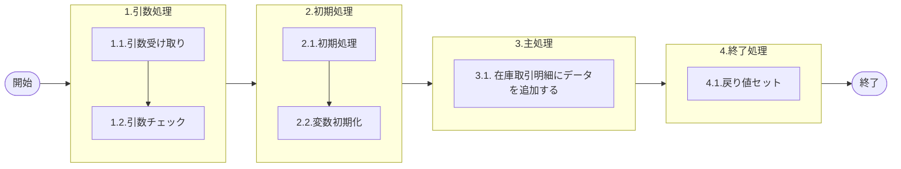

# 0. 表紙

| モジュール名 | プログラムID | プログラム名          |
| ------------ | ------------ | --------------------- |
| IC           | LDAS0424     | 在庫取引明細登録用SUB |

| RFC | Version | 更新日     |     更新者     | 更新内容 | 確認日     | 確認者 | 承認日     | 承認者 |
| --- | :-----: | ---------- | :------------: | -------- | ---------- | :----: | ---------- | :----: |
| -   |  1.0.0  | 2025/10/07 | オヘダイチロー | 初版作成 | 2025/XX/XX |  XXX  | 2025/XX/XX |  XXX  |

## 1. 処理概要

### 1.1. 機能概要

本機能は、 在庫取引明細 (ld_trn_trans) テーブルにデータを追加する。
※在庫取引明細登録 (LDAS0423) から呼び出されるSP

### 1.2. 処理概要フロー



### 1.3. プログラム入出力パラメータ

#### 1.3.1. 引数

| No. | パラメータ論理名           | パラメータ物理名            | 属性    | 備考 |
| --- | -------------------------- | --------------------------- | ------- | ---- |
| 1   | TP処理番号                 | pn_operation_no             | INTEGER |      |
| 2   | TP処理明細番号             | pn_operation_seq            | INTEGER |      |
| 3   | TP処理枝番                 | pn_operation_brn            | INTEGER |      |
| 4   | IC工場処理日               | ps_ic_slip_date             | VARCAHR |      |
| 5   | 品目番号                   | ps_itemno                   | VARCAHR |      |
| 6   | 供給者                     | ps_supplier                 | VARCAHR |      |
| 7   | 使用者                     | ps_usercd                   | VARCAHR |      |
| 8   | 内部トランザクションコード | ps_inter_txn                | VARCAHR |      |
| 9   | ソースコード               | ps_source                   | VARCAHR |      |
| 10  | 処理コード                 | ps_code                     | VARCAHR |      |
| 11  | 入力処理識別               | ps_input_operation_id       | VARCAHR |      |
| 12  | 入力変更区分               | ps_input_control_class      | VARCAHR |      |
| 13  | IA処理済みサイン           | ps_ia_sign                  | VARCAHR |      |
| 14  | 受領データ作成済サイン     | ps_receive_data_sign        | VARCAHR |      |
| 15  | 起票日                     | ps_input_date               | VARCAHR |      |
| 16  | 入庫数                     | pn_in_qty                   | DECIMAL |      |
| 17  | 出庫数                     | pn_out_qty                  | DECIMAL |      |
| 18  | 手持在庫数                 | pn_oh_qty                   | DECIMAL |      |
| 19  | 担当課                     | ps_org_section_mrp          | VARCAHR |      |
| 20  | 担当者                     | ps_org_person_mrp           | VARCAHR |      |
| 21  | 品目タイプ                 | ps_item_type                | VARCAHR |      |
| 22  | AIRSサイン                 | ps_airs_sign                | VARCAHR |      |
| 23  | オーダー番号               | ps_order_no                 | VARCAHR |      |
| 24  | オーダー/所要数            | pn_order_qty                | DECIMAL |      |
| 25  | 納入日                     | ps_due_date                 | VARCAHR |      |
| 26  | 親品目番号                 | ps_parent_itemno            | VARCAHR |      |
| 27  | 親供給者                   | ps_parent_supplier          | VARCAHR |      |
| 28  | 親使用者                   | ps_parent_usercd            | VARCAHR |      |
| 29  | 独立需要送り先区分         | ps_ind_user_class           | VARCAHR |      |
| 30  | 独立需要送り先コード       | ps_ind_user_code            | VARCAHR |      |
| 31  | 生試初品区分               | ps_pilot_class              | VARCAHR |      |
| 32  | フリーコメント             | ps_remark                   | VARCAHR |      |
| 33  | 相手先システム識別         | ps_request_system_code      | VARCAHR |      |
| 34  | 費用振替先区分             | ps_transfer_class           | VARCAHR |      |
| 35  | 費用振替先コード           | ps_transfer_code            | VARCAHR |      |
| 36  | 勘定科目コード             | ps_account_heading          | VARCAHR |      |
| 37  | 目的No                     | ps_budget_no                | VARCAHR |      |
| 38  | 受払種別コード             | ps_account_code_sales       | VARCAHR |      |
| 39  | 振替理由コード             | ps_transfer_reason_code     | VARCAHR |      |
| 40  | 入力品目番号               | ps_input_itemno             | VARCAHR |      |
| 41  | 入力供給者                 | ps_input_supplier           | VARCAHR |      |
| 42  | 入力使用者                 | ps_input_usercd             | VARCAHR |      |
| 43  | 入力オーダ番号             | ps_input_order_no           | VARCAHR |      |
| 44  | 入力カード識別             | ps_input_card_id            | VARCAHR |      |
| 45  | 入力ベンダーコード         | ps_input_vendor_code        | VARCAHR |      |
| 46  | 入力照合番号               | ps_input_slip_no            | VARCAHR |      |
| 47  | 入力数量                   | pn_input_qty                | DECIMAL |      |
| 48  | 入力理由コード             | ps_input_reason_code        | VARCAHR |      |
| 49  | 入力責任工程               | ps_input_rp_process         | VARCAHR |      |
| 50  | 入力責任職場／メーカー区分 | ps_input_rp_shop_class      | VARCAHR |      |
| 51  | 入力責任職場／メーカー     | ps_input_rp_shop_code       | VARCAHR |      |
| 52  | 入力組立ライン             | ps_input_assy_line_code     | VARCAHR |      |
| 53  | 入力組立順序番号           | ps_input_assy_seq           | VARCAHR |      |
| 54  | 入力金額                   | ps_input_amount             | DECIMAL |      |
| 55  | 入力移動先使用者           | ps_input_mv_usercd          | VARCAHR |      |
| 56  | 入力費用振替先区分         | ps_input_transfer_class     | VARCAHR |      |
| 57  | 入力費用振替先コード       | ps_input_transfer_code      | VARCAHR |      |
| 58  | 入力勘定科目コード         | ps_input_account_heading    | VARCAHR |      |
| 59  | 入力目的No                 | ps_input_budget_no          | VARCAHR |      |
| 60  | 入力受払種別コード         | ps_input_account_code_sales | VARCAHR |      |
| 61  | 入力仕掛サイン             | ps_input_in_process_sign    | VARCAHR |      |
| 62  | インボイスNo               | ps_invoice_no               | VARCAHR |      |
| 63  | B/LNo                      | ps_bl_no                    | VARCAHR |      |
| 64  | ケースマークオーダ番号     | ps_case_mark_order_no       | VARCAHR |      |
| 65  | ケースNo                   | ps_case_no                  | VARCAHR |      |
| 66  | 登録者ID                   | ps_register_user_id         | VARCAHR |      |
| 67  | G-SDMオーダー番号          | ps_gsdm_order_no            | VARCAHR |      |
| 68  | 外売品フラグ               | ps_external_sales_flg       | VARCAHR |      |
| 69  | HU-ID                      | ps_handling_unit_id         | VARCAHR |      |
| 70  | 構成LT用工程番号           | ps_strc_lt_proc_no          | VARCAHR |      |
| 71  | 原価用品目番号             | ps_cc_itemno                | VARCAHR |      |
| 72  | 原価用供給者               | ps_cc_supplier              | VARCAHR |      |
| 73  | 原価用使用者               | ps_cc_usercd                | VARCAHR |      |
| 74  | 原価用オーダー番号         | ps_cc_order_no              | VARCAHR |      |

#### 1.3.2. 戻り値

| No. | パラメータ論理名 | パラメータ物理名 | 属性    | 備考 |
| --- | ---------------- | ---------------- | ------- | ---- |
| 1   | 処理ステータス   | rn_status        | INTEGER |      |
| 2   | SQLコード        | rs_sql_code      | VARCHAR |      |
| 3   | エラーコード     | rs_err_code      | VARCHAR |      |
| 4   | エラーメッセージ | rs_err_msg       | VARCHAR |      |
| 5   | エラー位置       | rs_err_focus     | VARCHAR |      |

### 1.4. その他制御・要件

| 排他制御 |      |      |
| -------- | ---- | ---- |
| 楽観     | 悲観 | 無し |
| ●       | -    | -    |

| 項目               | 制約・制御・要件など | 記載内容説明                                                     |
| ------------------ | -------------------- | ---------------------------------------------------------------- |
| パフォーマンス要件 | 特になし。           | 特別なパフォーマンス要件がある場合に要件内容とその対処法を記述。 |

### 1.5. 入出力一覧

| No | 入出力対象 | 名称         | 物理名称     | C  | R | U | D | 備考 |
| -- | ---------- | ------------ | ------------ | -- | - | - | - | ---- |
| 1  | テーブル   | 在庫取引明細 | ld_trn_trans | ○ | - | - | - |      |

## 2. 詳細処理

### 2.1. 引数の取得とチェック

特記なし

### 2.2. 初期処理

- システム日時の値セット

```sql
   ld_sysdatetime := statement_timestamp(); 
```

### 2.3. 主処理

### 2.3.1. 在庫取引明細テーブルにデータを追加する。

```sql
 INSERT
      INTO ld_trn_trans
           (operation_no,   --TP処理番号
            operation_seq,   --TP処理明細番号
            operation_brn,   --TP処理枝番  
            ic_slip_date,   --IC工場処理日  
            itemno,   --品目番号  
            supplier,   --供給者  
            usercd,   --使用者  
            ic_update_datetime,   --IC更新日時
            inter_txn,   --内部トランザクションコード  
            source,   --ソースコード  
            code,   --処理コード  
            input_operation_id,   --入力処理識別  
            input_control_class,   --入力変更区分  
            ia_sign,   --IA処理済みサイン  
            receive_data_sign,   --受領データ作成済サイン  
            input_date,   --起票日  
            in_qty,   --入庫数  
            out_qty,   --出庫数  
            oh_qty,   --手持在庫数  
            org_section_mrp,   --担当課  
            org_person_mrp,   --担当者  
            item_type,   --品目タイプ  
            airs_sign,   --AIRSサイン  
            order_no,   --オーダー番号  
            order_qty,   --オーダー/所要数  
            due_date,   --納入日  
            parent_itemno,   --親品目番号  
            parent_supplier,   --親供給者  
            parent_usercd,   --親使用者  
            ind_user_class,   --独立需要送り先区分  
            ind_user_code,   --独立需要送り先コード  
            pilot_class,   --生試初品区分  
            remark,   --フリーコメント  
            request_system_code,   --相手先システム識別  
            transfer_class,   --費用振替先区分  
            transfer_code,   --費用振替先コード  
            account_heading,   --勘定科目コード  
            budget_no,   --目的No  
            account_code_sales,   --受払種別コード  
            transfer_reason_code,   --振替理由コード  
            input_itemno,   --入力品目番号  
            input_supplier,   --入力供給者  
            input_usercd,   --入力使用者  
            input_order_no,   --入力オーダ番号  
            input_card_id,   --入力カード識別  
            input_vendor_code,   --入力ベンダーコード  
            input_slip_no,   --入力照合番号  
            input_qty,   --入力数量  
            input_reason_code,   --入力理由コード  
            input_rp_process,   --入力責任工程  
            input_rp_shop_class,   --入力責任職場／メーカー区分  
            input_rp_shop_code,   --入力責任職場／メーカー  
            input_assy_line_code,   --入力組立ライン  
            input_assy_seq,   --入力組立順序番号  
            input_amount,   --入力金額  
            input_mv_usercd,   --入力移動先使用者  
            input_transfer_class,   --入力費用振替先区分  
            input_transfer_code,   --入力費用振替先コード  
            input_account_heading,   --入力勘定科目コード  
            input_budget_no,   --入力目的No  
            input_account_code_sales,   --入力受払種別コード  
            input_in_process_sign,   --入力仕掛サイン  
            invoice_no,   --インボイスNo  
            bl_no,   --B/LNo  
            case_mark_order_no,   --ケースマークオーダ番号  
            case_no,   --ケースNo  
            register_user_id,   --登録者ID  
            gsdm_order_no,   --G-SDMオーダー番号  
            external_sales_flg,   --外売品フラグ  
            handling_unit_id,   --HU-ID 
            strc_lt_proc_no,   --構成LT用工程番号  
            cc_itemno,   --原価用品目番号  
            cc_supplier,   --原価用供給者  
            cc_usercd,   --原価用使用者  
            cc_order_no,   --原価用オーダー番号  
            update_counter,   --更新カウンタ
            create_datetime,   --登録日時  
            create_author,   --登録者
            create_pgmid,   --登録PGID  
            update_datetime,   --更新日時
            update_author,   --更新者  
            update_pgmid)   --更新PGID
    VALUES (pn_operation_no,  
            pn_operation_seq, 
            pn_peration_brn,
            ps_ic_slip_date,  
            ps_itemno,  
            ps_supplier, 
            ps_usercd,   
            ld_sysdatetime,
            ps_inter_txn, 
            ps_source,
            ps_code, 
            ps_input_operation_id,  
            ps_input_control_class, 
            ps_ia_sign,  
            ps_receive_data_sign,  
            ps_input_date, 
            pn_in_qty,  
            pn_out_qty, 
            pn_oh_qty, 
            ps_org_section_mrp,   
            ps_org_person_mrp,
            ps_item_type,
            ps_airs_sign,  
            ps_order_no,  
            pn_order_qty,
            ps_due_date,
            ps_parent_itemno, 
            ps_parent_supplier, 
            ps_parent_usercd, 
            ps_ind_user_class, 
            ps_ind_user_code,  
            ps_pilot_class,  
            ps_remark, 
            ps_request_system_code,  
            ps_transfer_class,  
            ps_transfer_code, 
            ps_account_heading, 
            ps_budget_no, 
            ps_account_code_sales,   
            ps_transfer_reason_code,  
            ps_input_itemno,  
            ps_input_supplier,   
            ps_input_usercd,  
            ps_input_order_no, 
            ps_input_card_id,   
            ps_input_vendor_code,   
            ps_input_slip_no,  
            pn_input_qty,   
            ps_input_reason_code,  
            ps_input_rp_process, 
            ps_input_rp_shop_class, 
            ps_input_rp_shop_code,  
            ps_input_assy_line_code, 
            ps_input_assy_seq,  
            pn_input_amount,  
            ps_input_mv_usercd,   
            ps_input_transfer_class,  
            ps_input_transfer_code,   
            ps_input_account_heading,  
            ps_input_budget_no,  
            ps_input_account_code_sales,  
            ps_input_in_process_sign,  
            ps_invoice_no,  
            ps_bl_no, 
            ps_case_mark_order_no,  
            ps_case_no,  
            ps_register_user_id,   
            ps_gsdm_order_no,   
            ps_external_sales_flg, 
            ps_handling_unit_id, 
            ps_strc_lt_proc_no,  
            ps_cc_itemno, 
            ps_cc_supplier, 
            ps_cc_usercd,  
            ps_cc_order_no,  
            0,
            ld_sysdatetime,  
            ps_register_user_id,
            'LDAS0424', 
            ld_sysdatetime,
            ps_register_user_id,  
            'LDAS0424');
```

### 2.4. 終了処理

- 正常終了処理を行う

| No. | 戻り値           | 属性    | 設定値         |
| --- | ---------------- | ------- | -------------- |
| 1   | 処理ステータス   | INTEGER | 0              |
| 2   | SQL コード       | VARCHAR | ' ' (スペース) |
| 3   | エラーコード     | VARCHAR | ' ' (スペース) |
| 4   | エラーメッセージ | VARCHAR | ' ' (スペース) |
| 5   | エラー位置       | VARCHAR | ' ' (スペース) |

## 3. 補足説明

### 3.1. 戻り値について

- ステータスについて
  - 0 : Normal End
  - -1 : Abnormal End
  - -2 : PGM エラー

### 3.2. エラー発生時の対応について

- SQL エラーが発生した場合、エラーログを出力して処理終了
  
  | No. | 戻り値           | 属性    | 設定値         |
  | --- | ---------------- | ------- | -------------- |
  | 1   | 処理ステータス   | INTEGER | -1             |
  | 2   | SQL コード       | VARCHAR | SQLSTATE       |
  | 3   | エラーコード     | VARCHAR | ' ' (スペース) |
  | 4   | エラーメッセージ | VARCHAR | SQLERRM        |
  | 5   | エラー位置       | VARCHAR | LDAS0424       |

### 3.3. 備考

在庫取引明細登録 (LDAS0423) から呼び出されるSP
