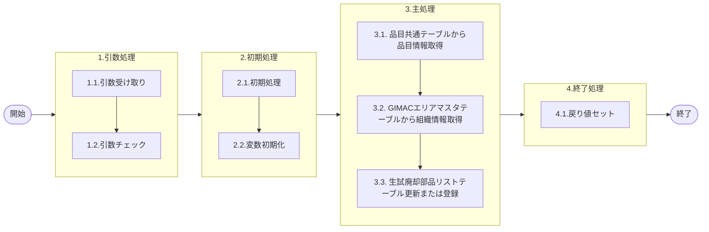

# 0. 表紙

| モジュール名 | プログラムID | プログラム名                   |
| ------------ | ------------ | ------------------------------ |
| IC           | LDAS0425     | 生試廃却部品リストテーブル登録 |

| RFC | Version | 更新日     |     更新者     | 更新内容 | 確認日     | 確認者 | 承認日     | 承認者 |
| --- | :-----: | ---------- | :------------: | -------- | ---------- | :----: | ---------- | :----: |
| -   |  1.0.0  | 2025/10/09 | オヘダイチロー | 初版作成 | 2025/XX/XX |  XXX  | 2025/XX/XX |  XXX  |

## 1. 処理概要

### 1.1. 機能概要

本機能は、以下の処理を通じて生試廃却部品リストテーブル (ld_trn_pilot_scrap_part_list) にデータを更新または登録を行います。

1. 品目共通 (la_itemcomn) テーブルから品目情報を取得する
2. GIMACエリアマスタ (la_area_master) テーブルから組織情報を取得する
3. 生試廃却部品リストテーブル (ld_trn_pilot_scrap_part_list) に該当するデータがあるか存在チェックを行う
   存在する場合: テーブルを更新する
   存在しない場合: テーブルにデータを登録する

### 1.2. 処理概要フロー



### 1.3. プログラム入出力パラメータ

#### 1.3.1. 引数

| No. | パラメータ論理名 | パラメータ物理名 | 属性    | 備考            |
| --- | ---------------- | ---------------- | ------- | --------------- |
| 1   | 品目番号         | ps_itemno        | VARCHAR | 必須            |
| 2   | 供給者           | ps_supplier      | VARCHAR | 必須            |
| 3   | 使用者           | ps_usercd        | VARCHAR | 必須            |
| 4   | 手持在庫数       | pn_oh_qty        | DECIMAL |                 |
| 5   | 保留在庫数       | pn_hold_qty      | DECIMAL | GIMACで新規追加 |
| 6   | 入力ユーザーID   | ps_input_user_id | VARCHAR |                 |
| 7   | IC工場処理日     | ps_ic_slip_date  | VARCHAR | 必須            |

#### 1.3.2. 戻り値ｘ

| No. | パラメータ論理名 | パラメータ物理名 | 属性    | 備考 |
| --- | ---------------- | ---------------- | ------- | ---- |
| 1   | 処理ステータス   | rn_status        | INTEGER |      |
| 2   | SQLコード        | rs_sql_code      | VARCAHR |      |
| 3   | エラーコード     | rs_err_code      | VARCAHR |      |
| 4   | エラーメッセージ | rs_err_msg       | VARCAHR |      |
| 5   | エラー位置       | rs_err_focus     | VARCAHR |      |

### 1.4. その他制御・要件

| 排他制御 |      |      |
| -------- | ---- | ---- |
| 楽観     | 悲観 | 無し |
| ●       | -    | -    |

| 項目               | 制約・制御・要件など | 記載内容説明                                                     |
| ------------------ | -------------------- | ---------------------------------------------------------------- |
| パフォーマンス要件 | 特になし。           | 特別なパフォーマンス要件がある場合に要件内容とその対処法を記述。 |

### 1.5. 入出力一覧

| No | 入出力対象 | 名称                       | 物理名称                     | C  | R  | U  | D | 備考           |
| -- | ---------- | -------------------------- | ---------------------------- | -- | -- | -- | - | -------------- |
| 1  | テーブル   | 品目共通                   | la_itemcomn                  | -  | ○ | -  | - |                |
| 2  | テーブル   | GIMACエリアマスタ          | la_area_master               | -  | ○ | -  | - | (旧)組織マスタ |
| 3  | テーブル   | SUマスタ                   | la_area_master_su            | -  | ○ | -  | - |                |
| 4  | テーブル   | 生試廃却部品リストテーブル | ld_trn_pilot_scrap_part_list | ○ | ○ | ○ | - |                |

## 2. 詳細処理

### 2.1. 引数の取得とチェック

特記なし

### 2.2. 初期処理

- システム日時セット

```sql
　ld_sysdatetime := statement_timestamp();
```

### 2.3. 主処理

### 2.3.1. 品目共通テーブルから品目情報を取得する

品目番号を条件に品目共通 (la_itemcomn) テーブルから品目分類コードを取得する。

```sql
　    SELECT reference_key --品目分類コード
      INTO STRICT
           ls_reference_key
      FROM la_itemcomn 
     WHERE itemno = ps_itemno; --品目番号
```

### 2.3.2. GIMACエリアマスタテーブルから組織情報を取得する

GIMACエリアマスタ（la_area_master）テーブルと、SUマスタ（la_area_master_su）テーブルを、
エリアコードをキーとして結合し、SUコードが引数で渡された引数.使用者と一致するレコードから、担当課および 担当者を取得する。

```sql
     SELECT area_section_code, area_person_code       --担当課, 担当者         
       INTO ls_area_section_code, ls_area_person_code  
       FROM la_area_master A, 
            la_area_master_su B 
     WHERE A.area_code = B.area_code -- エリアコード
       AND B.su_code = ps_usercd;  --SUコード
```

### 2.3.3. 生試廃却部品リストテーブル更新または登録

1. SU区分のセット
   供給者 = 使用者の場合、変数.SU区分に"1" (Ｓ＝Ｕ) を設定する
   そうでない場合は、変数.SU区分に"2" (Ｓ≠Ｕ) を設定する

```sql
    IF ps_supplier = ps_usercd THEN
        ls_su_class := '1'; --SU区分
　　ELSE
        ls_su_class := '2';
    END IF;
```

2. 生試廃却部品リストテーブル (ld_trn_pilot_scrap_part_list) に該当するデータがあるか存在チェックを行う

```sql
if EXISTS (SELECT 1
            FROM ld_trn_pilot_scrap_part_list
           WHERE itemno = ps_itemno
             AND supplier = ps_supplier 
             AND usercd = ps_usercd;)THEN
```

  2.1. データが存在する場合
   生試廃却部品リストテーブル (ld_trn_pilot_scrap_part_list) を更新する

- 担当課と担当者には、GIMACエリアマスタテーブルから取得した変数を代入する
- 品目分類コードには、品目共通テー部から取得した変数を代入する
- 廃却数に手持在庫数 (引数) を代入する

```sql
        UPDATE ld_trn_pilot_scrap_part_list
           SET org_section_mrp　= ls_area_section_code, -- 担当課(GIMACエリアマスタ)
               org_person_mrp   = ls_area_person_code,  -- 担当者(GIMACエリアマスタ)
               reference_key    = ls_reference_key, -- 品目分類コード(品目共通)
               ic_slip_date     = ps_ic_slip_date, --IC工場処理日
               scrap_qty        = pn_oh_qty,  --廃却数
               hold_qty         = pn_hold_qty,  --保留在庫数
               list_flg         = '0', --リスト出力フラグ
               update_counter   = update_counter + 1; --更新カウンタ
               update_datetime  = ld_sysdatetime,  --更新日時
               update_author    = ps_input_user_id, --更新者
               update_pgmid     = 'ldas0425'  --更新PGID
         WHERE itemno      = ps_itemno  
           AND supplier    = ps_supplier  
           AND usercd      = ps_usercd;  
```

  2.2. データが存在しない場合
  　生試廃却部品リストテーブル (ld_trn_pilot_scrap_part_list) にデータを登録する

- 担当課と担当者には、GIMACエリアマスタテーブルから取得した変数を代入する
- 品目分類コードには、品目共通テー部から取得した変数を代入する
- 廃却数に手持在庫数 (引数) を代入する

```sql
    ELSE
        INSERT INTO 生試廃却部品リストテーブル
            (itemno, supplier,
             usercd, su_class,
             org_section_mrp, org_person_mrp,
             reference_key, ic_slip_date, 
             scrap_qty, hold_qty, 
             list_flg, update_counter,
             create_datetime, create_author,  --登録日時, 登録者
             create_pgmid, update_datetime, --登録PGID
             update_author, update_pgmid)
        VALUES
            (ps_itemno, ps_supplier,
             ps_usercd, ls_su_class, 
             ls_area_section_code, ls_area_person_code,　--担当課, 担当者(GIMACエリアマスタ)
             ls_reference_key, ps_ic_slip_date, 　--品目分類コード(品目共通)
             pn_oh_qty, pn_hold_qty, 
             '0', 0,
             ld_sysdatetime, ps_input_user_id,
             'LDAS0425', ld_sysdatetime,
             ps_input_user_id, 'LDAS0425');
    END IF;
```

### 2.4. 終了処理

- 正常終了処理を行う

| No. | 戻り値           | 属性    | 設定値   |
| --- | ---------------- | ------- | -------- |
| 1   | 処理ステータス   | INTEGER | 0        |
| 2   | SQL コード       | VARCHAR | スペース |
| 3   | エラーコード     | VARCHAR | スペース |
| 4   | エラーメッセージ | VARCHAR | スペース |
| 5   | エラー位置       | VARCHAR | スペース |

## 3. 補足説明

### 3.1. 戻り値について

- ステータスについて
  - 0 : Normal End
  - -1 : Abnormal End
  - -2 : PGM エラー

### 3.2. エラー発生時の対応について

- SQL エラーが発生した場合、エラーログを出力して処理終了| No. | 戻り値           | 属性    | 設定値     |
  | --- | ---------------- | ------- | ---------- |
  | 1   | 処理ステータス   | INTEGER | -1         |
  | 2   | SQL コード       | VARCHAR | SQLSTATE   |
  | 3   | エラーコード     | VARCHAR | スペース   |
  | 4   | エラーメッセージ | VARCHAR | SQLERRM    |
  | 5   | エラー位置       | VARCHAR | 'LDAS0425' |
