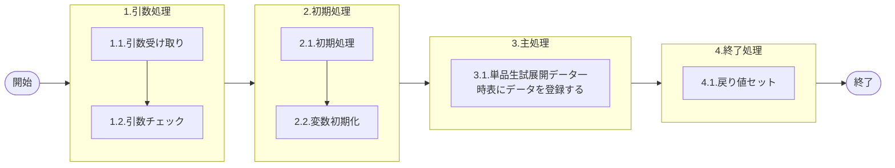

# 0. 表紙

| モジュール名 | プログラムID | プログラム名               |
| ------------ | ------------ | -------------------------- |
| IC           | LDAS0426     | Temp単品生試展開トラン登録 |

| RFC | Version | 更新日     |     更新者     | 更新内容 | 確認日     | 確認者 | 承認日     | 承認者 |
| --- | :-----: | ---------- | :------------: | -------- | ---------- | :----: | ---------- | :----: |
| -   |  1.0.0  | 2025/10/09 | オヘダイチロー | 初版作成 | 2025/XX/XX |  XXX  | 2025/XX/XX |  XXX  |

## 1. 処理概要

### 1.1. 機能概要

本機能は、引数を基に、単品生試展開データ一時表 (le_temp_pilot_exp) にデータを登録する。

### 1.2. 処理概要フロー



### 1.3. プログラム入出力パラメータ

#### 1.3.1. 引数

| No. | パラメータ論理名 | パラメータ物理名   | 属性    | 備考 |
| --- | ---------------- | ------------------ | ------- | ---- |
| 1   | レベル           | pn_level           | INTEGER |      |
| 2   | 番号             | pn_seq             | INTEGER |      |
| 3   | 品目番号         | ps_itemno          | VARCHAR |      |
| 4   | 供給者           | ps_supplier        | VARCHAR |      |
| 5   | 使用者           | ps_usercd          | VARCHAR |      |
| 6   | 数量             | pn_qty             | VARCHAR |      |
| 7   | 着手日           | ps_start_date      | VARCHAR |      |
| 8   | 品目タイプ       | ps_item_type       | VARCHAR |      |
| 9   | 品目クラス       | ps_item_class      | VARCHAR |      |
| 10  | 品目ステータス   | ps_item_status     | VARCHAR |      |
| 11  | 品目分類コード   | ps_reference_key   | VARCHAR |      |
| 12  | 品目名称         | ps_item_name       | VARCHAR |      |
| 13  | 製造リードタイム | pn_manuf_lt        | DECIMAL |      |
| 14  | 先行リードタイム | pn_precede_lt      | DECIMAL |      |
| 15  | 親品目番号       | ps_parent_itemno   | VARCHAR |      |
| 16  | 親供給者         | ps_parent_supplier | VARCHAR |      |
| 17  | 親使用者         | ps_parent_usercd   | VARCHAR |      |
| 18  | 構成連番         | ps_structure_seq   | VARCHAR |      |

#### 1.3.2. 戻り値

| No. | パラメータ論理名 | パラメータ物理名 | 属性    | 備考                                      |
| --- | ---------------- | ---------------- | ------- | ----------------------------------------- |
| 1   | 処理ステータス   | rn_status        | INTEGER | 0:正常終了, -1:SQLエラー終了, -2:異常終了 |
| 2   | SQLコード        | rs_sql_code      | VARCHAR |                                           |
| 3   | エラーコード     | rs_err_code      | VARCHAR |                                           |
| 4   | エラーメッセージ | rs_err_msg       | VARCHAR |                                           |
| 5   | エラー位置       | rs_err_focus     | VARCHAR |                                           |

### 1.4. その他制御・要件

| 排他制御 |      |      |
| -------- | ---- | ---- |
| 楽観     | 悲観 | 無し |
| ●       | -    | -    |

| 項目               | 制約・制御・要件など | 記載内容説明                                                     |
| ------------------ | -------------------- | ---------------------------------------------------------------- |
| パフォーマンス要件 | 特になし。           | 特別なパフォーマンス要件がある場合に要件内容とその対処法を記述。 |

### 1.5. 入出力一覧

| No | 入出力対象 | 名称                     | 物理名称          | C  | R | U | D | 備考   |
| -- | ---------- | ------------------------ | ----------------- | -- | - | - | - | ------ |
| 1  | テーブル   | 単品生試展開データ一時表 | le_temp_pilot_exp | ○ | - | - | - | 一時表 |

## 2. 詳細処理

### 2.1. 引数の取得とチェック

特記なし

### 2.2. 初期処理

特記なし

### 2.3. 主処理

引数を基に、単品生試展開データ一時表 (le_temp_pilot_exp) にデータを登録する。

```sql
    INSERT INTO le_temp_pilot_exp
    　　　　　　(level, --レベル
                seq,   --番号
                itemno, supplier,  --品目番号, 供給者
                usercd, qty,  --使用者, 数量
                start_date, item_type,   --着手日, 品目タイプ
                item_class, item_status,  --品目クラス, 品目ステータス
                reference_key, item_name,   --品目分類コード, 品目名称
                manuf_lt, precede_lt,  --製造リードタイム, 先行リードタイム
                parent_itemno, parent_supplier,   --親品目番号, 親供給者
                parent_usercd, structure_seq)  --親使用者, 構成連番
        VALUES(pn_level, pn_seq, 
               ps_itemno, ps_supplier, 
               ps_usercd, pn_qty,
               ps_start_date, ps_item_type, 
               ps_item_class, ps_item_status,
               ps_reference_key, ps_item_name, 
               pn_manuf_lt, pn_precede_lt,
               ps_parent_itemno, ps_parent_supplier, 
               ps_parent_usercd, ps_structure_seq);
```

### 2.4. 終了処理

- 正常終了処理を行う

| No. | 戻り値           | 属性    | 設定値   |
| --- | ---------------- | ------- | -------- |
| 1   | 処理ステータス   | INTEGER | 0        |
| 2   | SQL コード       | VARCHAR | スペース |
| 3   | エラーコード     | VARCHAR | スペース |
| 4   | エラーメッセージ | VARCHAR | スペース |
| 5   | エラー位置       | VARCHAR | スペース |

## 3. 補足説明

### 3.1. 戻り値について

- ステータスについて
  - 0 : Normal End
  - -1 : Abnormal End
  - -2 : PGM エラー

### 3.2. エラー発生時の対応について

- SQL エラーが発生した場合、エラーログを出力して処理終了
  | No. | 戻り値           | 属性    | 設定値   |
  | --- | ---------------- | ------- | -------- |
  | 1   | 処理ステータス   | INTEGER | -1       |
  | 2   | SQL コード       | VARCHAR | SQLSTATE |
  | 3   | エラーコード     | VARCHAR | スペース |
  | 4   | エラーメッセージ | VARCHAR | SQLERRM  |
  | 5   | エラー位置       | VARCHAR | LDAS0426 |
