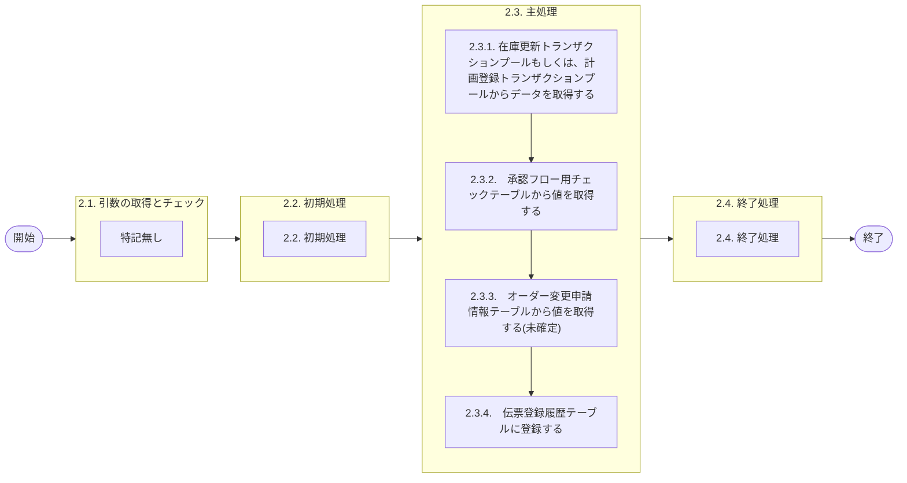

# 0. 表紙

| モジュール名 | プログラムID | プログラム名     |
| ------------ | ------------ | ---------------- |
| IC           | LDAS0427     | 伝票登録履歴登録 |

| RFC | Version | 更新日     |     更新者     | 更新内容 | 確認日     | 確認者 | 承認日     | 承認者 |
| --- | :-----: | ---------- | :------------: | -------- | ---------- | :----: | ---------- | :----: |
| -   |  1.0.0  | 2025/10/20 | オヘダイチロー | 初版作成 | 2025/XX/XX |  XXX  | 2025/XX/XX |  XXX  |

## 1. 処理概要

### 1.1. 機能概要

本機能は、以下の手順を通じて、各トランザクションプールファイルから値を抽出して伝票登録履歴に追加する。

1. 作業区分の値によって、どのテーブルから値を抽出するのかが変わる
   作成区分が '1'(計画登録処理) の場合、計画登録トランザクションプールファイル (le_trn_planning_tp) から値を抽出する
   作成区分が '2'(在庫更新処理) の場合、在庫更新トランザクションプールファイル (ld_trn_update_tp) から値を抽出する
2. 承認フロー用チェックテーブル (ld_trn_flow_check_tp) から値を取得する
3. オーダー変更申請情報 (le_order_change_information_app) テーブルから値を取得する (まだ未確定)
4. 伝票登録履歴 (ld_trn_slip_register_his) テーブルに登録する

### 1.2. 処理概要フロー



### 1.3. プログラム入出力パラメータ

#### 1.3.1. 引数

| No. | パラメータ論理名 | パラメータ物理名 | 属性    | 備考                         |
| --- | ---------------- | ---------------- | ------- | ---------------------------- |
| 1   | 作成区分         | ps_create_class  | VARCHAR | "01":計画登録、"02":在庫更新 |
| 2   | TP処理番号       | pn_operation_no  | INTEGER |                              |
| 3   | TP処理明細番号   | pn_operation_seq | INTEGER |                              |
| 4   | IC工場処理日     | ps_ic_slip_date  | VARCHAR |                              |

#### 1.3.2. 戻り値

| No. | パラメータ論理名 | パラメータ物理名 | 属性    | 備考 |
| --- | ---------------- | ---------------- | ------- | ---- |
| 1   | 処理ステータス   | rn_status        | INTEGER |      |
| 2   | SQLコード        | rs_sql_code      | VARCHAR |      |
| 3   | エラーコード     | rs_err_code      | VARCHAR |      |
| 4   | エラーメッセージ | rs_err_msg       | VARCHAR |      |
| 5   | エラー位置       | rs_err_focus     | VARCHAR |      |

### 1.4. その他制御・要件

### 1.5. 入出力一覧

| No | 入出力対象 | 名称                                   | 物理名称                        | C  | R  | U | D | 備考                       |
| -- | ---------- | -------------------------------------- | ------------------------------- | -- | -- | - | - | -------------------------- |
| 1  | テーブル   | 計画登録トランザクションプールファイル | le_trn_planning_tp              | -  | ○ | - | - |                            |
| 2  | テーブル   | 在庫更新トランザクションプールファイル | ld_trn_update_tp                | -  | ○ | - | - |                            |
| 3  | テーブル   | 承認フロー用チェックテーブル           | ld_trn_flow_check_tp            | -  | ○ | - | - |                            |
| 4  | テーブル   | オーダー変更申請情報                   | le_order_change_information_app | -  | ○ | - | - | (使用) 未確定              |
| 5  | テーブル   | 伝票登録履歴                           | ld_trn_slip_register_his        | ○ | -  | - | - | (旧)インプット履歴ファイル |

## 2. 詳細処理

### 2.1. 引数の取得とチェック

特記なし

### 2.2. 初期処理

- システム日時セット

```sql
ld_sysdatetime  := statement_timestamp();
```

判別変数セット

```sql
 ln_flag  := 0 ;
```

### 2.3. 主処理

### 2.3.1. 在庫更新トランザクションプールもしくは、計画登録トランザクションプールからデータを取得する

1. 作成区分が '01' の場合
   計画登録トランザクションプールファイル (le_trn_planning_tp) テーブルで、条件に該当するデータが存在するかを確認する。

```sql
　 IF ps_create_class = '01' THEN  --作成区分
        IF EXISTS (SELECT 1
                     FROM le_trn_planning_tp
                    WHERE operation_no  = pn_operation_no   --TP処理番号
                      AND operation_seq = pn_operation_seq  --TP処理明細番号
                      AND input_class   = '1';)Then  --入力区分
```

存在する場合は、
   ・計画登録トランザクションプールファイル (le_trn_planning_tp) テーブルから条件に合った値を取得する。
   ・変数.作成区分と 判別変数に '1' を代入する。

存在しない場合は、次の処理へ

```sql
            SELECT input_class,  --入力区分
                   input_user_id,  --入力ユーザーID
                   operation_id,  --処理識別
                   control_class,  --変更区分
                   receive_id,  --受信ID
                   request_system_code,  --相手先システム識別
                   input_txn,  --入力元トランザクション
                   ird_delete_ymd,  --先行所要量削除日付
                   itemno,  --品目番号
                   supplier,  --供給者
                   usercd,  --使用者
                   order_no,  --オーダー番号
                   wf_no,  --ワークフロー番号
                   slip_no,  --照合番号
                   pilot_condition_type,  --生試処理タイプ
                   qty,  --数量
                   start_date,  --着手日
                   due_date,  --完了日
                   disburse_date,  --払出日
                   due_begin_time,  --完了開始時間
                   due_end_time,  --完了終了時間
                   reason_code,  --理由コード
                   carry_over_qty,  --繰越数
                   pilot_class,  --生試初品区分
                   rd_class,  --所要量区分
                   ind_user_class,  --独立需要送り先区分
                   ind_user_code,  --独立需要送り先コード
                   transfer_class,  --費用振替先区分
                   transfer_code,  --費用振替先コード
                   transfer_reason_code,  --振替理由コード
                   account_heading,  --勘定科目コード
                   budget_no,  --目的No
                   account_code_sales,  --受払種別コード
                   remark,  --フリーコメント
                   create_datetime  --登録日時
              INTO STRICT
                   ls_input_class,  
                   ls_input_user_id, 
                   ls_operation_id, 
                   ls_control_class, 
                   ls_receive_id, 
                   ls_request_system_code,
                   ls_input_txn, 
                   ls_ird_delete_ymd, 
                   ls_itemno,
                   ls_supplier, 
                   ls_usercd, 
                   ls_order_no, 
                   ls_wf_no, 
                   ls_slip_no, 
                   ls_pilot_condition_type, 
                   ln_qty,  
                   ls_start_date,  
                   ls_due_date,  
                   ls_disburse_date,  
                   ls_due_begin_time,  
                   ls_due_end_time, 
                   ls_reason_code,  
                   ln_carry_over_qty,  
                   ls_pilot_class,  
                   ls_rd_class, 
                   ls_ind_user_class, 
                   ls_ind_user_code,  
                   ls_transfer_class,
                   ls_transfer_code, 
                   ls_transfer_reason_code, 
                   ls_account_heading,  
                   ls_budget_no, 
                   ls_account_code_sales,  
                   ls_remark,
                   ld_input_datetime
              FROM le_trn_planning_tp
             WHERE operation_no  = pn_operation_no  --TP処理番号
               AND operation_seq = pn_operation_seq --TP処理明細番号
               AND input_class   = '1'; --入力区分

            ls_create_class := '1';   --作成区分(変数)
  
            ln_flag := 1; --判別変数
        END IF;
```

2. 作成区分が '02' の場合
   在庫更新トランザクションプールファイル (ld_trn_update_tp) テーブルで、条件に該当するデータが存在するかを確認する。

```sql
ELSIF ps_create_class = '02' THEN  --作成区分
        IF EXISTS (SELECT 1
                     FROM ld_trn_update_tp
                    WHERE operation_no  = pn_operation_no   --TP処理番号
                      AND operation_seq = pn_operation_seq;)Then  --TP処理明細番号
```

存在する場合は、
   ・在庫更新トランザクションプールファイル (le_trn_planning_tp) テーブルから条件に合った値を取得する。
　 ・変数.作成区分に '2' 、判別変数に '1' を代入する。
 　・処理識別が LD68(部品振替) だった場合、費用振替先区分、コードを 責任職場/メーカー区分、責任職場/メーカーに代入する

存在しない場合は、次の処理へ

```sql
            SELECT input_class, --入力区分
                   input_user_id, --入力ユーザーID
                   operation_id, --処理識別
                   control_class, --変更区分
                   receive_id, --受信ID
                   request_system_code, --相手先システム識別
                   itemno, --品目番号
                   supplier, --供給者
                   usercd, --使用者
                   order_no, --オーダー番号
                   hold_on_hand_flag, --引落区分
                   wf_no, --ワークフロー番号
                   slip_no, --照合番号
                   qty, --数量
                   input_date, --起票日
                   reason_code, --理由コード
                   rp_process, --責任工程
                   rp_shop_class, --責任職場/メーカー区分
                   rp_shop_code, --責任職場/メーカー
                   amount, --金額
                   transfer_class, --費用振替先区分
                   transfer_code, --費用振替先コード
                   account_heading, --勘定科目コード
                   budget_no, --目的No
                   account_code_sales, --受払種別コード
                   in_process_sign, --仕掛サイン
                   remark, --フリーコメント
                   gsdm_order_no, --G-SDMオーダー番号
                   external_sales_flg, --外売品フラグ
                   handling_unit_id, --HU-ID
                   strc_lt_proc_no, --構成LT用工程番号
                   cc_itemno, --原価用品目番号
                   cc_supplier, --原価用供給者
                   cc_usercd, --原価用使用者
                   cc_order_no, --原価用オーダー番号
                   create_datetime --登録日時
            INTO STRICT
                   ls_input_class,
                   ls_input_user_id,
                   ls_operation_id,
                   ls_control_class,
                   ls_receive_id,
                   ls_request_system_code,
                   ls_itemno,
                   ls_supplier,
                   ls_usercd,
                   ls_order_no,
                   ls_hold_on_hand_flag,
                   ls_wf_no,
                   ls_slip_no,
                   ln_qty,
                   ls_input_date,
                   ls_reason_code,
                   ls_rp_process,
                   ls_rp_shop_class,
                   ls_rp_shop_code,
                   ln_amount,
                   ls_transfer_class,
                   ls_transfer_code,
                   ls_account_heading,
                   ls_budget_no,
                   ls_account_code_sales,
                   ls_in_process_sign,
                   ls_remark,
                   ls_gsdm_order_no,
                   ls_external_sales_flg,
                   ls_handling_unit_id,
                   ls_strc_lt_proc_no,
                   ls_cc_itemno,
                   ls_cc_supplier,
                   ls_cc_usercd,
                   ls_cc_order_no
                   ld_input_datetime
          FROM ld_trn_update_tp
         WHERE operation_no  = pn_operation_no   --TP処理番号
           AND operation_seq = pn_operation_seq; --TP処理明細番号

         ls_create_class := '2';   --作成区分(変数)
         ln_flag := 1; --判別変数

            IF ls_operation_id = 'LD68' THEN  --処理識別
                ls_rp_shop_class := ls_transfer_class;  --責任職場/メーカー区分 := 費用振替先区分
                ls_rp_shop_code  := ls_transfer_code; --責任職場/メーカー := 費用振替先コード
            END IF;

        END IF;
    END IF;
```

### 2.3.2.　承認フロー用チェックテーブルから値を取得する

判別変数が '0' 以外の場合、承認フロー用チェックテーブル(ld_trn_flow_check_tp)で条件に該当するデータがあるかを存在チェックする。

存在する場合、承認フロー用チェックテーブル(ld_trn_flow_check_tp) から連絡コメントと承認完了日を取得する。
存在しない場合、次の処理へ進む

```sql
IF ln_flag <> 0 THEN --判別変数
        IF EXISTS (SELECT 1
                     FROM ld_trn_flow_check_tp
                    WHERE wf_no  = ls_wf_no   --ワークフロー番号
                      AND slip_no = ls_slip_no;)Then  --照合番号

              SELECT contact_comment,　--連絡コメント
                     flow_date  --承認完了日
                INTO STRICT
                     ls_remark_1,
                     ls_end_flow_date
                FROM ld_trn_flow_check_tp
               WHERE wf_no  = ls_wf_no   --ワークフロー番号
                 AND slip_no = ls_slip_no; --照合番号
        END IF;
```

### 2.3.3.　オーダー変更申請情報テーブルから値を取得する(未確定)

この処理で最終承認者名を取得するが、工程が決まっていないので記入していない

テーブル名: オーダー変更申請情報 (le_order_change_information_app)
※未確定、このテーブル使用するか不明
条件: ワークフロー番号, 品目番号
格納変数: ls_end_flow_user_name

### 2.3.4.　伝票登録履歴テーブルに登録する

伝票登録履歴テーブル (ld_trn_slip_register_his) テーブルに取得したデータを登録する

```sql
        INSERT INTO ld_trn_slip_register_his
            (operation_no,  --TP処理番号
             operation_seq,  --TP処理明細番号
             create_class,  --作成区分
             input_datetime,  --インプット日時
             input_class,  --入力区分
             input_user_id,  --入力ユーザーID
             operation_id,  --処理識別
             operation_class,  --処理区分
             receive_id,  --受信ID
             request_system_code,  --相手先システム識別
             input_txn,  --入力元トランザクション
             ind_delete_ymd,  --先行所要量削除日付
             itemno,  --品目番号
             supplier, --供給者
             usercd,  --使用者
             order_no, --オーダー番号
             slip_no,  --伝票番号
             pilot_condition_type,  --生試処理タイプ
             hold_on_hand_flag,  --引落区分
             qty,  --数量
             input_date,  --起票日
             start_date,  --着手日
             due_date,  --完了日
             due_begin_time,  --完了開始時間
             due_end_time,  --完了終了時間
             disburse_date, --払出日
             reason_code,  --理由コード
             carry_over_qty,  --繰越調整数
             pilot_class,  --生試初品区分
             rd_class,  --所要量区分
             rp_process,  --責任工程
             rp_shop_class,  --責任職場/メーカー区分
             rp_shop_code,  --責任職場/メーカー
             amount,  --金額
             ind_user_class,  --独立需要送り先区分
             ind_user_code,  --独立需要送り先コード
             transfer_reason_code,  --振替理由コード
             account_heading,  --勘定科目コード
             transfer_class,  --費用振替先区分
             transfer_code,  --費用振替先コード
             budget_no,  --目的No
             account_code_sales,  --受払種別コード
             in_process_sign,  --仕掛サイン
             rv_supplier,  --受取側供給者
             rv_usercd,  --受取側使用者
             remark,  --フリーコメント
             remark_1,  --連絡事項
             ic_slip_date,  --IC工場処理日
             gsdm_order_no,  --G-SDMオーダー番号
             external_sales_flg,  --外売品フラグ
             handling_unit_id,  --HU-ID
             strc_lt_proc_no,  --構成LT用工程番号
             cc_itemno,  --原価用品目番号
             cc_supplier,  --原価用供給者
             cc_usercd,  --原価用使用者
             cc_order_no,  --原価用オーダー番号
             end_flow_user_name,  --最終承認者名
             end_flow_date,  --最終承認日
             update_counter, --更新カウンタ
             create_datetime,  --登録日時   
             create_author,  --登録者
             create_pgmid,  --登録PGID
             update_datetime, --更新日時   
             update_author,   --更新者
             update_pgmid)   --更新PGID
        VALUES
            (pn_operation_no,
             pn_operation_seq,
             ls_create_class, 
             ls_input_datetime,  
             ls_input_class,
             ls_input_user_id,
             ls_operation_id,
             ls_control_class,
             ls_receive_id,
             ls_request_system_code,
             ls_input_txn,
             ls_ind_delete_ymd,
             ls_itemno,
             ls_supplier,
             ls_usercd,
             ls_order_no,
             ls_slip_no,
             ls_pilot_condition_type,
             ls_hold_on_hand_flag,
             ln_qty,
             ls_input_date,
             ls_start_date,
             ls_due_date,
             ls_due_begin_time,
             ls_due_end_time,
             ls_disburse_date,
             ls_reason_code,
             ls_ln_carry_over_qty,
             ls_pilot_class,
             ls_rd_class,
             ls_rp_process,
             ls_rp_shop_class,
             ls_rp_shop_code,
             ln_amount,
             ls_ind_user_class,
             ls_ind_user_code,
             ls_transfer_reason_code,
             ls_account_heading,
             ls_transfer_class,
             ls_transfer_code,
             ls_budget_no,
             ls_account_code_sales,
             ls_in_process_sign,
             ls_supplier,
             ls_usercd,
             ls_remark,
             ls_remark_1,
             ps_ic_slip_date,
             ls_gsdm_order_no,
             ls_external_sales_flg,
             ls_handling_unit_id,
             ls_strc_lt_proc_no,
             ls_cc_itemno,
             ls_cc_supplier,
             ls_cc_usercd,
             ls_cc_order_no,
             ls_end_flow_user_name,
             ls_end_flow_date,
             0, 
             ld_sysdatetime,   
             ls_input_user_id, 
             'LDAS0427',  
             ld_sysdatetime,   
             ls_input_user_id,  
             'LDAS0427');
    END IF;
```

### 2.4. 終了処理

- 正常終了処理を行う

| No. | 戻り値           | 属性    | 設定値   |
| --- | ---------------- | ------- | -------- |
| 1   | 処理ステータス   | INTEGER | 0        |
| 2   | SQL コード       | VARCHAR | スペース |
| 3   | エラーコード     | VARCHAR | スペース |
| 4   | エラーメッセージ | VARCHAR | スペース |
| 5   | エラー位置       | VARCHAR | スペース |

## 3. 補足説明

### 3.1. 戻り値について

- ステータスについて
  - 0 : Normal End
  - -1 : Abnormal End
  - -2 : PGM エラー

### 3.2. エラー発生時の対応について

- RAISE EXCEPTIONのエラーが発生した場合、プログラム処理終了
- SQL エラーが発生した場合、エラーログを出力して処理終了| No. | 戻り値           | 属性    | 設定値   |
  | --- | ---------------- | ------- | -------- |
  | 1   | 処理ステータス   | INTEGER | -1       |
  | 2   | SQL コード       | VARCHAR | SQLSTATE |
  | 3   | エラーコード     | VARCHAR | スペース |
  | 4   | エラーメッセージ | VARCHAR | SQLERRM  |
  | 5   | エラー位置       | VARCHAR | LDAS0427 |
