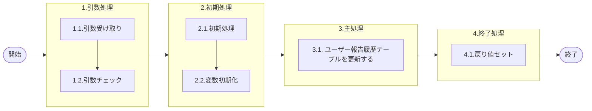

# 0. 表紙

| モジュール名 | プログラムID | プログラム名 |
| --- | --- | --- |
| IC | LDAS0428 | ユーザー報告履歴更新 |


| RFC        | Version | 更新日      | 更新者 | 更新内容 | 確認日 | 確認者 | 承認日     | 承認者 |
| ---------- | :-----: | ----------- | :----: | -------- | ------ | :----: | ---------- | :----: |
| - |  1.0.0  | 2025/10/13 |  オヘダイチロー  | 　初版作成　 | 2025/XX/XX  |  XXX  | 2025/XX/XX |  XXX  |

## 1. 処理概要

### 1.1. 機能概要

本機能は、引数を基に、ユーザー報告履歴 (ld_trn_user_rep_his) テーブルを更新する。

### 1.2. 処理概要フロー



### 1.3. プログラム入出力パラメータ

#### 1.3.1. 引数

| No. | パラメータ論理名 | パラメータ物理名 | 属性 | 備考 |
| --- | --- | --- | --- | --- |
| 1 | TP処理番号 | pn_operation_no | INTEGER |  |
| 2 | TP処理明細番号 | pn_operation_seq | INTEGER |  |
| 3 | 処理状況 | ps_op_status | VARCHAR | 0:未完了1:完了9:在庫更新/計画登録エラー終了 |
| 4 | エラーコード | ps_err_code | VARCHAR |  |
| 5 | ユーザーID | ps_user_id | VARCHAR |  |

#### 1.3.2. 戻り値

| No. | パラメータ論理名 | パラメータ物理名 | 属性 | 備考 |
| --- | --- | --- | --- | --- |
| 1 | ステータス | rn_status | INTEGER |  |
| 2 | SQLコード | rs_sql_code | VARCHAR |  |
| 3 | エラーコード | rs_err_code | VARCHAR |  |
| 4 | エラーメッセージ | rs_err_msg | VARCHAR |  |
| 5 | エラー位置 | rs_err_focus | VARCHAR |  |

### 1.4. その他制御・要件

| 排他制御 |      |      |
| -------- | ---- | ---- |
| 楽観     | 悲観 | 無し |
| ●       | -    | -    |

| 項目               | 制約・制御・要件など | 記載内容説明                                                     |
| ------------------ | -------------------- | ---------------------------------------------------------------- |
| パフォーマンス要件 | 特になし。           | 特別なパフォーマンス要件がある場合に要件内容とその対処法を記述。 |


### 1.5. 入出力一覧

| No | 入出力対象 | 名称 | 物理名称 | C | R | U | D | 備考 |
| --- | --- | --- | --- | --- | --- | --- | --- | --- |
| 1 | テーブル | ユーザー報告履歴 | ld_trn_user_rep_his | - | - | ○ | - |  |

## 2. 詳細処理

### 2.1. 引数の取得とチェック

特記無し

### 2.2. 初期処理

- システム日時セット

```sql
　ld_sysdatetime := statement_timestamp();
```

### 2.3. 主処理

引数を基に、ユーザー報告履歴 (ld_trn_user_rep_his) テーブルを更新する。

```sql
　    UPDATE ld_trn_user_rep_his
       SET err_code = ps_err_code,   --エラーコード
           op_status = ps_op_status,   --処理状況
           update_counter = update_counter + 1; --更新カウンタ
           update_datetime = ld_sysdatetime,   --更新日時
           update_author = ps_user_id,   --更新者
           update_pgmid = 'ldas0428'   --更新PGID
     WHERE operation_no =  pn_operation_no   --TP処理番号
       AND operation_seq = pn_operation_seq;   --TP処理明細番号
```

### 2.4. 終了処理

- 正常終了処理を行う

| No. | 戻り値           | 属性    | 設定値   |
| --- | ---------------- | ------- | -------- |
| 1   | 処理ステータス   | INTEGER | 0        |
| 2   | SQL コード       | VARCHAR | スペース |
| 3   | エラーコード     | VARCHAR | スペース |
| 4   | エラーメッセージ | VARCHAR | スペース |
| 5   | エラー位置       | VARCHAR | スペース |


## 3. 補足説明

### 3.1. 戻り値について

- ステータスについて
  - 0 : Normal End
  - -1 : Abnormal End
  - -2 : PGM エラー

### 3.2. エラー発生時の対応について

- SQL エラーが発生した場合、エラーログを出力して処理終了
  
  | No. | 戻り値           | 属性    | 設定値     |
  | --- | ---------------- | ------- | ---------- |
  | 1   | 処理ステータス   | INTEGER | -1         |
  | 2   | SQL コード       | VARCHAR | SQLSTATE   |
  | 3   | エラーコード     | VARCHAR | スペース   |
  | 4   | エラーメッセージ | VARCHAR | SQLERRM    |
  | 5   | エラー位置       | VARCHAR | 'LDAS0428' |
