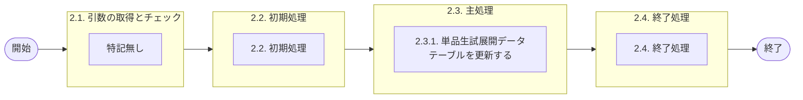

# 0. 表紙

| モジュール名 | プログラムID | プログラム名     |
| ------------ | ------------ | ---------------- |
| IC           | LDAS0430     | 単品生試展開更新 |

| RFC | Version | 更新日     |     更新者     | 更新内容 | 確認日     | 確認者 | 承認日     | 承認者 |
| --- | :-----: | ---------- | :------------: | -------- | ---------- | :----: | ---------- | :----: |
| -   |  1.0.0  | 2025/10/13 | オヘダイチロー | 初版作成 | 2025/XX/XX |  XXX  | 2025/XX/XX |  XXX  |

## 1. 処理概要

### 1.1. 機能概要

本機能は、引数を基に、単品生試展開データ (le_trn_pilot_exp) テーブルを更新する。

### 1.2. 処理概要フロー



### 1.3. プログラム入出力パラメータ

#### 1.3.1. 引数

| No. | パラメータ論理名 | パラメータ物理名 | 属性    | 備考 |
| --- | ---------------- | ---------------- | ------- | ---- |
| 1   | 品目番号         | ps_itemno        | VARCAHR |      |
| 2   | 供給者           | ps_supplier      | VARCAHR |      |
| 3   | 使用者           | ps_usercd        | VARCAHR |      |
| 4   | 着手日           | ps_start_date    | VARCAHR |      |
| 5   | TP処理番号       | pn_operation_no  | INTEGER |      |
| 6   | TP処理明細番号   | pn_operation_seq | INTEGER |      |
| 7   | オーダー番号     | ps_order_no      | VARCAHR |      |
| 8   | ユーザーID       | ps_user_id       | VARCAHR |      |

#### 1.3.2. 戻り値

| No. | パラメータ論理名 | パラメータ物理名 | 属性    | 備考                                      |
| --- | ---------------- | ---------------- | ------- | ----------------------------------------- |
| 1   | 処理ステータス   | rn_status        | INTEGER | 0:正常終了,-1: SQLエラー発生, -2:異常終了 |
| 2   | SQLコード        | rs_sql_code      | VARCHAR |                                           |
| 3   | エラーコード     | rs_err_code      | VARCHAR |                                           |
| 4   | エラーメッセージ | rs_err_msg       | VARCHAR |                                           |
| 5   | エラー位置       | rs_err_focus     | VARCHAR |                                           |

### 1.4. その他制御・要件

| 排他制御 |      |      |
| -------- | ---- | ---- |
| 楽観     | 悲観 | 無し |
| ●       | -    | -    |

| 項目               | 制約・制御・要件など | 記載内容説明                                                     |
| ------------------ | -------------------- | ---------------------------------------------------------------- |
| パフォーマンス要件 | 特になし。           | 特別なパフォーマンス要件がある場合に要件内容とその対処法を記述。 |

### 1.5. 入出力一覧

| No | 入出力対象 | 名称               | 物理名称         | C | R | U  | D | 備考 |
| -- | ---------- | ------------------ | ---------------- | - | - | -- | - | ---- |
| 1  | テーブル   | 単品生試展開データ | le_trn_pilot_exp | - | - | ○ | - |      |

## 2. 詳細処理

### 2.1. 引数の取得とチェック

特記無し

### 2.2. 初期処理

- システム日時セット

```sql
　 ld_sysdatetime := statement_timestamp(); 
```

### 2.3. 主処理

### 2.3.1. 単品生試展開データテーブルを更新する

引数として渡されたオーダー番号が空文字でない場合、単品生試展開データ (le_trn_pilot_exp) テーブルを更新する。空文字の場合、更新処理を行わずに処理を終了する。

```sql
IF trim(ps_order_no) <> '' THEN --オーダー番号
        UPDATE le_trn_pilot_exp
           SET order_no = ps_order_no,
               update_counter = update_counter + 1;  --更新カウンタ
               update_datetime = ld_sysdatetime, --更新日時 
               update_author = ps_user_id  --更新者
               update_pgmid = 'LDAS0430' --更新PGID
         WHERE input_itemno = ps_itemno  --入力品目番号
           AND input_supplier = ps_supplier  --入力供給者
           AND input_usercd = ps_usercd  --入力使用者
           AND input_start_date = ps_start_date  --入力着手日
           AND operation_no = pn_operation_no  --TP処理番号
           AND operation_seq = pn_operation_seq;  --TP処理明細番号
END IF;
```

- trim(引数.オーダー番号)は、引数として渡された「オーダー番号」の前後の空白を取り除く処理です。

### 2.4. 終了処理

- 正常終了処理を行う

| No. | 戻り値           | 属性    | 設定値   |
| --- | ---------------- | ------- | -------- |
| 1   | 処理ステータス   | INTEGER | 0        |
| 2   | SQL コード       | VARCHAR | スペース |
| 3   | エラーコード     | VARCHAR | スペース |
| 4   | エラーメッセージ | VARCHAR | スペース |
| 5   | エラー位置       | VARCHAR | スペース |

## 3. 補足説明

### 3.1. 戻り値について

- ステータスについて
  - 0 : Normal End
  - -1 : Abnormal End
  - -2 : PGM エラー

### 3.2. エラー発生時の対応について

- SQL エラーが発生した場合、エラーログを出力して処理終了
  | No. | 戻り値           | 属性    | 設定値     |
  | --- | ---------------- | ------- | ---------- |
  | 1   | 処理ステータス   | INTEGER | -1         |
  | 2   | SQL コード       | VARCHAR | SQLSTATE   |
  | 3   | エラーコード     | VARCHAR | スペース   |
  | 4   | エラーメッセージ | VARCHAR | SQLERRM    |
  | 5   | エラー位置       | VARCHAR | 'LDAS0430' |

### 3.3. 備考

- NEXTとPYMACで使用していないため、基本設計の引数 (削除日、オーダーステータス)を削除　
