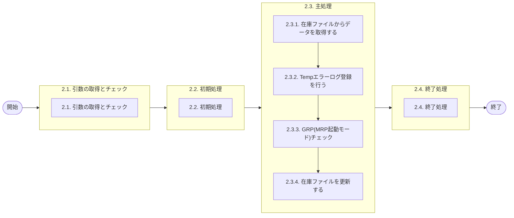

# 0. 表紙

| モジュール名 | プログラムID | プログラム名     |
| ------------ | ------------ | ---------------- |
| IC           | LDAS0431     | 在庫ファイル更新 |

| RFC | Version | 更新日     |     更新者     | 更新内容 | 確認日     | 確認者 | 承認日     | 承認者 |
| --- | :-----: | ---------- | :------------: | -------- | ---------- | :----: | ---------- | :----: |
| -   |  1.0.0  | 2025/10/15 | オヘダイチロー | 初版作成 | 2025/XX/XX |  XXX  | 2025/XX/XX |  XXX  |

## 1. 処理概要

### 1.1. 機能概要

本機能は、以下の手順を通じて、在庫ファイルを更新する。

1.在庫ファイル (ld_trn_inv) から更新するデータを取得する
2.手持在庫数がマイナスの場合、Tempエラーログ登録 (LDAS0407) を行う
3.GRP(MRP起動モード)チェックを行い、入出庫情報を更新する
4.在庫ファイル (ld_trn_inv) を更新する

### 1.2. 処理概要フロー



### 1.3. プログラム入出力パラメータ

#### 1.3.1. 引数

| No. | パラメータ論理名 | パラメータ物理名     | 属性    | 備考                                                                                                                                                                       |
| --- | ---------------- | -------------------- | ------- | -------------------------------------------------------------------------------------------------------------------------------------------------------------------------- |
| 1   | 入力ユーザーID   | ps_input_user_id     | VARCHAR | 更新用                                                                                                                                                                     |
| 2   | 品目番号         | ps_itemno            | VARCHAR |                                                                                                                                                                            |
| 3   | 供給者           | ps_supplier          | VARCHAR |                                                                                                                                                                            |
| 4   | 使用者           | ps_usercd            | VARCHAR |                                                                                                                                                                            |
| 5   | 手持在庫数       | pn_oh_qty            | DECIMAL |                                                                                                                                                                            |
| 6   | 手持在庫数区分   | ps_oh_qty_class      | VARCHAR | 0:更新しない1:入庫2:出庫3:棚卸更新しない4:棚卸入庫5:棚卸更新＆手持在庫更新しない6:保留在庫を更新しない7:保留在庫入庫＆手持在庫更新しない8:保留在庫出庫＆手持在庫更新しない |
| 7   | 発注済オーダー数 | pn_ordered_qty       | DECIMAL |                                                                                                                                                                            |
| 8   | 発注済独立所要数 | pn_ind_required_qty  | DECIMAL | 発注済所要数（独立所要）                                                                                                                                                   |
| 9   | 発注済従属所要数 | pn_dpd_required_qty  | DECIMAL | 発注済所要数（従属所要）                                                                                                                                                   |
| 10  | 繰越数           | pn_carry_over_qty    | DECIMAL |                                                                                                                                                                            |
| 11  | 繰越数上書き数量 | pn_overwrite_co_qty  | DECIMAL |                                                                                                                                                                            |
| 12  | 保留在庫数       | pn_hold_qty          | DECIMAL |                                                                                                                                                                            |
| 13  | 最新数量区分     | ps_latest_qty_class  | VARCHAR | 0:更新しない 1:入庫数を更新 2:出庫数を更新 3:両方更新                                                                                                                      |
| 14  | 最新オーダー番号 | ps_latest_orderno    | VARCHAR |                                                                                                                                                                            |
| 15  | 最新日           | ps_latest_date       | VARCHAR |                                                                                                                                                                            |
| 16  | 前回棚卸実施日   | ps_last_invtake_date | VARCHAR |                                                                                                                                                                            |
| 17  | 入庫区分         | ps_tiq_class         | VARCHAR |                                                                                                                                                                            |
| 18  | 出庫区分         | ps_toq_class         | VARCHAR |                                                                                                                                                                            |
| 19  | トータル区分     | ps_total_class       | VARCHAR | 0:更新しない 1:所要量出庫累計を更新する 2:使用中仕損数量を更新する 3:両値を更新する 9:両値を0に更新す                                                                      |

#### 1.3.2. 戻り値

| No. | パラメータ論理名 | パラメータ物理名 | 属性    | 備考 |
| --- | ---------------- | ---------------- | ------- | ---- |
| 1   | 処理ステータス   | rn_status        | INTEGER |      |
| 2   | SQLコード        | rs_sql_code      | VARCHAR |      |
| 3   | エラーコード     | rs_err_code      | VARCHAR |      |
| 4   | エラーメッセージ | rs_err_msg       | VARCHAR |      |
| 5   | エラー位置       | rs_err_focus     | VARCHAR |      |
| 6   | 手持在庫数       | rs_oh_qty        | VARCHAR |      |

### 1.4. その他制御・要件

| 排他制御 |      |      |
| -------- | ---- | ---- |
| 楽観     | 悲観 | 無し |
| ●       | -    | -    |

| 項目               | 制約・制御・要件など | 記載内容説明                                                     |
| ------------------ | -------------------- | ---------------------------------------------------------------- |
| パフォーマンス要件 | 特になし。           | 特別なパフォーマンス要件がある場合に要件内容とその対処法を記述。 |

### 1.5. 入出力一覧

| No | 入出力対象 | 名称                  | 物理名称            | C | R  | U  | D | 備考 |
| -- | ---------- | --------------------- | ------------------- | - | -- | -- | - | ---- |
| 1  | テーブル   | 在庫ファイル          | ld_trn_inv          | - | ○ | ○ | - |      |
| 2  | テーブル   | MRPシステムパラメータ | le_system_parameter | - | ○ | -  | - |      |

## 2. 詳細処理

### 2.1. 引数の取得とチェック

入力ユーザーID、品目番号、供給者、使用者、繰越数上書き数量, 前回棚卸実施日 以外の各種入力引数が NULL の場合、初期値（数値の場合は 0、文字列の場合は '0'）を代入し、NULL でない場合はその引数の値を対応するローカル変数に代入する。

### 2.2. 初期処理

- システム日時セット

```sql
　ld_sysdatetime := statement_timestamp();
```

- システム日付セット

```sql
　ls_sysdate := to_char(ld_sysdatetime , 'YYYYMMDD');
```

### 2.3. 主処理

### 2.3.1. 在庫ファイルからデータを取得する

条件に該当するデータが存在するかどうかチェックを行います。
   存在する場合、処理に進む
   存在しない場合、プログラムを終了する

1. 在庫ファイルからデータを取得する
   在庫ファイル (ld_trn_inv) テーブルから該当するデータが存在する場合、データを取得する

```sql
　if EXISTS(SELECT 1
             FROM ld_trn_inv
            WHERE itemno = ps_itemno  --品目番号
              AND supplier = ps_supplier  --供給者
              AND usercd = ps_usercd; )THEN  --使用者

        SELECT oh_qty, --手持在庫数
               ordered_qty, --発注済オーダー数
               ind_required_qty, -- 発注済所要数(独立所要)
               dpd_required_qty, --注済所要数(従属所要)
               carry_over_qty, --繰越数
               hold_qty,  --保留在庫数
               latest_in_qty, --最新入庫数
               latest_in_orderno,  --最新入庫オーダー番号
               latest_in_date, --最新入庫日
               latest_out_qty, --最新出庫数 
               latest_out_orderno, --最新出庫オーダー番号
               latest_out_date, --最新出庫日
               last_invtake_qty, --前回実施棚卸数
               last_invtake_date, --前回棚卸実施日 
               total_in_qty, --入庫数(累計)
               tiq_back, --入庫数-返品 
               tiq_move, --入庫数-移動
               tiq_adjust, --在庫調整数 
               total_out_qty, --出庫数(累計)
               toq_sir, --出庫数-SIR 
               toq_nonmanufact, --出庫数-非製造
               toq_scrap_use, --出庫数-仕損(使用中)
               toq_scrap_manufact, --出庫数-仕損(製造中)
               toq_scrap_sir, --出庫数-仕損(SIR) 
               toq_service, --出庫数-サービス
               toq_ckd, --出庫数-CKD 
               toq_ind_required, --出庫数-独立需要
               toq_back, --出庫数-返品 
               toq_move, --出庫数-移動
               total_req_issue_qty, --所要量出庫累計 
               total_use_scrap_ratio_qty --使用中仕損累計
          INTO STRICT
               ln_i_oh_qty, 
               ln_i_ordered_qty,
               ln_i_ind_required_qty, 
               ln_i_dpd_required_qty,
               ln_i_carry_over_qty,
               ln_i_hold_qty,
               ln_i_latest_in_qty, 
               ls_i_latest_in_orderno, 
               ls_i_latest_in_date, 
               ln_i_latest_out_qty, 
               ls_i_latest_out_orderno, 
               ls_i_latest_out_date,
               ln_i_last_invtake_qty, 
               ls_i_last_invtake_date,
               ln_i_total_in_qty,
               ln_i_tiq_back,
               ln_i_tiq_move, 
               ln_i_tiq_adjust, 
               ln_i_total_out_qty, 
               ln_i_toq_sir,
               ln_i_toq_nonmanufact,
               ln_i_toq_scrap_use,
               ln_i_toq_scrap_manufact,
               ln_i_toq_scrap_sir,
               ln_i_toq_service, 
               ln_i_toq_ckd, 
               ln_i_toq_ind_required,
               ln_i_toq_back, 
               ln_i_toq_move, 
               ln_i_total_req_issue_qty, 
               ln_i_total_use_scrap_ratio_qty
          FROM ld_trn_inv
         WHERE itemno = ps_itemno  --品目番号
           AND supplier = ps_supplier  --供給者
           AND usercd = ps_usercd;  --使用者
```

1. 手持在庫数または保留在庫の更新
   手持在庫数(退避用)に先ほど在庫ファイルから取得した手持在庫数を代入する

```sql
　      ln_oh_qty_bak := ln_i_oh_qty;  --手持在庫数(退避用) := 在庫ファイル.手持在庫数
```

    次に、手持在庫数区分 の値に応じて、在庫数を更新する。
　    各区分ごとに異なる処理を行い、在庫数の加減算や棚卸数への加算などを実施する。

    手持在庫数区分が '1' (入庫) の場合
　　在庫ファイルの手持在庫数に、変数の手持在庫数を加算する。

    手持在庫数区分が '2' (出庫) の場合
　　在庫ファイルの手持在庫数から、変数の手持在庫数を減算する。

    手持在庫数区分が '4' (棚卸入庫) の場合
　　在庫ファイルの 手持在庫数 と 前回実施棚卸数 に、変数の手持在庫数を加算する

    手持在庫数区分が '5' (棚卸更新＆手持在庫更新しない) の場合
　　在庫ファイルの 前回実施棚卸数 に、手持在庫数を加算する。

    手持在庫数区分が '7' (保留在庫入庫＆手持在庫更新しない) の場合
     　在庫ファイルの保留在庫数に、変数の保留在庫数を加算する。

    手持在庫数区分が '8' (保留在庫出庫＆手持在庫更新しない) の場合
     　在庫ファイルの保留在庫数に、変数の保留在庫数を減算する。

```sql
        IF ls_oh_qty_class = '1' THEN    --手持在庫数区分
            ln_i_oh_qty := ln_i_oh_qty + ln_oh_qty; --在庫ファイル.手持在庫数 + 手持在庫数

        ELSIF ls_oh_qty_class = '2' THEN
            ln_i_oh_qty := ln_i_oh_qty - ln_oh_qty; --在庫ファイル.手持在庫数 - 手持在庫数

        ELSIF ls_oh_qty_class = '4' THEN
            ln_i_oh_qty := ln_i_oh_qty + ln_oh_qty;
            ln_i_last_invtake_qty := ln_i_last_invtake_qty + ln_oh_qty; --在庫ファイル.前回実施棚卸数 ＋ 手持在庫数

        ELSIF ls_oh_qty_class = '5' THEN
            ln_i_last_invtake_qty := ln_i_last_invtake_qty + ln_oh_qty;
      
        ELSIF ls_oh_qty_class = '7' THEN
            ln_i_hold_qty := ln_i_hold_qty + ls_hold_qty;  --在庫ファイル.保留在庫数 + 保留在庫数
      
         ELSIF ls_oh_qty_class = '8' THEN
            ln_i_hold_qty := ln_i_hold_qty + ls_hold_qty;   --在庫ファイル.保留在庫数 - 保留在庫数

        END IF;
```

### 2.3.2. Tempエラーログ登録を行う

1. Tempエラーログ登録(LDAS0407)を行う
   在庫ファイルの手持在庫数区分が '1' (入庫) または '2' (出庫) の場合、手持在庫数がマイナスであり、かつ退避用手持在庫数よりも小さい場合に、Tempエラーログ登録(LDAS0407)を行う。

   そして、処理ステータス が "-1" (SQLエラー終了)の場合、例外を発生させて処理を中断する。

   在庫ファイルの手持在庫数区分が '1' (入庫) または '2' (出庫) 以外の場合、次の処理に進む。

```sql
        IF ln_i_oh_qty = '1' OR ln_i_oh_qty = '2' THEN --手持在庫数(在庫ファイル)
            IF ln_i_oh_qty < 0 AND ln_i_oh_qty < ln_oh_qty_bak THEN　--手持在庫数(在庫ファイル) < 手持在庫数(退避用)
                SELECT * 
                  INTO ln_sub_sp_status, --処理ステータス(変数)
                       ls_sub_sql_code, --SQLコード(変数)
                       ls_sub_err_code, --エラーコード (変数)
                       ls_sub_err_msg, --エラーメッセージ(変数)
                       ls_sub_err_focus --エラー位置(変数)
                  FROM ldas0407('9', --エラーレベル
                                'ld.E.LDP10154',  --エラーコード
                                'LDAS0431',  --プログラムID
                                ps_itemno,  --品目番号
                                ps_supplier,   --供給者
                                ps_usercd,   --使用者
                                ln_oh_qty,   --数量
                                ' ',   --着手日
                                ' ',   --納入日
                                ' ');  --払出日

               IF ln_sub_sp_status = -1 THEN
                    RAISE EXCEPTION '';
               END IF;

        　END IF;
    END IF;　-- 
```

2. 所要数・繰越数の在庫加算
   引数または内部処理 (2.1. 引数の取得とチェック) によって取得した発注済オーダー数、発注済所要数（独立所要および従属所要）、および繰越数を、在庫ファイルから取得した変数に加算する。

```sql
　　　ln_i_ordered_qty := ln_i_ordered_qty + ln_ordered_qty; 　--在庫ファイル.発注済オーダー数 + 変数.発注済オーダー数
      ln_i_ind_required_qty := ln_i_ind_required_qty + ln_ind_required_qty; 　--在庫ファイル.発注済所要数(独立所要) + 変数.発注済独立所要数;
      ln_i_dpd_required_qty := ln_i_dpd_required_qty + ln_dpd_required_qty; 　--在庫ファイル.発注済所要数(従属所要) + 変数.発注済従属所要数
      ln_i_carry_over_qty := ln_i_carry_over_qty + ln_carry_over_qty; 　--在庫ファイル.繰越数 + 変数.繰越数
```

### 2.3.3. GRP(MRP起動モード)チェック

1. GRP(MRP起動モード)チェック

   MRPシステムパラメータ (le_system_parameter) テーブルに該当するデータが存在するかどうかを確認する

   該当データが 存在しない場合 は、繰越数上書き数量が指定されているかを判定する。
   繰越数上書き数量が NULL でない場合 は、その値を在庫ファイルの繰越数として設定する。

   該当データが存在する場合は、次の処理に進む。

```sql
       IF NOT EXISTS(SELECT 1
                       FROM le_system_parameter
                      WHERE system_code = 'LE'  --システムコード
                        AND mrp_run_mode = 'GRP';)THEN  --MRP起動モード

              IF pn_overwrite_co_qty IS NOT NULL THEN　--繰越数上書き数量
                   ln_i_carry_over_qty := pn_overwrite_co_qty;  --在庫ファイル.繰越数
              END IF;
       END IF;
```

2. 最新入出庫情報(数量・オーダー番号・日付)の更新

   最新数量区分が '1'(入庫数を更新) の場合
     手持在庫数区分が '0'(更新しない), '1'(入庫), '2'(出庫) のいずれかに該当する場合、以下の更新を行う。
   　  在庫ファイルの最新入庫数に手持在庫数を設定する。
         在庫ファイルの 最新入庫オーダー番号に引数の最新オーダー番号を設定する。
         在庫ファイルの 最新入庫日に引数の最新日を設定する。

   最新数量区分が '2'(出庫数を更新) の場合
         在庫ファイルの最新出庫数に手持在庫数を設定する。
         在庫ファイルの最新出庫オーダー番号に引数の最新オーダー番号を設定する。
         在庫ファイルの最新出庫に引数の最新日を設定する。

   最新数量区分が '3'(両方更新) の場合
     手持在庫数区分が '0'(更新しない), '1'(入庫), '2'(出庫) のいずれかに該当する場合、以下の更新を行う。
   　  最新入庫数、最新入庫オーダー番号、最新入庫日 に各対応値を設定。

   次に、以下の更新を行う
     最新出庫数、最新出庫オーダー番号、最新出庫日 に各対応値を設定。

```sql
        IF ls_latest_qty_class = '1' THEN  --最新数量区分

            IF ls_oh_qty_class IN ('0','1','2') THEN  --手持在庫数区分
                ln_i_latest_in_qty := ln_oh_qty; -- 在庫ファイル.最新入庫数 := 変数.手持在庫数
                ls_i_latest_in_orderno := ps_latest_orderno;  --在庫ファイル.最新入庫オーダー番号  := 引数.最新オーダー番号
                ls_i_latest_in_date := ps_latest_date;  --在庫ファイル.最新入庫日 := 引数.最新日
            END IF;

        ELSIF ls_latest_qty_class = '2' THEN

            ln_i_latest_out_qty := ln_oh_qty;  --在庫ファイル.最新出庫数
            ls_i_latest_out_orderno := ps_latest_orderno;  --在庫ファイル.最新出庫オーダー番号
            ls_i_latest_out_date  := ps_latest_date;  --在庫ファイル.最新出庫日

        ELSIF ls_latest_qty_class = '3' THEN

            IF ls_oh_qty_class IN ('0','1','2') THEN
                ln_i_latest_in_qty := ln_oh_qty;
                ls_i_latest_in_orderno := ps_latest_orderno;
                ls_i_latest_in_date := ps_latest_date;
            END IF;

            ln_i_latest_out_qty := ln_oh_qty;
            ls_i_latest_out_orderno := ps_latest_orderno;
            ls_i_latest_out_date  := ps_latest_date;

        END IF;
```

3. 前回棚卸実施日の更新
   手持在庫数区分が '0'(更新しない), '1'(入庫), '2'(出庫) のいずれかに該当する場合、以下の更新を行う。
   前回棚卸実施日が NULL でない場合 は、その値を在庫ファイルの前回棚卸実施日として設定する。

```sql
        IF ls_oh_qty_class IN ('0','1','2') THEN  --手持在庫数区分
            IF ps_last_invtake_date IS NOT NULL THEN  --前回棚卸実施日
                ls_i_last_invtake_date := ps_last_invtake_date; --在庫ファイル.前回棚卸実施日
            END IF;
        END IF;
```

4. 入出庫区分に基づく在庫数量累計更新処理
   入庫区分が '1' の場合
        在庫ファイルの入庫数(累計)に手持在庫数を加算する

   入庫区分が '2' の場合
   　 在庫ファイルの 入庫数(累計) と 入庫数-返品 に手持在庫数を加算する

   入庫区分が '3' の場合
        在庫ファイルの 入庫数(累計) と 入庫数-移動 に手持在庫数を加算する

   入庫区分が '4' の場合
        在庫ファイルの 入庫数(累計) と 在庫調整数 に手持在庫数を加算する

   区分下記参照

   | 区分 | 内容                            |
   | ---- | ------------------------------- |
   | '0'  | 更新しない                      |
   | '1'  | 入庫数(累計)のみ更新            |
   | '2'  | 入庫数(累計)と入庫数-返品　更新 |
   | '3'  | 入庫数(累計)と入庫数-移動　更新 |
   | '4'  | 入庫数(累計)と在庫調整数　更新  |

```sql
        IF ls_tiq_class = '1' THEN   --入庫区分
            ln_i_total_in_qty :=  ln_i_total_in_qty + ln_oh_qty;  --在庫ファイル.入庫数(累計) + 変数.手持在庫数

        ELSIF ls_tiq_class = '2' THEN
            ln_i_total_in_qty := ln_i_total_in_qty + ln_oh_qty;
            ln_i_tiq_back := ln_i_tiq_back + ln_oh_qty; --在庫ファイル.入庫数-返品

        ELSIF ls_tiq_class = '3' THEN
            ln_i_total_in_qty := ln_i_total_in_qty + ln_oh_qty;
            ln_i_tiq_move := ln_i_tiq_move + ln_oh_qty; --在庫ファイル.入庫数-移動

        ELSIF ls_tiq_class = '4' THEN
            ln_i_total_in_qty := ln_i_total_in_qty + ln_oh_qty;
            ln_i_tiq_adjust := ln_i_tiq_adjust + ln_oh_qty;  --在庫ファイル.在庫調整数
        END IF;
```

   出庫区分が '1' もしくは '01' の場合
      在庫ファイルの 出庫数(累計) に手持在庫数を加算する

   出庫区分が '2' もしくは '02' の場合
      在庫ファイルの 出庫数(累計) と 出庫数-SIR に手持在庫数を加算する

   出庫区分が '3' もしくは '03' の場合
      在庫ファイルの 出庫数(累計) と 出庫数-非製造 に手持在庫数を加算する

   出庫区分が '4' もしくは '04' の場合
     在庫ファイルの 出庫数(累計) と 出庫数-仕損(使用中) に手持在庫数を加算する

   出庫区分が '5' もしくは '05' の場合
     在庫ファイルの 出庫数-仕損(製造中) に手持在庫数を加算する
   　
   出庫区分が '6' もしくは '06' の場合
  　在庫ファイルの 出庫数(累計) と 出庫数-仕損(SIR) に手持在庫数を加算する

   出庫区分が '7' もしくは '07' の場合
   　在庫ファイルの 出庫数(累計) と 出庫数 に手持在庫数を加算する

   出庫区分が '8' もしくは '08' の場合
   　在庫ファイルの 出庫数(累計) と 出庫数-CKD に手持在庫数を加算する

   出庫区分が '9' もしくは '09' の場合
   　在庫ファイルの 出庫数(累計) と 出庫数-独立需要 に手持在庫数を加算する

   出庫区分が '10' の場合
   　在庫ファイルの 出庫数(累計) と 出庫数-返品 に手持在庫数を加算する

   出庫区分が '11' の場合
   　在庫ファイルの 出庫数(累計) と 出庫数-移動 に手持在庫数を加算する
　　　
 区分下記参照

| 区分              | 内容                                    |
| ----------------- | --------------------------------------- |
| '0' もしくは '00' | 更新しない                              |
| '1' もしくは '01' | 出庫数(累計)のみ更新                    |
| '2' もしくは '02' | 出庫数(累計)と出庫数-SIR　更新          |
| '3' もしくは '03' | 出庫数(累計)と出庫数-非製造　更新       |
| '4' もしくは '04' | 出庫数(累計)と出庫数-仕損(使用中)　更新 |
| '5' もしくは '05' | 出庫数-仕損(製造中)のみ更新             |
| '6' もしくは '06' | 出庫数(累計)と出庫数-仕損(SIR)　更新    |
| '7' もしくは '07' | 出庫数(累計)と出庫数　更新              |
| '8' もしくは '08' | 出庫数(累計)と出庫数-CKD　更新          |
| '9' もしくは '09' | 出庫数(累計)と出庫数-独立需要　更新     |
| '10'              | 出庫数(累計)と出庫数-返品　更新         |
| '11'              | 出庫数(累計)と出庫数-移動　更新         |

```sql
        IF ls_toq_class = '01' OR trim(ls_toq_class) = '1' THEN  --出庫区分
            ln_i_total_out_qty := ln_i_total_out_qty + ln_oh_qty;  --在庫ファイル.出庫数(累計) + 変数.手持在庫数

        ELSIF ls_toq_class = '02' OR trim(ls_toq_class) = '2' THEN
            ln_i_total_out_qty := ln_i_total_out_qty +ln_oh_qty;
            ln_i_toq_sir := ln_i_toq_sir + ln_oh_qty;  --在庫ファイル.出庫数-SIR

        ELSIF ls_toq_class = '03' OR trim(ls_toq_class) = '3' THEN
            ln_i_total_out_qty  := ln_i_total_out_qty + ln_oh_qty;
            ln_i_toq_nonmanufact := ln_i_toq_nonmanufact + ln_oh_qty;  --在庫ファイル.出庫数-非製造

        ELSIF ls_toq_class = '04' OR trim(ls_toq_class) = '4' THEN
            ln_i_total_out_qty  := ln_i_total_out_qty + ln_oh_qty;
            ln_i_toq_scrap_use := ln_i_toq_scrap_use + ln_oh_qty;  --在庫ファイル.出庫数-仕損(使用中)

        ELSIF ls_toq_class = '05' OR trim(ls_toq_class) = '5' THEN
            ln_i_toq_scrap_manufact := ln_i_toq_scrap_manufact + ln_oh_qty;  --在庫ファイル.出庫数-仕損(製造中)

        ELSIF ls_toq_class = '06' OR trim(ls_toq_class) = '6' THEN
            ln_i_total_out_qty  := ln_i_total_out_qty + ln_oh_qty;
            ln_i_toq_scrap_sir := ln_i_toq_scrap_sir + ln_oh_qty;  --在庫ファイル.出庫数-仕損(SIR)

        ELSIF ls_toq_class = '07' OR trim(ls_toq_class) = '7' THEN
            ln_i_total_out_qty  := ln_i_total_out_qty + ln_oh_qty;
            ln_i_toq_service := ln_i_toq_service + ln_oh_qty;  --在庫ファイル.出庫数

        ELSIF ls_toq_class = '08' OR trim(ls_toq_class) = '8' THEN
            ln_i_total_out_qty  := ln_i_total_out_qty + ln_oh_qty;
            ln_i_toq_ckd := ln_i_toq_ckd + ln_oh_qty;  --在庫ファイル.出庫数-CKD

        ELSIF ls_toq_class = '09' OR trim(ls_toq_class) = '9' THEN
            ln_i_total_out_qty  := ln_i_total_out_qty + ln_oh_qty;
            ln_i_toq_ind_required := ln_i_toq_ind_required + ln_oh_qty;  --在庫ファイル.出庫数-独立需要

        ELSIF ls_toq_class = '10' THEN
            ln_i_total_out_qty := ln_i_total_out_qty + ln_oh_qty;
            ln_i_toq_back := ln_i_toq_back + ln_oh_qty;  --出庫数-返品

        ELSIF ls_toq_class = '11' THEN
            ln_i_total_out_qty  := ln_i_total_out_qty + ln_oh_qty;
            ln_i_toq_move := ln_i_toq_move + ln_oh_qty;  --出庫数-移動
        END IF;
```

1. 手持在庫数区分およびトータル区分による在庫数量更新処理
   手持在庫数区分が '0'(更新しない) , '1'(入庫) , '2'(出庫) のいずれかに該当する場合、以下の更新を行う。
   トータル区分が '1' (所要量出庫累計を更新する) の場合
      在庫ファイルの 所要量出庫累計 に手持在庫数を加算する

   トータル区分が '2' (使用中仕損数量を更新する) の場合
      在庫ファイルの 使用中仕損累計 に手持在庫数を加算する

   トータル区分が '3' (両値を更新する) の場合
      在庫ファイルの 所要量出庫累計 と 使用中仕損累計 に手持在庫数を加算する

   トータル区分が '9' (両値を0に更新する) の場合
      在庫ファイルの 所要量出庫累計 と 使用中仕損累計 に 0 を設定する

```sql
        IF ls_oh_qty_class IN ('0','1','2') THEN  --手持在庫数区分
            IF ls_total_class = '1' THEN   --トータル区分
                ln_i_total_req_issue_qty := ln_i_total_req_issue_qty + ln_oh_qty;     --在庫ファイル.所要量出庫累計 + 変数.手持在庫数

            ELSIF ls_total_class = '2' THEN
                ln_i_total_use_scrap_ratio_qty := ln_i_total_use_scrap_ratio_qty + ln_oh_qty;     --在庫ファイル.使用中仕損累計

            ELSIF ls_total_class = '3' THEN
                ln_i_total_req_issue_qty := ln_i_total_req_issue_qty + ln_oh_qty;
                ln_i_total_use_scrap_ratio_qty := ln_i_total_use_scrap_ratio_qty + ln_oh_qty;

            ELSIF ls_total_class = '9' THEN
                ln_i_total_req_issue_qty := 0; 
                ln_i_total_use_scrap_ratio_qty := 0;  
            END IF;
        END IF;
```

### 2.3.4. 在庫ファイルを更新する

対象の品目に対し、在庫ファイル（ld_trn_inv）テーブルの各種在庫情報を更新し、更新後の 手持在庫数 を戻り値変数に設定する。

```sql
        UPDATE ld_trn_inv
           SET oh_qty = ln_i_oh_qty,  --手持在庫数
               ordered_qty = ln_i_ordered_qty,  --発注済オーダー数
               ind_required_qty = ln_i_ind_required_qty,  --発注済所要数(独立所要)
               dpd_required_qty = ln_i_dpd_required_qty,  --発注済所要数(従属所要)
               carry_over_qty = ln_i_carry_over_qty,  --繰越数
               hold_qty = ln_i_hold_qty,   --保留在庫数
               latest_in_qty = ln_i_latest_in_qty,  --最新入庫数
               latest_in_orderno = ls_i_latest_in_orderno,  --最新入庫オーダー番号
               latest_in_date = ls_i_latest_in_date,  --最新入庫日
               latest_out_qty = ln_i_latest_out_qty,  --最新出庫数
               latest_out_orderno = ls_i_latest_out_orderno,  --最新出庫オーダー番号
               latest_out_date = ls_i_latest_out_date,  --最新出庫日
               last_invtake_qty = ln_i_last_invtake_qty,  --前回実施棚卸数
               last_invtake_date = ls_i_last_invtake_date,  --前回棚卸実施日
               total_in_qty = ln_i_total_in_qty,  --入庫数(累計)
               tiq_back = ln_i_tiq_back,  --入庫数-返品
               tiq_move = ln_i_tiq_move,  --入庫数-移動
               tiq_adjust = ln_i_tiq_adjust,  --在庫調整数
               total_out_qty = ln_i_total_out_qty,  --出庫数(累計)
               toq_sir = ln_i_toq_sir,  --出庫数-SIR
               toq_nonmanufact = ln_i_toq_nonmanufact,  --出庫数-非製造
               toq_scrap_use = ln_i_toq_scrap_use,  --出庫数-仕損(使用中)
               toq_scrap_manufact = ln_i_toq_scrap_manufact,  --出庫数-仕損(製造中)
               toq_scrap_sir = ln_i_toq_scrap_sir,  --出庫数-仕損(SIR)
               toq_service = ln_i_toq_service,  --出庫数-サービス
               toq_ckd = ln_i_toq_ckd,  --出庫数-CKD
               toq_ind_required = ln_i_toq_ind_required,  --出庫数-独立需要
               toq_back = ln_i_toq_back,  --出庫数-返品
               toq_move = ln_i_toq_move,  --出庫数-移動
               total_req_issue_qty = ln_i_total_req_issue_qty,  --所要量出庫累計
               total_use_scrap_ratio_qty = ln_i_total_use_scrap_ratio_qty  --使用中仕損累計
               ic_update_datetime  = ls_sysdate,  --IC更新日
               update_counter = update_counter + 1,  --更新カウンタ
               update_datetime = ld_sysdatetime,  --更新日時
               update_author = ps_input_user_id,  --更新者
               update_pgmid = 'ldas0431'  --更新PGID
         WHERE itemno = ps_itemno  --品目番号
           AND supplier = ps_supplier  --供給者
           AND usercd = ps_usercd;  --使用者

    END IF;

    rs_oh_qty :=　ln_i_oh_qty; --戻り値.手持在庫数 := 在庫ファイル.手持在庫数
```

### 2.4. 終了処理

- 正常終了処理を行う

| No. | 戻り値           | 属性    | 設定値         |
| --- | ---------------- | ------- | -------------- |
| 1   | 処理ステータス   | INTEGER | 0              |
| 2   | SQL コード       | VARCHAR | ' ' (スペース) |
| 3   | エラーコード     | VARCHAR | ' ' (スペース) |
| 4   | エラーメッセージ | VARCHAR | ' ' (スペース) |
| 5   | エラー位置       | VARCHAR | ' ' (スペース) |

## 3. 補足説明

### 3.1. 戻り値について

- ステータスについて
  - 0 : Normal End
  - -1 : Abnormal End
  - -2 : PGM エラー

### 3.2. エラー発生時の対応について

- RAISE EXCEPTIONのエラーが発生した場合、エラーログを出力して処理終了
  | No. | 戻り値           | 属性    | 設定値                |
  | --- | ---------------- | ------- | --------------------- |
  | 1   | 処理ステータス   | INTEGER | 変数.処理ステータス   |
  | 2   | SQL コード       | VARCHAR | 変数.SQL コード       |
  | 3   | エラーコード     | VARCHAR | 変数.エラーコード     |
  | 4   | エラーメッセージ | VARCHAR | 変数.エラーメッセージ |
  | 5   | エラー位置       | VARCHAR | 変数.エラー位置       |
- SQL エラーが発生した場合、エラーログを出力して処理終了
  | No. | 戻り値           | 属性    | 設定値         |
  | --- | ---------------- | ------- | -------------- |
  | 1   | 処理ステータス   | INTEGER | -1             |
  | 2   | SQL コード       | VARCHAR | SQLSTATE       |
  | 3   | エラーコード     | VARCHAR | ' ' (スペース) |
  | 4   | エラーメッセージ | VARCHAR | SQLERRM        |
  | 5   | エラー位置       | VARCHAR | 'LDAS0431'     |
