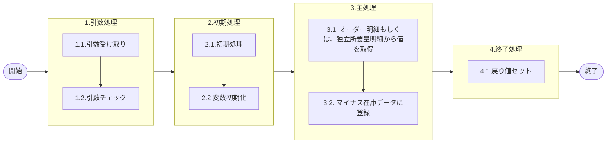

# 0. 表紙

| モジュール名 | プログラムID | プログラム名           |
| ------------ | ------------ | ---------------------- |
| IC           | LDAS0432     | マイナス在庫データ登録 |

| RFC | Version | 更新日     |     更新者     | 更新内容 | 確認日     | 確認者 | 承認日     | 承認者 |
| --- | :-----: | ---------- | :------------: | -------- | ---------- | :----: | ---------- | :----: |
| -   |  1.0.0  | 2025/10/14 | オヘダイチロー | 初版作成 | 2025/XX/XX |  XXX  | 2025/XX/XX |  XXX  |

## 1. 処理概要

### 1.1. 機能概要

本機能は、処理状況によってオーダー明細 (le_trn_order) テーブルもしくは、独立所要量明細 (le_trn_ird) テーブルから値を取得し、引数をもとにマイナス在庫データ (ld_trn_minus_stock) テーブルにデータを登録する。

### 1.2. 処理概要フロー



### 1.3. プログラム入出力パラメータ

#### 1.3.1. 引数

| No. | パラメータ論理名 | パラメータ物理名 | 属性    | 備考 |
| --- | ---------------- | ---------------- | ------- | ---- |
| 1   | TP処理番号       | pn_operation_no  | INTEGER |      |
| 2   | TP処理明細番号   | pn_operation_seq | INTEGER |      |
| 3   | 入力区分         | ps_input_class   | VARCHAR |      |
| 5   | 処理識別         | ps_operation_id  | VARCHAR |      |
| 4   | 入力ユーザーID   | ps_input_user_id | VARCHAR |      |
| 6   | 変更区分         | ps_control_class | VARCHAR |      |
| 7   | 品目番号         | ps_itemno        | VARCHAR |      |
| 8   | 供給者           | ps_supplier      | VARCHAR |      |
| 9   | 使用者           | ps_usercd        | VARCHAR |      |
| 10  | オーダ番号       | ps_order_no      | VARCHAR |      |
| 11  | カード識別       | ps_card_id       | VARCHAR |      |
| 12  | 数量             | pn_qty           | DECIMAL |      |
| 13  | 起票日           | ps_input_date    | VARCHAR |      |

#### 1.3.2. 戻り値

| No. | パラメータ論理名 | パラメータ物理名 | 属性    | 備考 |
| --- | ---------------- | ---------------- | ------- | ---- |
| 1   | 処理ステータス   | rn_status        | INTEGER |      |
| 2   | SQLコード        | rs_sql_code      | VARCHAR |      |
| 3   | エラーコード     | rs_err_code      | VARCHAR |      |
| 4   | エラーメッセージ | rs_err_msg       | VARCHAR |      |
| 5   | エラー位置       | rs_err_focus     | VARCHAR |      |

### 1.4. その他制御・要件

| 排他制御 |      |      |
| -------- | ---- | ---- |
| 楽観     | 悲観 | 無し |
| ●       | -    | -    |

| 項目               | 制約・制御・要件など | 記載内容説明                                                     |
| ------------------ | -------------------- | ---------------------------------------------------------------- |
| パフォーマンス要件 | 特になし。           | 特別なパフォーマンス要件がある場合に要件内容とその対処法を記述。 |

### 1.5. 入出力一覧

| No | 入出力対象 | 名称               | 物理名称           | C  | R  | U | D | 備考 |
| -- | ---------- | ------------------ | ------------------ | -- | -- | - | - | ---- |
| 1  | テーブル   | オーダー明細       | le_trn_order       | -  | ○ | - | - |      |
| 2  | テーブル   | 独立所要量明細     | le_trn_ird         | -  | ○ | - | - |      |
| 3  | テーブル   | マイナス在庫データ | ld_trn_minus_stock | ○ | -  | - | - |      |

## 2. 詳細処理

### 2.1. 引数の取得とチェック

特記なし

### 2.2. 初期処理

- システム日時セット

```sql
　ld_sysdatetime := statement_timestamp();
```

### 2.3. 主処理

### 2.3.1. オーダー明細もしくは、独立所要量明細から値を取得

   オーダー番号が空文字の場合は、展開基準日として起票日を設定する。
   オーダー番号が指定されている場合は、処理識別により参照テーブルを切り替える。
   オーダー番号が指定されている場合、処理識別が 'LD46' でない場合は オーダー明細 (le_trn_order)、'LD46' の場合は 独立所要量明細 (le_trn_ird) を参照元とする。

```sql
      IF ps_order_no = ' ' then --オーダー番号
        ls_base_date :=  ps_input_date; --展開基準日 := 起票日
      ELSE
        IF ps_operation_id <> 'LD46' THEN
            ls_sql_where := ' FROM le_trn_order ';   
        ELSE
            ls_sql_where := ' FROM le_trn_ird ';
        END IF;

```

条件クエリ変数に、品目番号・供給者・使用者・オーダー番号・削除日を条件とした WHERE 句を動的に追加する。
その後、存在チェックを行うための SELECT COUNT(1) 文として、条件クエリを結合し、クエリ変数に代入する。

```sql
        ls_sql_where := ls_sql_where
                        || ' WHERE itemno       = $1'　--品目番号
                        || '   AND supplier     = $2'　--供給者
                        || '   AND usercd       = $3'　--使用者
                        || '   AND order_no     = $4'　--オーダー番号
                        || '   AND delete_ymd   = '' ''';　--削除日

        ls_query := 'SELECT COUNT(1) ' || ls_sql_where;
```

動的に生成された SQL（SELECT COUNT）を実行し、実行結果の件数はカウント変数に格納される。

```sql
          EXECUTE ls_query INTO ln_counter --カウント
            USING ps_itemno, 　--品目番号
                  ps_supplier,  --供給者
                  ps_usercd,  --使用者
                  ps_order_no; --オーダー番号
```

件数が 1 件以上存在する場合は、事前に組み立てた条件クエリを用いて 発注時着手日 を取得し、展開基準日として設定する。
一致するデータが存在しない場合は、引数として渡された 起票日 を展開基準日とする。

```sql
        IF ln_counter <> 0 THEN
           ls_query := 'SELECT rls_start_date ' || ls_sql_where;　--発注時着手日

            EXECUTE ls_query INTO ls_base_date --展開基準日
                USING ps_itemno, 　
                      ps_supplier,
                      ps_usercd, 
                      ps_order_no; 
        ELSE
            ls_base_date :=  ps_input_date;  --展開基準日 := 起票日
        END IF;
    END IF;
```

### 2.3.2. マイナス在庫データテーブルにデータを登録

マイナス在庫データ (ld_trn_minus_stock) テーブルにデータを追加する

- エラー発生日時のカラムにシステム日時を代入する

```sql
    INSERT INTO ld_trn_minus_stock
        (operation_no, --TP処理番号
         operation_seq, --TP処理明細番号
         input_class, --入力区分
         operation_id, --処理識別
         input_user_id, --入力ユーザーID
         control_class, --変更区分
         itemno, --品目番号
         supplier, --供給者
         usercd, --使用者
         order_no, --オーダー番号
         card_id, --カード識別
         qty, --数量
         input_date, --起票日
         base_date, --展開基準日
         occured_datetime, --エラー発生日時
         close_flg, --処理済フラグ
         update_counte, --更新カウンタ
         create_datetime, --登録日時
         create_author, --登録者
         create_pgmid, --登録PGID
         update_datetime, --更新日時
         update_author, --更新者
         update_pgmid) --更新PGID
        VALUES
        (pn_operation_no, 
        pn_operation_seq,
         ps_input_class, 
         ps_operation_id,
         ps_input_user_id, 
         ps_control_class,
         ps_itemno, 
         ps_supplier,
         ps_usercd, 
         ps_order_no,
         ps_card_id, 
         pn_qty,
         ps_input_date, 
         ls_base_date,
         ld_sysdatetime,
         '0',
         0, 
         ld_sysdatetime,
         ps_input_user_id, 
         'LDAS0432',
         ld_sysdatetime, 
         ps_input_user_id,
         'LDAS0432');
```

### 2.4. 終了処理

- 正常終了処理を行う

| No. | 戻り値           | 属性    | 設定値   |
| --- | ---------------- | ------- | -------- |
| 1   | 処理ステータス   | INTEGER | 0        |
| 2   | SQL コード       | VARCHAR | スペース |
| 3   | エラーコード     | VARCHAR | スペース |
| 4   | エラーメッセージ | VARCHAR | スペース |
| 5   | エラー位置       | VARCHAR | スペース |

## 3. 補足説明

### 3.1. 戻り値について

- ステータスについて
  - 0 : Normal End
  - -1 : Abnormal End
  - -2 : PGM エラー

### 3.2. エラー発生時の対応について

- SQL エラーが発生した場合、エラーログを出力して処理終了| No. | 戻り値           | 属性    | 設定値     |
  | --- | ---------------- | ------- | ---------- |
  | 1   | 処理ステータス   | INTEGER | -1         |
  | 2   | SQL コード       | VARCHAR | SQLSTATE   |
  | 3   | エラーコード     | VARCHAR | スペース   |
  | 4   | エラーメッセージ | VARCHAR | SQLERRM    |
  | 5   | エラー位置       | VARCHAR | 'LDAS0400' |
