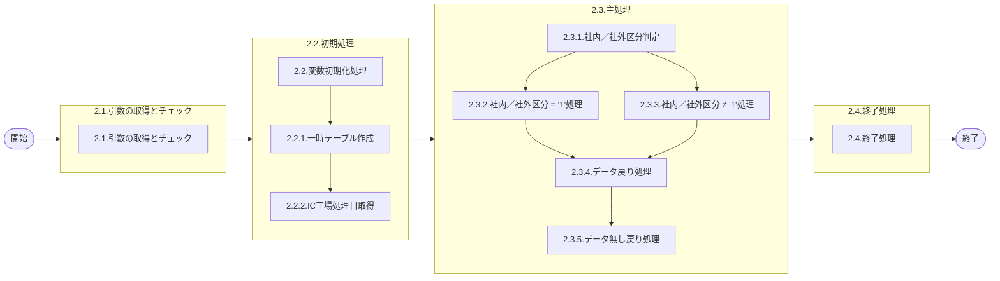

# 0. 表紙

| モジュール名 | プログラムID | プログラム名                     |
| ------------ | ------------ | -------------------------------- |
| IC           | LDAS9002     | 未受入問合せ(担当課／担当者指定) |

| RFC | Version | 更新日     | 更新者 | 更新内容 | 確認日     | 確認者 | 承認日     | 承認者 |
| --- | :-----: | ---------- | :----: | -------- | ---------- | :----: | ---------- | :----: |
| -   |  1.0.0  | 2025/09/26 | 余暁東 | 初版作成 | 2025/XX/XX |  XXX  | 2025/XX/XX |  XXX  |

## 1. 処理概要

### 1.1. 機能概要

担当課、担当者指定のオーダー明細と独立所要量明細の未受入問合せを返す。

### 1.2. 処理概要フロー



### 1.3. プログラム入出力パラメータ

#### 1.3.1. 引数

| No. | パラメータ論理名 | パラメータ物理名 | 属性    | 備考              |
| --- | ---------------- | ---------------- | ------- | ----------------- |
| 1   | 担当課           | ps_section       | VARCHAR |                   |
| 2   | 担当者           | ps_person_cd     | VARCHAR |                   |
| 3   | 抽出期間開始日   | ps_start_date    | VARCHAR |                   |
| 4   | 抽出期間終了日   | ps_end_date      | VARCHAR |                   |
| 5   | 納入PF番号       | ps_deliv_pf_no   | VARCHAR |                   |
| 6   | 社内／社外区分   | ps_org_division  | VARCHAR | 1:ALL2:社内3:社外 |
| 7   | 供給者           | ps_supplier      | VARCHAR |                   |
| 8   | 生試初品区分     | ps_pilot_class   | VARCHAR |                   |
| 9   | 先行リードタイム | pn_precede_lt    | DECIMAL |                   |
| 10  | Ｗビン管理コード | ps_wbin_ctrl_cd  | VARCHAR |                   |
| 11  | AIRS             | ps_airs_sign     | VARCHAR |                   |

#### 1.3.2. 戻り値

| No. | パラメータ論理名 | パラメータ物理名  | 属性    | 備考                                               |
| --- | ---------------- | ----------------- | ------- | -------------------------------------------------- |
| 1   | 処理ステータス   | rn_status         | INTEGER | 0:Normal-1:SqlError-2:ProgramError100:NotDataFound |
| 2   | SQLコード        | rs_sql_code       | VARCHAR |                                                    |
| 3   | エラーコード     | rs_err_code       | VARCHAR |                                                    |
| 4   | エラーメッセージ | rs_err_msg        | VARCHAR |                                                    |
| 5   | エラー位置       | rs_err_focus      | VARCHAR |                                                    |
| 6   | 遅延日数         | rn_delay_days     | INTEGER |                                                    |
| 7   | 品目番号         | rs_itemno         | VARCHAR |                                                    |
| 8   | 供給者           | rs_supplier       | VARCHAR |                                                    |
| 9   | 使用者           | rs_usercd         | VARCHAR |                                                    |
| 10  | 先行リードタイム | rn_precede_lt     | DECIMAL |                                                    |
| 11  | 納入PF番号       | rs_deliv_pf_no    | VARCHAR |                                                    |
| 12  | 格納ロケ         | rs_stock_location | VARCHAR |                                                    |
| 13  | 品目名称         | rs_item_name      | VARCHAR |                                                    |
| 14  | オーダー番号     | rs_order_no       | VARCHAR |                                                    |
| 15  | 着手日           | rs_start_date     | VARCHAR |                                                    |
| 16  | 完了開始時間     | rs_due_begin_time | VARCHAR |                                                    |
| 17  | 完了終了時間     | rs_due_end_time   | VARCHAR |                                                    |
| 18  | 所要数           | rn_required_qty   | DECIMAL |                                                    |
| 19  | オーダー残数     | rn_bo_qty         | DECIMAL |                                                    |
| 20  | 生試初品区分     | rs_pilot_class    | VARCHAR | 必須項目：1:ALL2:生試／単品生試3:初品4:量産        |

### 1.4. その他制御・要件

| 排他制御 |      |      |
| -------- | ---- | ---- |
| 楽観     | 悲観 | 無し |
| ●       | -    | -    |

| 項目               | 制約・制御・要件など                | 記載内容説明                                                     |
| ------------------ | ----------------------------------- | ---------------------------------------------------------------- |
| パフォーマンス要件 | 特になし。 ※現行に合わせて作成する | 特別なパフォーマンス要件がある場合に要件内容とその対処法を記述。 |

### 1.5. 入出力一覧

| No | 入出力対象 | 名称                      | 物理名称               | C | R  | U | D | 備考 |
| -- | ---------- | ------------------------- | ---------------------- | - | -- | - | - | ---- |
| 1  | テーブル   | IC工場処理日              | ld_mst_slip_date       | - | ○ | - | - |      |
| 2  | テーブル   | MRP情報値                 | le_mst_mrp_information | - | ○ | - | - |      |
| 3  | テーブル   | 品目共通                  | la_itemcomn            | - | ○ | - | - |      |
| 4  | テーブル   | SUマスタ                  | la_area_master_su      | - | ○ | - | - |      |
| 5  | テーブル   | オーダー明細              | le_trn_order           | - | ○ | - | - |      |
| 6  | テーブル   | 独立所要量明細            | le_trn_ird             | - | ○ | - | - |      |
| 7  | テーブル   | 日別カレンダーマスタ（D） | le_mst_calendar_sum    | - | ○ | - | - |      |
| 8  | テーブル   | GIMACエリアマスタ         | la_area_master         | - | ○ | - | - |      |

## 2. 詳細処理

### 2.1. 引数の取得とチェック

なし。

### 2.2. 初期処理

#### 2.2.1. 変数初期化処理

- 利用する変数を初期化する。

#### 2.2.2. 一時テーブル作成

未受入問合せ結果格納用の一時テーブルを作成する。

```sql
CREATE TEMP TABLE temp_date1(
     delay_days                   INTEGER,     --遅延日数
     itemno                       VARCHAR(30), --品目番号
     supplier                     VARCHAR(04), --供給者
     usercd                       VARCHAR(04), --使用者
     precede_lt                   DECIMAL,     --先行リードタイム
     deliv_pf_no                  VARCHAR(04), --納入PF番号
     stock_location               VARCHAR(05), --格納ロケ
     item_name                    VARCHAR(30), --品目名称
     order_no                     VARCHAR(05), --オーダー番号
     start_date                   VARCHAR(08), --着手日
     due_end_time                 VARCHAR(04), --完了終了時間
     required_qty                 DECIMAL,     --所要数
     bo_qty                       DECIMAL,     --オーダー残数
     pilot_class                  VARCHAR(01)  --生試初品区分
)ON COMMIT DROP
```

```sql
CREATE TEMP TABLE temp_date2(
     su_code                      VARCHAR(04)
)ON COMMIT DROP;
```

#### 2.2.3. GIMACエリアマスタ情報取得・設定

```sql
SELECT 1
  FROM SUマスタ a
 INNER JOIN GIMACエリアマスタ b
        ON a.エリアコード = b.エリアコード
      WHERE b.担当課 = 引数.担当課
       AND (b.担当者 =  スペース or b.担当者 = 引数.担当者)
```

該当データが存在する場合：

```sql
INSERT  INTO temp_date2
SELECT a.SUコード 
  FROM SUマスタ a
 INNER JOIN GIMACエリアマスタ b
        ON a.エリアコード = b.エリアコード
      WHERE b.担当課 = 引数.担当課
       AND (b.担当者 =  スペース or b.担当者 = 引数.担当者)
```

#### 2.2.4. IC工場処理日取得

```sql
SELECT IC工場処理日
  FROM IC工場処理日
 WHERE 処理タイプ = 'STD'
```

- データが存在しない場合：
  - エラーコード：'ld.E.LDP10004'
  - エラーメッセージ：'The IC pymac date is not exist. '

### 2.3. 主処理

#### 2.3.1. 社内／社外区分判定

引数.社内／社外区分により処理を分岐する。

- 社内／社外区分 = '1'（ALL）の場合：2.3.2へ
- 社内／社外区分 ≠ '1'の場合：2.3.3へ

#### 2.3.2. 社内／社外区分 = '1'（ALL）処理

##### 2.3.2.1. オーダー明細未受入データ存在チェック・取得処理

```sql
SELECT B.品目番号
      ,B.供給者
      ,B.使用者
      ,A.先行リードタイム
      ,A.納入PF番号
      ,A.格納ロケーション
      ,COALESCE(D.品目名称, ' ') AS 品目名称
      ,B.オーダー番号
      ,B.完了日
      ,B.完了開始時間
      ,B.オーダー数
      ,B.オーダー残数
      ,B.生試初品区分
      ,C.カレンダーコード
  FROM MRP情報値 A
  LEFT OUTER JOIN 品目共通 D
    ON (D.品目番号 = A.品目番号)
      ,オーダー明細 B
      ,SUマスタ C
 WHERE A.品目番号    = B.品目番号
   AND A.供給者      = B.供給者
   AND A.使用者      = B.使用者
   AND A.供給者     <> A.使用者
   AND A.使用者  IN (SELECT su_code FROM temp_date2)
   AND C.SUコード    = A.使用者
   AND ((A.Wビン管理コード = '0' AND 引数.Ｗビン管理コード = '0')
       OR 引数.Ｗビン管理コード = '1')
   AND B.オーダーステータス = '2'
   AND B.オーダー残数 > 0
   AND (引数.生試初品区分 = '1'
       OR (引数.生試初品区分 = '2' AND B.生試初品区分 IN ('2','4'))
       OR (引数.生試初品区分 = '3' AND B.生試初品区分 = '3')
       OR (引数.生試初品区分 = '4' AND B.生試初品区分 = ' '))
   AND (TRIM(引数.供給者)    = '' OR A.供給者    = 引数.供給者)
   AND (TRIM(引数.納入PF番号) = '' OR A.納入PF番号 = 引数.納入PF番号)
   AND (引数.先行リードタイム = 0 OR A.先行リードタイム  = 引数.先行リードタイム)
   AND (TRIM(引数.抽出期間開始日)  = '' OR B.完了日 >= 引数.抽出期間開始日)
   AND B.完了日 <= 引数.抽出期間終了日
```

各レコードに対して以下のLOOP処理を行う：

**遅延日数計算処理（取得した.完了日とIC工場処理日の日数差）**

```sql
SELECT 1
  FROM 日別カレンダーマスタ（D）
 WHERE カレンダーコード = 取得した.カレンダーコード
   AND 稼働日区分 = '0'
   AND カレンダー年月日 >= 2.2.4で取得.IC工場処理日
   AND カレンダー年月日 <= 取得した.完了日
```

データが存在する場合、遅延日数取得：

```sql
SELECT COUNT(1)
  FROM 日別カレンダーマスタ（D）
 WHERE カレンダーコード = 取得した.カレンダーコード
   AND 稼働日区分 = '0'
   AND カレンダー年月日 >= 2.2.4で取得.IC工場処理日
   AND カレンダー年月日 <= 取得した.完了日
```

**一時テーブルへの挿入**

```sql
INSERT INTO temp_date1
( delay_days
 ,itemno
 ,supplier
 ,usercd
 ,precede_lt
 ,deliv_pf_no
 ,stock_location
 ,item_name
 ,order_no
 ,start_date
 ,disburse_time
 ,required_qty
 ,bo_qty
 ,pilot_class
 ,mrp_date  
 ,od_rd_flag  
 ,item_class  
 ,measure_unit)
VALUES
( 遅延日数
 ,取得した.品目番号
 ,取得した.供給者
 ,取得した.使用者
 ,取得した.先行リードタイム
 ,取得した.納入PF番号
 ,取得した.格納ロケーション
 ,取得した.品目名称
 ,取得した.オーダー番号
 ,取得した.完了日
 ,取得した.完了開始時間
 ,取得した.オーダー数
 ,取得した.オーダー残数
 ,取得した.生試初品区分
 );
```

##### 2.3.2.2. 独立所要量明細未受入データ処理

引数.供給者がスペースの場合のみ実行

```sql
SELECT B.品目番号
      ,B.供給者
      ,B.使用者
      ,A.先行リードタイム
      ,B.独立需要送り先コード
      ,A.格納ロケーション
      ,COALESCE(D.品目名称, ' ') AS 品目名称
      ,B.オーダー番号
      ,B.着手日
      ,' ' AS 完了終了時間
      ,B.所要数
      ,B.所要残数
      ,B.生試初品区分
      ,C.カレンダーコード
  FROM MRP情報値 A
  LEFT OUTER JOIN 品目共通 D
    ON (D.品目番号 = A.品目番号)
      ,独立所要量明細 B
      ,SUマスタ C
 WHERE A.品目番号        = B.品目番号
   AND A.供給者      = B.供給者
   AND A.使用者        = B.使用者
   AND C.SUコード      = A.使用者
   AND B.独立需要送り先コード  IN (SELECT su_code FROM temp_date2)
   AND B.オーダーステータス = '2'
   AND B.所要残数 > 0
   AND (引数.生試初品区分 = '1'
       OR (引数.生試初品区分 = '2' AND B.生試初品区分 IN ('2','4'))
       OR (引数.生試初品区分 = '3' AND B.生試初品区分 = '3')
       OR (引数.生試初品区分 = '4' AND B.生試初品区分 = ' '))
   AND B.所要量区分 = '0'
   AND ((A.Wビン管理コード = '0' AND 引数.Ｗビン管理コード = '0')
       OR 引数.Ｗビン管理コード = '1')
   AND (TRIM(引数.抽出期間開始日)  = '' OR B.着手日  >= 引数.抽出期間開始日)
   AND B.着手日 <= 引数.抽出期間終了日
   AND (引数.先行リードタイム = 0 OR A.先行リードタイム = 引数.先行リードタイム)
   AND (TRIM(引数.納入PF番号) = '' OR A.納入PF番号  = 引数.納入PF番号)
```

**遅延日数計算処理（取得した.着手日とIC工場処理日の日数差）**2.3.2.1.の**遅延日数計算処理**と同じように遅延日数を計算する

**一時テーブルへの挿入**

```sql
INSERT INTO temp_date1
( delay_days
 ,itemno
 ,supplier
 ,usercd
 ,precede_lt
 ,deliv_pf_no
 ,stock_location
 ,item_name
 ,order_no
 ,start_date
 ,disburse_time
 ,required_qty
 ,bo_qty
 ,pilot_class
 ,mrp_date  
 ,od_rd_flag  
 ,item_class  
 ,measure_unit)
VALUES
( 遅延日数
 ,取得した.品目番号
 ,取得した.供給者
 ,取得した.使用者
 ,取得した.先行リードタイム
 ,取得した.納入PF番号
 ,取得した.格納ロケーション
 ,取得した.品目名称
 ,取得した.オーダー番号
 ,取得した.完了日
 ,取得した.完了開始時間
 ,取得した.オーダー数
 ,取得した.オーダー残数
 ,取得した.生試初品区分
 );
```

#### 2.3.3. 社内／社外区分 ≠ '1'処理

##### 2.3.3.1. オーダー明細処理

```sql
SELECT D.品目番号
      ,D.供給者
      ,D.使用者
      ,A.先行リードタイム
      ,A.納入PF番号
      ,A.格納ロケーション
      ,COALESCE(E.品目名称, ' ') AS 品目名称
      ,D.オーダー番号
      ,D.完了日
      ,D.完了開始時間
      ,D.オーダー数
      ,D.オーダー残数
      ,D.生試初品区分
      ,C.カレンダーコード
  FROM MRP情報値 A
  LEFT OUTER JOIN 品目共通 E
    ON (E.品目番号 = A.品目番号)
      ,SUマスタ B
      ,SUマスタ C
      ,オーダー明細 D
 WHERE A.供給者     <> A.使用者
   AND A.使用者  IN (SELECT su_code FROM temp_date2)
   AND B.SUコード      = A.供給者
   AND A.品目番号        = D.品目番号
   AND A.供給者      = D.供給者
   AND A.使用者        = D.使用者
   AND D.オーダーステータス = '2'
   AND D.オーダー残数 > 0
   AND (引数.生試初品区分 = '1'
       OR (引数.生試初品区分 = '2' AND D.生試初品区分 IN ('2','4'))
       OR (引数.生試初品区分 = '3' AND D.生試初品区分 = '3')
       OR (引数.生試初品区分 = '4' AND D.生試初品区分 = ' '))
   AND C.SUコード      = A.使用者
   AND ((A.Wビン管理コード = '0' AND 引数.Ｗビン管理コード = '0')
       OR 引数.Ｗビン管理コード = '1')
   AND (引数.社内／社外区分 = '1'
       OR (B.エリアカテゴリ = '06' AND 引数.社内／社外区分 = '2')
       OR (B.エリアカテゴリ = '56' AND 引数.社内／社外区分 = '3'))
   AND (TRIM(引数.供給者)    = '' OR A.供給者     = 引数.供給者)
   AND (TRIM(引数.納入PF番号) = '' OR A.納入PF番号  = 引数.納入PF番号)
   AND (引数.先行リードタイム = 0 OR A.先行リードタイム = 引数.先行リードタイム)
   AND (TRIM(引数.抽出期間開始日)  = '' OR D.完了日  >= 引数.抽出期間開始日)
   AND D.完了日 <= 引数.抽出期間終了日
```

**遅延日数計算処理（取得した.完了日とIC工場処理日の日数差）**2.3.2.1.の**遅延日数計算処理**と同じように遅延日数を計算する

**一時テーブルへの挿入**

```sql
INSERT INTO temp_date1
( delay_days
 ,itemno
 ,supplier
 ,usercd
 ,precede_lt
 ,deliv_pf_no
 ,stock_location
 ,item_name
 ,order_no
 ,start_date
 ,disburse_time
 ,required_qty
 ,bo_qty
 ,pilot_class
 ,mrp_date  
 ,od_rd_flag  
 ,item_class  
 ,measure_unit)
VALUES
( 遅延日数
 ,取得した.品目番号
 ,取得した.供給者
 ,取得した.使用者
 ,取得した.先行リードタイム
 ,取得した.納入PF番号
 ,取得した.格納ロケーション
 ,取得した.品目名称
 ,取得した.オーダー番号
 ,取得した.完了日
 ,取得した.完了開始時間
 ,取得した.オーダー数
 ,取得した.オーダー残数
 ,取得した.生試初品区分
 );
```

##### 2.3.3.2. 独立所要量明細処理

引数.供給者がスペースの場合のみ実行

```sql
SELECT B.品目番号
      ,B.供給者
      ,B.使用者
      ,A.先行リードタイム
      ,B.独立需要送り先コード
      ,A.格納ロケーション
      ,COALESCE(D.品目名称, ' ') AS 品目名称
      ,B.オーダー番号
      ,B.着手日
      ,' ' AS 完了終了時間
      ,B.所要数
      ,B.所要残数
      ,B.生試初品区分
      ,C.カレンダーコード
  FROM MRP情報値 A
  LEFT OUTER JOIN 品目共通 D
    ON (D.品目番号 = A.品目番号)
      ,独立所要量明細 B
      ,SUマスタ C
 WHERE A.品目番号        = B.品目番号
   AND A.供給者      = B.供給者
   AND A.使用者        = B.使用者
   AND C.SUコード      = A.使用者
   AND B.独立需要送り先コード  IN (SELECT su_code FROM temp_date2)
   AND B.オーダーステータス = '2'
   AND B.所要残数 > 0
   AND (引数.生試初品区分 = '1'
       OR (引数.生試初品区分 = '2' AND B.生試初品区分 IN ('2','4'))
       OR (引数.生試初品区分 = '3' AND B.生試初品区分 = '3')
       OR (引数.生試初品区分 = '4' AND B.生試初品区分 = ' '))
   AND B.所要量区分 = '0'
   AND ((A.Wビン管理コード = '0' AND 引数.Ｗビン管理コード = '0')
       OR 引数.Ｗビン管理コード = '1')
   AND (引数.社内／社外区分 = '1'
       OR (C.エリアカテゴリ = '06' AND 引数.社内／社外区分 = '2')
       OR (C.エリアカテゴリ = '56' AND 引数.社内／社外区分 = '3'))
   AND (TRIM(引数.抽出期間開始日)  = '' OR B.着手日  >= 引数.抽出期間開始日)
   AND B.着手日 <= 引数.抽出期間終了日
   AND (引数.先行リードタイム = 0 OR A.先行リードタイム = 引数.先行リードタイム)
   AND (TRIM(引数.納入PF番号) = '' OR A.納入PF番号  = 引数.納入PF番号)
```

**遅延日数計算処理（取得した.着手日とIC工場処理日の日数差）**2.3.2.1.の**遅延日数計算処理**と同じように遅延日数を計算して

**一時テーブルへの挿入**

```sql
INSERT INTO temp_date1
( delay_days
 ,itemno
 ,supplier
 ,usercd
 ,precede_lt
 ,deliv_pf_no
 ,stock_location
 ,item_name
 ,order_no
 ,start_date
 ,disburse_time
 ,required_qty
 ,bo_qty
 ,pilot_class
 ,mrp_date  
 ,od_rd_flag  
 ,item_class  
 ,measure_unit)
VALUES
( 遅延日数
 ,取得した.品目番号
 ,取得した.供給者
 ,取得した.使用者
 ,取得した.先行リードタイム
 ,取得した.納入PF番号
 ,取得した.格納ロケーション
 ,取得した.品目名称
 ,取得した.オーダー番号
 ,取得した.着手日
 ,取得した.完了開始時間
 ,取得した.オーダー数
 ,取得した.オーダー残数
 ,取得した.生試初品区分
 );
```

#### 2.3.4. データ戻り処理

一時テーブルにデータが存在する場合、以下の処理を行う：

```sql
SELECT 遅延日数
      ,品目番号
      ,供給者
      ,使用者
      ,先行リードタイム
      ,納入PF番号
      ,格納ロケーション
      ,品目名称
      ,オーダー番号
      ,着手日
      ,払出時間
      ,所要数
      ,オーダー残数
      ,生試初品区分
  FROM temp_date1
```

該当データがなくなるまで以下の処理を繰り返す：

- 戻り値.処理ステータス = 0
- 取得した各項目を対応する戻り値パラメータに設定
- 結果を戻す

#### 2.3.5. データ無し戻り処理

一時テーブルにデータが存在しない場合：

- 戻り値.処理ステータス = 100
- その他の項目は初期値のまま
- 結果を戻す

### 2.4. 終了処理

該当データがなくなるまでのループ処理が完了した場合、RETURNで処理を終了する。

## 3. 補足説明

### 3.1. 戻り値について

- 処理ステータス
  - 0: 正常終了
  - 100: データなし
  - -1: SQLエラー
  - -2: プログラムエラー

### 3.2. エラー発生時の対応について

戻り値.エラー位置 = 'LDAS9002'

#### 3.2.1. プログラムエラー

引数チェック等でプログラムエラーが発生した場合：

- 戻り値.処理ステータス = -2
- エラーコードとエラーメッセージに詳細情報を設定
- その他の項目は初期値またはスペースを設定
- RETURN NEXTで結果をリターンして処理終了

#### 3.2.2. SQLエラー

データベースアクセス時にSQLエラーが発生した場合：

- 戻り値.処理ステータス = -1
- SQLコードにSQLSTATEを設定
- エラーメッセージにSQLERRMを設定
- その他の項目は初期値またはスペースを設定
- RETURN NEXTで結果をリターンして処理終了
