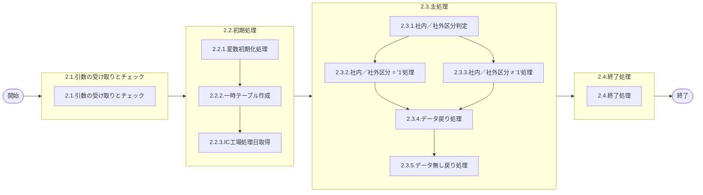

# 0. 表紙

| モジュール名 | プログラムID | プログラム名             |
| ------------ | ------------ | ------------------------ |
| IC           | LDAS9004     | 未出荷問合せ(複数SU指定) |

| RFC | Version | 更新日     | 更新者 | 更新内容 | 確認日     | 確認者 | 承認日     | 承認者 |
| --- | :-----: | ---------- | :----: | -------- | ---------- | :----: | ---------- | :----: |
| -   |  1.0.0  | 2025/09/26 | 余暁東 | 初版作成 | 2025/XX/XX |  XXX  | 2025/XX/XX |  XXX  |

## 1. 処理概要

### 1.1. 機能概要

複数SU指定のオーダー明細と独立所要量明細の未出荷問合せを返す。

### 1.2. 処理概要フロー



### 1.3. プログラム入出力パラメータ

#### 1.3.1. 引数

| No. | パラメータ論理名 | パラメータ物理名 | 属性    | 備考              |
| --- | ---------------- | ---------------- | ------- | ----------------- |
| 1   | 抽出期間開始日   | ps_start_date    | VARCHAR |                   |
| 2   | 抽出期間終了日   | ps_end_date      | VARCHAR |                   |
| 3   | 納入PF番号       | ps_deliv_pf_no   | VARCHAR |                   |
| 4   | 社内／社外区分   | ps_org_category  | VARCHAR | 1:ALL2:社内3:社外 |
| 5   | 使用者           | ps_usercd        | VARCHAR |                   |
| 6   | 生試初品区分     | ps_pilot_class   | VARCHAR |                   |
| 7   | 先行リードタイム | pn_precede_lt    | DECIMAL |                   |
| 8   | 供給者01         | ps_supplier01    | VARCHAR |                   |
| 9   | 供給者02         | ps_supplier02    | VARCHAR |                   |
| 10  | 供給者03         | ps_supplier03    | VARCHAR |                   |
| 11  | 供給者04         | ps_supplier04    | VARCHAR |                   |
| 12  | 供給者05         | ps_supplier05    | VARCHAR |                   |
| 13  | 供給者06         | ps_supplier06    | VARCHAR |                   |
| 14  | 供給者07         | ps_supplier07    | VARCHAR |                   |
| 15  | 供給者08         | ps_supplier08    | VARCHAR |                   |
| 16  | 供給者09         | ps_supplier09    | VARCHAR |                   |
| 17  | 供給者10         | ps_supplier10    | VARCHAR |                   |
| 18  | 供給者11         | ps_supplier11    | VARCHAR |                   |
| 19  | 供給者12         | ps_supplier12    | VARCHAR |                   |
| 20  | 供給者13         | ps_supplier13    | VARCHAR |                   |
| 21  | 供給者14         | ps_supplier14    | VARCHAR |                   |
| 22  | 供給者15         | ps_supplier15    | VARCHAR |                   |
| 23  | 供給者16         | ps_supplier16    | VARCHAR |                   |
| 24  | 供給者17         | ps_supplier17    | VARCHAR |                   |
| 25  | 供給者18         | ps_supplier18    | VARCHAR |                   |
| 26  | 供給者19         | ps_supplier19    | VARCHAR |                   |
| 27  | 供給者20         | ps_supplier20    | VARCHAR |                   |
| 28  | 供給者21         | ps_supplier21    | VARCHAR |                   |
| 29  | 供給者22         | ps_supplier22    | VARCHAR |                   |
| 30  | 供給者23         | ps_supplier23    | VARCHAR |                   |
| 31  | 供給者24         | ps_supplier24    | VARCHAR |                   |
| 32  | 供給者25         | ps_supplier25    | VARCHAR |                   |
| 33  | 供給者26         | ps_supplier26    | VARCHAR |                   |
| 34  | 供給者27         | ps_supplier27    | VARCHAR |                   |
| 35  | 供給者28         | ps_supplier28    | VARCHAR |                   |
| 36  | 供給者29         | ps_supplier29    | VARCHAR |                   |
| 37  | 供給者30         | ps_supplier30    | VARCHAR |                   |
| 38  | 供給者31         | ps_supplier31    | VARCHAR |                   |
| 39  | 供給者32         | ps_supplier32    | VARCHAR |                   |
| 40  | 供給者33         | ps_supplier33    | VARCHAR |                   |
| 41  | 供給者34         | ps_supplier34    | VARCHAR |                   |
| 42  | 供給者35         | ps_supplier35    | VARCHAR |                   |
| 43  | 供給者36         | ps_supplier36    | VARCHAR |                   |
| 44  | 供給者37         | ps_supplier37    | VARCHAR |                   |
| 45  | 供給者38         | ps_supplier38    | VARCHAR |                   |
| 46  | 供給者39         | ps_supplier39    | VARCHAR |                   |
| 47  | 供給者40         | ps_supplier40    | VARCHAR |                   |
| 48  | 供給者41         | ps_supplier41    | VARCHAR |                   |
| 49  | 供給者42         | ps_supplier42    | VARCHAR |                   |
| 50  | 供給者43         | ps_supplier43    | VARCHAR |                   |
| 51  | 供給者44         | ps_supplier44    | VARCHAR |                   |
| 52  | 供給者45         | ps_supplier45    | VARCHAR |                   |
| 53  | 供給者46         | ps_supplier46    | VARCHAR |                   |
| 54  | 供給者47         | ps_supplier47    | VARCHAR |                   |
| 55  | 供給者48         | ps_supplier48    | VARCHAR |                   |
| 56  | 供給者49         | ps_supplier49    | VARCHAR |                   |
| 57  | 供給者50         | ps_supplier50    | VARCHAR |                   |

#### 1.3.2. 戻り値

| No. | パラメータ論理名 | パラメータ物理名    | 属性    | 備考                                               |
| --- | ---------------- | ------------------- | ------- | -------------------------------------------------- |
| 1   | 処理ステータス   | rn_status           | INTEGER | 0:Normal-1:SqlError-2:ProgramError100:NotDataFound |
| 2   | SQLコード        | rs_sql_code         | VARCHAR |                                                    |
| 3   | エラーコード     | rs_err_code         | VARCHAR |                                                    |
| 4   | エラーメッセージ | rs_err_msg          | VARCHAR |                                                    |
| 5   | エラー位置       | rs_err_focus        | VARCHAR |                                                    |
| 6   | 遅延日数         | rn_delay_days       | INTEGER |                                                    |
| 7   | 品目番号         | rs_itemno           | VARCHAR |                                                    |
| 8   | 供給者           | rs_supplier         | VARCHAR |                                                    |
| 9   | 使用者           | rs_usercd           | VARCHAR |                                                    |
| 10  | 先行リードタイム | rn_precede_lt       | DECIMAL |                                                    |
| 11  | 納入PF番号       | rs_deliv_pf_no      | VARCHAR |                                                    |
| 12  | 格納ロケ         | rs_stock_location   | VARCHAR |                                                    |
| 13  | 品目名称         | rs_item_name        | VARCHAR |                                                    |
| 14  | オーダー番号     | rs_order_no         | VARCHAR |                                                    |
| 15  | 着手日           | rs_start_date       | VARCHAR |                                                    |
| 16  | 完了開始時間     | rs_due_begin_time   | VARCHAR |                                                    |
| 17  | 完了終了時間     | rs_due_end_time     | VARCHAR |                                                    |
| 18  | 所要数           | rn_required_qty     | DECIMAL |                                                    |
| 19  | オーダー残数     | rn_bo_qty           | DECIMAL |                                                    |
| 20  | 前工程在庫数     | rn_b_prj_stock_qty  | DECIMAL |                                                    |
| 21  | 引当残数         | rn_alloc_remain_qty | DECIMAL |                                                    |
| 22  | 生試初品区分     | rs_pilot_class      | VARCHAR |                                                    |

### 1.4. その他制御・要件

| 排他制御 |      |      |
| -------- | ---- | ---- |
| 楽観     | 悲観 | 無し |
| ●       | -    | -    |

| 項目               | 制約・制御・要件など              | 記載内容説明                                                     |
| ------------------ | --------------------------------- | ---------------------------------------------------------------- |
| パフォーマンス要件 | 特になし。 ※現行ベースで作成する | 特別なパフォーマンス要件がある場合に要件内容とその対処法を記述。 |

### 1.5. 入出力一覧

| No | 入出力対象 | 名称                      | 物理名称               | C | R  | U | D | 備考                    |
| -- | ---------- | ------------------------- | ---------------------- | - | -- | - | - | ----------------------- |
| 1  | テーブル   | IC工場処理日              | ld_mst_slip_date       | - | ○ | - | - |                         |
| 2  | テーブル   | MRP情報値                 | le_mst_mrp_information | - | ○ | - | - |                         |
| 3  | テーブル   | 品目共通                  | la_itemcomn            | - | ○ | - | - |                         |
| 4  | テーブル   | SUマスタ                  | la_area_master_su      | - | ○ | - | - |                         |
| 5  | テーブル   | オーダー明細              | le_trn_order           | - | ○ | - | - |                         |
| 6  | テーブル   | 日別カレンダーマスタ（D） | le_mst_calendar_sum    | - | ○ | - | - | (旧)lc_mst_calendar_sum |
| 7  | テーブル   | 独立所要量明細            | le_trn_ird             | - | ○ | - | - |                         |
| 8  | 共通関数   | 前工程在庫数取得          | LDYS0012               |   |    |   |   |                         |

## 2. 詳細処理

### 2.1. 引数の受け取りとチェック

なし。

### 2.2. 初期処理

#### 2.2.1. 変数初期化

内部変数の初期化を行う。

| 変数名                | 初期値 | 備考                           |
| --------------------- | ------ | ------------------------------ |
| ls_ic_slip_date       | ' '    | IC工場処理日                   |
| ln_interval_day_no    | 0      | 遅延日数                       |
| ls_itemno_key         | ' '    | 品目番号キー                   |
| ls_supplier_key       | ' '    | 供給者キー                     |
| ls_usercd_key         | ' '    | 使用者キー                     |
| ls_rs_count           | 0      | LDYS0012から取得した計算結果   |
| ls_rn_b_prj_stock_qty | 0      | LDYS0012から取得した手持在庫数 |
| ls_b_prj_stock_qty    | 0      | 前工程在庫数                   |
| ls_alloc_remain_qty   | 0      | 引当残数                       |
| ls_b_prj_stock_qty1   | 0      | 引当残数ワーク                 |

#### 2.2.2. 一時テーブル作成

未出荷問合せ結果格納用の一時テーブルを作成する。

```sql
CREATE TEMP TABLE temp_date(
     delay_days                   INTEGER,     --遅延日数
     itemno                       VARCHAR(30), --品目番号
     supplier                     VARCHAR(04), --供給者
     usercd                       VARCHAR(04), --使用者
     precede_lt                   DECIMAL,     --先行リードタイム
     deliv_pf_no                  VARCHAR(04), --納入PF番号
     stock_location               VARCHAR(05), --格納ロケ
     item_name                    VARCHAR(30), --品目名称
     order_no                     VARCHAR(05), --オーダー番号
     start_date                   VARCHAR(08), --着手日
     due_begin_time               VARCHAR(04), --完了開始時間
     due_end_time                 VARCHAR(04), --完了終了時間     
     required_qty                 DECIMAL,     --所要数
     bo_qty                       DECIMAL,     --オーダー残数
     b_prj_stock_qty              DECIMAL,     --前工程在庫数
     alloc_remain_qty             DECIMAL,     --引当残数
     pilot_class                  VARCHAR(01) --生試初品区分
) ON COMMIT DROP;
```

#### 2.2.3. IC工場処理日取得

IC工場処理日マスタからIC工場処理日を取得する。

```sql
SELECT IC工場処理日
  FROM IC工場処理日
 WHERE 処理タイプ = 'STD'
```

- データが存在しない場合：

  - エラーコード：'ld.E.LDP10004'
  - エラーメッセージ：'The IC pymac date is not exist.'
    - IC工場処理日が存在しません。
- 抽出期間終了日が空文字の場合：

  - 抽出期間終了日 = IC工場処理日

### 2.3. 主処理

#### 2.3.1. 社内／社外区分判定

引数.社内／社外区分により処理を分岐する。

- 社内／社外区分 = '1'（ALL）の場合：2.3.2へ
- 社内／社外区分 ≠ '1'の場合：2.3.3へ

#### 2.3.2. 社内／社外区分 = '1'（ALL）処理

##### 2.3.2.1. オーダー明細未出荷データ存在チェック・取得処理

```sql
SELECT B.品目番号
      ,B.供給者
      ,B.使用者
      ,A.先行リードタイム
      ,A.納入PF番号
      ,A.格納ロケーション
      ,COALESCE(D.品目名称, ' ') AS 品目名称
      ,B.オーダー番号
      ,B.完了日
      ,B.完了開始時間
      ,B.完了終了時間
      ,B.オーダー数
      ,B.オーダー残数
      ,B.生試初品区分
      ,C.現在有効カレンダー
  FROM MRP情報値 A
  LEFT OUTER JOIN 品目共通 D
    ON (D.品目番号 = A.品目番号)
      ,オーダー明細 B
      ,SUマスタ C
 WHERE A.品目番号    = B.品目番号
   AND A.供給者      = B.供給者
   AND A.使用者      = B.使用者
   AND A.供給者     <> A.使用者
   AND C.SUコード    = A.供給者
   AND A.供給者     IN (引数.供給者01, 引数.供給者02, ..., 引数.供給者50)
   AND B.オーダーステータス  = '2'
   AND (引数.生試初品区分 = '1'
       OR (引数.生試初品区分 = '2' AND B.生試初品区分 IN ('2','4'))
       OR (引数.生試初品区分 = '3' AND B.生試初品区分 = '3')
       OR (引数.生試初品区分 = '4' AND B.生試初品区分 = ' '))
   AND (TRIM(引数.使用者) = ''      OR A.使用者      = 引数.使用者)
   AND (TRIM(引数.納入PF番号) = '' OR A.納入PF番号 = 引数.納入PF番号)
   AND (引数.先行リードタイム = 0     OR A.先行リードタイム  = 引数.先行リードタイム)
   AND (TRIM(引数.抽出期間開始日) = ''  OR B.完了日  >= 引数.抽出期間開始日)
   AND B.完了日 <= 引数.抽出期間終了日
 ORDER BY B.品目番号
         ,B.供給者
         ,B.使用者
         ,B.完了日
```

各レコードに対して以下のLOOP処理を行う：

##### 2.3.2.1.1. 遅延日数計算処理（取得した.完了日とIC工場処理日の日数差）

```sql
SELECT 1
  FROM 日別カレンダーマスター(D)
 WHERE カレンダーコード = 取得した.現在有効カレンダー
   AND 稼働日区分       = '0'
   AND カレンダー年月日   > 2.2.3で取得した.IC工場処理日
   AND カレンダー年月日  <= 取得した.完了日
```

データが存在する場合、遅延日数を計算：

```sql
SELECT COUNT(1)
  FROM 日別カレンダーマスター(D)
 WHERE カレンダーコード = 取得した.現在有効カレンダー
   AND 稼働日区分       = '0'
   AND カレンダー年月日   > 2.2.3で取得した.IC工場処理日
   AND カレンダー年月日  <= 取得した.完了日
```

##### 2.3.2.1.2. 前工程在庫数・引当残数取得処理

###### 品目・供給者・使用者の変更チェック

2.3.2.1で取得した品目番号、供給者、使用者と変数.品目番号キー、供給者キー、使用者キーを比較し、いずれかに変更があった場合は新規に前工程在庫数を取得する。

**① 品目・供給者・使用者に変更がある場合**
変更がある場合、LDYS0012（前工程在庫数取得）をコールして前工程在庫数を取得する：

```sql
SELECT *
  FROM LDYS0012( 取得した.品目番号
                 ,取得した.供給者
                 ,取得した.使用者
                 ,2.2.3で取得した.IC工場処理日
                 ,取得した.オーダー番号
               )
```

- 戻り値.ステータスがエラー(0以外)の場合、例外を発生させる。
- その他の場合、以下の情報を取得：
  - 計算結果
  - 手持在庫数

**前工程在庫数・引当残数設定**
LDYS0012の戻り値.計算結果により以下の処理を行う：

• SP戻り値.計算結果 = '1'の場合：
変数.前工程在庫数と変数.引当残数 = NULL

• SP戻り値.計算結果 ≠ '1'の場合：
変数.前工程在庫数 = SP戻り値.手持在庫数
変数.引当残数 = SP戻り値.手持在庫数-2.3.2.1で取得.オーダー残数

**キー項目更新**
• 変数.品目番号キー = 2.3.2.1で取得.品目番号
• 変数.供給者キー = 2.3.2.1で取得.供給者
• 変数.使用者キー = 2.3.2.1で取得.使用者
• 変数.引当残数ワーク = 変数.引当残数

**② 品目・供給者・使用者に変更がない場合**
同一の品目・供給者・使用者の場合、以下の処理を行う：

• SP戻り値.計算結果 = '1'の場合：
変数.前工程在庫数と変数.引当残数 = NULL

• SP戻り値.計算結果 ≠ '1'の場合：
変数.前工程在庫数 = 変数.引当残数ワーク
変数.引当残数 = 変数.引当残数ワーク-2.3.2.1で取得.オーダー残数

• 変数.引当残数ワーク= 変数.引当残数

##### 2.3.2.1.3. 一時テーブルに挿入

```sql
INSERT INTO temp_date
( delay_days
  ,itemno
  ,supplier
  ,usercd
  ,precede_lt
  ,deliv_pf_no
  ,stock_location
  ,item_name
  ,order_no
  ,start_date
  ,due_begin_time
  ,due_end_time
  ,required_qty
  ,bo_qty
  ,b_prj_stock_qty
  ,alloc_remain_qty
  ,pilot_class)
VALUES
( 取得した.遅延日数
  ,2.3.2.1で取得した.品目番号
  ,2.3.2.1取得した.供給者
  ,取得した.使用者
  ,取得した.先行リードタイム
  ,取得した.納入PF番号
  ,取得した.格納ロケーション
  ,取得した.品目名称
  ,取得した.オーダー番号
  ,取得した.完了日
  ,取得した.完了開始時間
  ,取得した.完了終了時間
  ,取得した.オーダー数
  ,取得した.オーダー残数
  ,変数.前工程在庫数
  ,変数.引当残数
  ,取得した.生試初品区分
  );
```

LOOP終了後：

- 変数.遅延日数  =  0
- 変数.品目キー  =  ' '
- 変数.供給者キー = ' '
- 変数.使用者キー = ' '

##### 2.3.2.2. 独立所要量明細未出荷データ処理

引数.使用者がスペースの場合のみ実行

```sql
SELECT B.品目番号
      ,B.供給者
      ,B.使用者
      ,A.先行リードタイム
      ,B.独立需要送り先コード
      ,A.格納ロケーション
      ,COALESCE(D.品目名称, ' ') AS 品目名称
      ,B.オーダー番号
      ,B.着手日
      ,' ' AS 完了開始時間
      ,' ' AS 完了終了時間
      ,B.所要数
      ,B.所要残数
      ,B.生試初品区分
      ,C.現在有効カレンダー
  FROM MRP情報値 A
  LEFT OUTER JOIN 品目共通 D
    ON (D.品目番号 = A.品目番号)
      ,独立所要量明細 B
      ,SUマスタ C
 WHERE A.品目番号 = B.品目番号 
   AND A.供給者= B.供給者
   AND A.使用者= B.使用者
   AND C.SUコード = A.使用者
   AND A.使用者 IN (引数.供給者01, 引数.供給者02, ..., 引数.供給者50)
   AND B.オーダーステータス = '2'
   AND (引数.生試初品区分 = '1'
       OR (引数.生試初品区分 = '2' AND B.生試初品区分 IN ('2','4'))
       OR (引数.生試初品区分 = '3' AND B.生試初品区分 = '3')
       OR (引数.生試初品区分 = '4' AND B.生試初品区分 = ' '))
   AND B.所要量区分 = '0'
   AND (TRIM(引数.抽出期間開始日)  = '' OR B.着手日 >= 引数.抽出期間開始日)
   AND B.着手日 <= 引数.抽出期間終了日
   AND (引数.先行リードタイム = 0     OR A.先行リードタイム = 引数.先行リードタイム)
   AND (TRIM(引数.納入PF番号) = '' OR B.独立需要送り先コード = 引数.納入PF番号)
 ORDER BY B.品目番号
         ,B.供給者
         ,B.使用者
         ,B.着手日
```

**遅延日数計算処理（取得した.着手日とIC工場処理日の日数差）**2.3.2.1.1の**遅延日数計算処理**と同じように遅延日数を計算する

**2.3.2.1.2の前工程在庫数・引当残数取得処理と同じように数量を計算する**

**一時テーブルに挿入**

```sql
INSERT INTO temp_date
( delay_days
  ,itemno
  ,supplier
  ,usercd
  ,precede_lt
  ,deliv_pf_no
  ,stock_location
  ,item_name
  ,order_no
  ,start_date
  ,due_begin_time
  ,due_end_time
  ,required_qty
  ,bo_qty
  ,b_prj_stock_qty
  ,alloc_remain_qty
  ,pilot_class)
VALUES
( 取得した.遅延日数
  ,2.3.2.2で取得した.品目番号
  ,2.3.2.2取得した.供給者
  ,取得した.使用者
  ,取得した.先行リードタイム
  ,取得した.納入PF番号
  ,取得した.格納ロケーション
  ,取得した.品目名称
  ,取得した.オーダー番号
  ,取得した.着手日
  ,取得した.完了開始時間
  ,取得した.完了終了時間
  ,取得した.オーダー数
  ,取得した.オーダー残数
  ,変数.前工程在庫数
  ,変数.引当残数
  ,取得した.生試初品区分);
```

LOOP終了後：

- 変数.遅延日数  =  0
- 変数.品目キー  =  ' '
- 変数.供給者キー = ' '
- 変数.使用者キー = ' '

#### 2.3.3. 社内／社外区分 ≠ '1'処理

##### 2.3.3.1. オーダー明細処理

```sql
SELECT D.品目番号
      ,D.供給者
      ,D.使用者
      ,A.先行リードタイム
      ,A.納入PF番号
      ,A.格納ロケーション
      ,COALESCE(E.品目名称, ' ') AS 品目名称
      ,D.オーダー番号
      ,D.完了日
      ,D.完了開始時間
      ,D.完了終了時間
      ,D.オーダー数
      ,D.オーダー残数
      ,D.生試初品区分
      ,C.現在有効カレンダー
  FROM MRP情報値 A
  LEFT OUTER JOIN 品目共通 E
    ON (E.品目番号 = A.品目番号)
      ,SUマスタ B
      ,SUマスタ C
      ,オーダー明細 D
 WHERE A.供給者     <> A.使用者
   AND A.供給者     IN (引数.供給者01, 引数.供給者02, ..., 引数.供給者50)
   AND B.SUコード      = A.使用者
   AND A.品目番号      = D.品目番号
   AND A.供給者        = D.供給者
   AND A.使用者        = D.使用者
   AND D.オーダーステータス  = '2'
   AND (引数.生試初品区分 = '1'
       OR (引数.生試初品区分 = '2' AND D.生試初品区分 IN ('2','4'))
       OR (引数.生試初品区分 = '3' AND D.生試初品区分 = '3')
       OR (引数.生試初品区分 = '4' AND D.生試初品区分 = ' '))
   AND C.SUコード       = A.供給者
   AND (引数.社内／社外区分 = '1'
       OR (B.エリアカテゴリ = '06' AND 引数.社内／社外区分 = '2')
       OR (B.エリアカテゴリ = '56' AND 引数.社内／社外区分 = '3'))
   AND (TRIM(引数.使用者) = ''      OR A.使用者       = 引数.使用者)
   AND (TRIM(引数.納入PF番号) = '' OR A.納入PF番号  = 引数.納入PF番号)
   AND (引数.先行リードタイム = 0     OR A.先行リードタイム   = 引数.先行リードタイム)
   AND (TRIM(引数.抽出期間開始日) = ''  OR D.完了日    >= 引数.抽出期間開始日)
   AND D.完了日 <= 引数.抽出期間終了日
 ORDER BY D.品目番号
         ,D.供給者
         ,D.使用者
         ,D.完了日
```

**遅延日数計算処理（取得した.着手日とIC工場処理日の日数差）**2.3.2.1.1の**遅延日数計算処理**と同じように遅延日数を計算する

**2.3.2.1.2の前工程在庫数・引当残数取得処理と同じように数量を計算する**

**一時テーブルに挿入**

```sql
INSERT INTO temp_date
( delay_days
  ,itemno
  ,supplier
  ,usercd
  ,precede_lt
  ,deliv_pf_no
  ,stock_location
  ,item_name
  ,order_no
  ,start_date
  ,due_begin_time
  ,due_end_time
  ,required_qty
  ,bo_qty
  ,b_prj_stock_qty
  ,alloc_remain_qty
  ,pilot_class)
VALUES
( 取得した.遅延日数
  ,2.3.2.2で取得した.品目番号
  ,2.3.2.2取得した.供給者
  ,取得した.使用者
  ,取得した.先行リードタイム
  ,取得した.納入PF番号
  ,取得した.格納ロケーション
  ,取得した.品目名称
  ,取得した.オーダー番号
  ,取得した.完了日
  ,取得した.完了開始時間
  ,取得した.完了終了時間
  ,取得した.オーダー数
  ,取得した.オーダー残数
  ,変数.前工程在庫数
  ,変数.引当残数
  ,取得した.生試初品区分);
```

LOOP終了後：

- 変数.遅延日数  =  0
- 変数.品目キー  =  ' '
- 変数.供給者キー = ' '
- 変数.使用者キー = ' '

##### 2.3.3.2. 独立所要量明細処理

引数.使用者がスペースの場合のみ実行。

```sql
SELECT B.品目番号
      ,B.供給者
      ,B.使用者
      ,A.先行リードタイム
      ,B.独立需要送り先コード
      ,A.格納ロケーション
      ,COALESCE(E.品目名称, ' ') AS 品目名称
      ,B.オーダー番号
      ,B.着手日
      ,' ' AS 完了開始時間
      ,' ' AS 完了終了時間
      ,B.所要数
      ,B.所要残数
      ,B.生試初品区分
      ,D.現在有効カレンダー
  FROM MRP情報値 A
  LEFT OUTER JOIN 品目共通 E
    ON (E.品目番号 = A.品目番号)
      ,独立所要量明細 B
      ,SUマスタ C
      ,SUマスタ D
 WHERE A.品目番号 = B.品目番号 
   AND A.供給者= B.供給者
   AND A.使用者= B.使用者
   AND C.SUコード = A.使用者
   AND D.SUコード = A.供給者
   AND A.使用者 IN (引数.供給者01, 引数.供給者02, ..., 引数.供給者50)
   AND B.オーダーステータス = '2'
   AND (引数.生試初品区分 = '1'
       OR (引数.生試初品区分 = '2' AND B.生試初品区分 IN ('2','4'))
       OR (引数.生試初品区分 = '3' AND B.生試初品区分 = '3')
       OR (引数.生試初品区分 = '4' AND B.生試初品区分 = ' '))
   AND B.所要量区分 = '0'
   AND (引数.社内／社外区分 = '1'
       OR (C.エリアカテゴリ = '06' AND 引数.社内／社外区分 = '2')
       OR (C.エリアカテゴリ = '56' AND 引数.社内／社外区分 = '3'))
   AND (TRIM(引数.抽出期間開始日)  = '' OR B.着手日 >= 引数.抽出期間開始日)
   AND B.着手日 <= 引数.抽出期間終了日
   AND (引数.先行リードタイム = 0     OR A.先行リードタイム = 引数.先行リードタイム)
   AND (TRIM(引数.納入PF番号) = '' OR B.独立需要送り先コード = 引数.納入PF番号)
 ORDER BY B.品目番号
         ,B.供給者
         ,B.使用者
         ,B.着手日
```

**遅延日数計算処理（取得した.着手日とIC工場処理日の日数差）**2.3.2.1.1の**遅延日数計算処理**と同じように遅延日数を計算する

**2.3.2.1.2の前工程在庫数・引当残数取得処理と同じように数量を計算する**

**一時テーブルに挿入**

```sql
INSERT INTO temp_date
( delay_days
  ,itemno
  ,supplier
  ,usercd
  ,precede_lt
  ,deliv_pf_no
  ,stock_location
  ,item_name
  ,order_no
  ,start_date
  ,due_begin_time
  ,due_end_time
  ,required_qty
  ,bo_qty
  ,b_prj_stock_qty
  ,alloc_remain_qty
  ,pilot_class)
VALUES
( 取得した.遅延日数
  ,2.3.2.2で取得した.品目番号
  ,2.3.2.2取得した.供給者
  ,取得した.使用者
  ,取得した.先行リードタイム
  ,取得した.納入PF番号
  ,取得した.格納ロケーション
  ,取得した.品目名称
  ,取得した.オーダー番号
  ,取得した.着手日
  ,取得した.完了開始時間
  ,取得した.完了終了時間
  ,取得した.オーダー数
  ,取得した.オーダー残数
  ,変数.前工程在庫数
  ,変数.引当残数
  ,取得した.生試初品区分);
```

LOOP終了後：

- 変数.遅延日数  =  0
- 変数.品目キー  =  ' '
- 変数.供給者キー = ' '
- 変数.使用者キー = ' '

#### 2.3.4. データ戻り処理

一時テーブルにデータが存在する場合、以下の処理を行う：

```sql
SELECT 遅延日数
      ,品目番号
      ,供給者
      ,使用者
      ,先行リードタイム
      ,納入PF番号
      ,格納ロケ
      ,品目名称
      ,オーダー番号
      ,着手日
      ,完了開始時間
      ,完了終了時間
      ,所要数
      ,オーダー残数
      ,前工程在庫数
      ,引当残数
      ,生試区分
  FROM temp_date
```

該当データがなくなるまで以下の処理を繰り返す：

- 戻り値.処理ステータス = 0
- 遅延日数を「* -1」で変換
- 取得した各項目を対応する戻り値パラメータに設定
- RETURN NEXTで結果を戻す

#### 2.3.5. データ無し戻り処理

一時テーブルにデータが存在しない場合：

- 戻り値.処理ステータス = 100
- その他の項目は初期値のまま
- 結果を戻す

### 2.4. 終了処理

- 処理を正常終了する

| 戻り値           | 属性    | 設定値   |
| ---------------- | ------- | -------- |
| 処理ステータス   | INTEGER | 0        |
| SQL コード       | VARCHAR | スペース |
| エラーコード     | VARCHAR | スペース |
| エラーメッセージ | VARCHAR | スペース |

## 3. 補足説明

### 3.1. 戻り値について

**ステータスについて**

- 0 : Normal（正常終了）
- 100 : Not Data Found（データなし）
- -1 : Sql Error（SQLエラー）
- -2 : Program Error（プログラムエラー）

### 3.2. エラー発生時の対応について

### 3.2.1. 業務例外処理

引数チェック等でプログラムエラーが発生した場合：

| 戻り値           | 設定値         |
| ---------------- | -------------- |
| 処理ステータス   | -2             |
| SQLコード        | スペース       |
| エラーコード     | エラーコード値 |
| エラーメッセージ | エラー内容     |
| エラー位置       | 'LDAS9004'     |
| その他項目       | 初期値         |

### 3.2.2. その他例外処理

データベースアクセス時にSQLエラーが発生した場合：

| 戻り値           | 設定値     |
| ---------------- | ---------- |
| 処理ステータス   | -1         |
| SQLコード        | SQLSTATE   |
| エラーコード     | スペース   |
| エラーメッセージ | SQLERRM    |
| エラー位置       | 'LDAS9004' |
| その他項目       | 初期値     |
