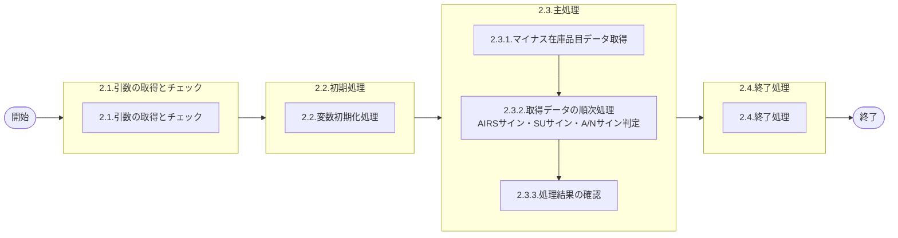

# 0. 表紙

| モジュール名 | プログラムID | プログラム名     |
| ------------ | ------------ | ---------------- |
| IC           | LDAS9010     | マイナス在庫抽出 |

| RFC | Version | 更新日     | 更新者 | 更新内容 | 確認日     | 確認者 | 承認日     | 承認者 |
| --- | :-----: | ---------- | :----: | -------- | ---------- | :----: | ---------- | :----: |
| -   |  1.0.0  | 2025/09/23 | 余暁東 | 初版作成 | 2025/XX/XX |  XXX  | 2025/XX/XX |  XXX  |

## 1. 処理概要

### 1.1. 機能概要

手持在庫数がマイナスの品目情報を返す。
AIRS以外のデータを対象にしている。

### 1.2. 処理概要フロー



### 1.3. プログラム入出力パラメータ

#### 1.3.1. 引数

| No. | パラメータ論理名 | パラメータ物理名 | 属性    | 備考                                           |
| --- | ---------------- | ---------------- | ------- | ---------------------------------------------- |
| 1   | SUサイン         | ps_su_sign       | VARCHAR | ALL:1   S=U:2  S≠U:3   (必須)            |
| 2   | 供給者           | ps_supplier      | VARCHAR | 任意指定                                       |
| 3   | A/Nサイン        | ps_act_sign      | VARCHAR | ALL:1   ACTIVE:2   NOTACTIVE:3    (必須) |
| 4   | 使用者01         | ps_usercd01      | VARCHAR |                                                |
| 5   | 使用者02         | ps_usercd02      | VARCHAR |                                                |
| 6   | 使用者03         | ps_usercd03      | VARCHAR |                                                |
| 7   | 使用者04         | ps_usercd04      | VARCHAR |                                                |
| 8   | 使用者05         | ps_usercd05      | VARCHAR |                                                |
| 9   | 使用者06         | ps_usercd06      | VARCHAR |                                                |
| 10  | 使用者07         | ps_usercd07      | VARCHAR |                                                |
| 11  | 使用者08         | ps_usercd08      | VARCHAR |                                                |
| 12  | 使用者09         | ps_usercd09      | VARCHAR |                                                |
| 13  | 使用者10         | ps_usercd10      | VARCHAR |                                                |
| 14  | 使用者11         | ps_usercd11      | VARCHAR |                                                |
| 15  | 使用者12         | ps_usercd12      | VARCHAR |                                                |
| 16  | 使用者13         | ps_usercd13      | VARCHAR |                                                |
| 17  | 使用者14         | ps_usercd14      | VARCHAR |                                                |
| 18  | 使用者15         | ps_usercd15      | VARCHAR |                                                |
| 19  | 使用者16         | ps_usercd16      | VARCHAR |                                                |
| 20  | 使用者17         | ps_usercd17      | VARCHAR |                                                |
| 21  | 使用者18         | ps_usercd18      | VARCHAR |                                                |
| 22  | 使用者19         | ps_usercd19      | VARCHAR |                                                |
| 23  | 使用者20         | ps_usercd20      | VARCHAR |                                                |
| 24  | 使用者21         | ps_usercd21      | VARCHAR |                                                |
| 25  | 使用者22         | ps_usercd22      | VARCHAR |                                                |
| 26  | 使用者23         | ps_usercd23      | VARCHAR |                                                |
| 27  | 使用者24         | ps_usercd24      | VARCHAR |                                                |
| 28  | 使用者25         | ps_usercd25      | VARCHAR |                                                |
| 29  | 使用者26         | ps_usercd26      | VARCHAR |                                                |
| 30  | 使用者27         | ps_usercd27      | VARCHAR |                                                |
| 31  | 使用者28         | ps_usercd28      | VARCHAR |                                                |
| 32  | 使用者29         | ps_usercd29      | VARCHAR |                                                |
| 33  | 使用者30         | ps_usercd30      | VARCHAR |                                                |
| 34  | 使用者31         | ps_usercd31      | VARCHAR |                                                |
| 35  | 使用者32         | ps_usercd32      | VARCHAR |                                                |
| 36  | 使用者33         | ps_usercd33      | VARCHAR |                                                |
| 37  | 使用者34         | ps_usercd34      | VARCHAR |                                                |
| 38  | 使用者35         | ps_usercd35      | VARCHAR |                                                |
| 39  | 使用者36         | ps_usercd36      | VARCHAR |                                                |
| 40  | 使用者37         | ps_usercd37      | VARCHAR |                                                |
| 41  | 使用者38         | ps_usercd38      | VARCHAR |                                                |
| 42  | 使用者39         | ps_usercd39      | VARCHAR |                                                |
| 43  | 使用者40         | ps_usercd40      | VARCHAR |                                                |
| 44  | 使用者41         | ps_usercd41      | VARCHAR |                                                |
| 45  | 使用者42         | ps_usercd42      | VARCHAR |                                                |
| 46  | 使用者43         | ps_usercd43      | VARCHAR |                                                |
| 47  | 使用者44         | ps_usercd44      | VARCHAR |                                                |
| 48  | 使用者45         | ps_usercd45      | VARCHAR |                                                |
| 49  | 使用者46         | ps_usercd46      | VARCHAR |                                                |
| 50  | 使用者47         | ps_usercd47      | VARCHAR |                                                |
| 51  | 使用者48         | ps_usercd48      | VARCHAR |                                                |
| 52  | 使用者49         | ps_usercd49      | VARCHAR |                                                |
| 53  | 使用者50         | ps_usercd50      | VARCHAR |                                                |

#### 1.3.2. 戻り値

| No. | パラメータ論理名 | パラメータ物理名     | 属性      | 備考 |
| --- | ---------------- | -------------------- | --------- | ---- |
| 1   | ステータス       | rn_status            | INTEGER   |      |
| 2   | SQLコード        | rs_sql_code          | VARCHAR   |      |
| 3   | エラーコード     | rs_err_code          | VARCHAR   |      |
| 4   | エラーメッセージ | rs_err_msg           | VARCHAR   |      |
| 5   | エラー位置       | rs_err_focus         | VARCHAR   |      |
| 6   | 品目番号         | rs_itemno            | VARCHAR   |      |
| 7   | 供給者           | rs_supplier          | VARCHAR   |      |
| 8   | 使用者           | rs_usercd            | VARCHAR   |      |
| 9   | 品目名称         | rs_item_name         | VARCHAR   |      |
| 10  | 品目ステータス   | rs_item_status       | VARCHAR   |      |
| 11  | 納入PF番号       | rs_deliv_pf_no       | VARCHAR   |      |
| 12  | 格納ロケーション | rs_stock_location_no | VARCHAR   |      |
| 13  | 投入作業区       | rs_input_work_center | VARCHAR   |      |
| 14  | 手持在庫数       | rn_oh_qty            | DECIMAL   |      |
| 15  | 更新日時         | rt_update_datetime   | TIMESTAMP |      |

### 1.4. その他制御・要件

| 排他制御 |      |      |
| -------- | ---- | ---- |
| 楽観     | 悲観 | 無し |
| ●       | -    | -    |

| 項目               | 制約・制御・要件など | 記載内容説明                                                     |
| ------------------ | -------------------- | ---------------------------------------------------------------- |
| パフォーマンス要件 | 特になし。           | 特別なパフォーマンス要件がある場合に要件内容とその対処法を記述。 |

### 1.5. 入出力一覧

| No | 入出力対象 | 名称         | 物理名称               | C | R  | U | D | 備考 |
| -- | ---------- | ------------ | ---------------------- | - | -- | - | - | ---- |
| 1  | テーブル   | 品目マスター | la_itemmast            | - | ○ | - | - |      |
| 2  | テーブル   | MRP情報値    | le_mst_mrp_information | - | ○ | - | - |      |
| 3  | テーブル   | 在庫ファイル | ld_trn_inv             | - | ○ | - | - |      |
| 4  | テーブル   | 品目共通     | la_itemcomn            | - | ○ | - | - |      |
| 5  | テーブル   | SUマスタ     | la_area_master_su      | - | ○ | - | - |      |

## 2. 詳細処理

### 2.1. 引数の取得とチェック

- 引数.SUサインが NULL または '1', '2', '3' 以外の場合

  - エラーコード：ld.E.LDP10123
  - エラーメッセージ：'SUサインが"1"、"2"、"3"以外です。'
- 引数.A/Nサインが NULL または '1', '2', '3' 以外の場合

  - エラーコード：ld.E.LDP10124
  - エラーメッセージ：'A/Nサインが"1"、"2"、"3"以外です。'
- 引数.供給者が NULL の場合はスペースに設定する

### 2.2. 初期処理

- 利用する変数を初期化する。

### 2.3. 主処理

#### 2.3.1. マイナス在庫品目データ取得

手持在庫数がマイナスの品目情報を取得する。

```sql
SELECT A.品目番号
      ,A.供給者
      ,A.使用者
      ,A.品目ステータス
      ,B.納入PF番号
      ,B.格納ロケーション
      ,B.投入作業区
      ,C.手持在庫数
      ,C.更新日時
      ,C.発注済オーダー数
      ,C.発注済所要数(独立所要)
      ,C.発注済所要数(従属所要)
      ,C.内示計画存在区分
      ,D.品目名称
      ,CASE WHEN B.AIRSサイン = ' ' THEN E.AIRSサイン
            ELSE B.AIRSサイン END  AS AIRSサイン
  FROM 品目マスター A
      ,MRP情報値 B
      ,在庫ファイル C
      ,品目共通 D
      ,SUマスタ E
 WHERE A.品目クラス IN ('2', 'E')
   AND (引数.供給者 = ' '
    OR  引数.供給者 <> ' ' AND A.供給者 = 引数.供給者)
   AND A.使用者 IN (引数.使用者01, 引数.使用者02, ..., 引数.使用者50)
   AND B.品目番号 = A.品目番号
   AND B.供給者 = A.供給者
   AND B.使用者 = A.使用者
   AND C.品目番号 = A.品目番号
   AND C.供給者 = A.供給者
   AND C.使用者 = A.使用者
   AND C.手持在庫数 < 0
   AND D.品目番号 = A.品目番号
   AND E.SUコード = A.供給者
 ORDER BY A.品目番号
         ,A.供給者
         ,A.使用者
```

#### 2.3.2. 取得データの順次処理

2.3.1で取得したレコードを1件ずつ処理し、以下の条件チェックを全レコードが処理完了するまで繰り返す。

##### 2.3.2.1. AIRSサイン判定

取得したレコードのAIRSサインをチェックし、'1'の場合は次のレコードの処理へ移行する。

##### 2.3.2.2. SUサイン判定

引数のSUサインに基づいてフィルタリングを行う。

- SUサイン = '2' かつ 供給者 ≠ 使用者 の場合：次のレコードの処理へ移行する
- SUサイン = '3' かつ 供給者 = 使用者 の場合：次のレコードの処理へ移行する

##### 2.3.2.3. A/Nサイン判定

引数のA/Nサインに基づいてフィルタリングを行う。

- 引数.A/Nサイン = '2' かつ  (2.3.1で取得.発注済オーダー数 <= 0 かつ  2.3.1で取得.発注済所要数（独立所要）<= 0 かつ 2.3.1で取得.発注済所要数（従属所要）<= 0  かつ  2.3.1で取得.内示計画存在区分 = "0")  )の場合：次のレコードの処理へ移行する
- 引数.A/Nサイン = '3' かつ (2.3.1で取得.発注済オーダー数  >0  または  2.3.1で取得.発注済所要数（独立所要）>0  または 2.3.1で取得. 発注済所要数（従属所要）>0  または  2.3.1で取得.内示計画存在区分 ≠ "0")  )   の場合：次のレコードの処理へ移行する

##### 2.3.2.4. 結果データ返却

検索条件を満たすレコードを戻り値に設定して返却する。

該当データが存在することを示すフラグを '1' に設定する。

#### 2.3.3. 処理結果の確認

全レコードの処理が完了後、該当データ存在フラグをチェックする。

### 2.4. 終了処理

該当データ存在フラグが '0' の場合（該当データが存在しない場合）、ステータスを100に設定し、その他の戻り値を初期化して返却する。

該当データ存在フラグが '1' の場合（該当データが存在する場合）、ステータスを0に設定して正常終了する。

## 3. 補足説明

### 3.1. 戻り値について

- ステータス
  - 0: 正常終了
  - -1: SQLエラー
  - -2: プログラムエラー
  - 100: データ無し

### 3.2. エラー発生時の対応について

- 戻り値.エラー位置 :'LDAS9010'

#### 3.2.1. プログラムエラー

引数チェック等でプログラムエラーが発生した場合：

- 処理ステータス = -2
- エラーコードとエラーメッセージに詳細情報を設定
- その他の項目は初期値またはスペースを設定
- 結果をリターンして処理終了

#### 3.2.2. SQLエラー

データベースアクセス時にSQLエラーが発生した場合：

- 処理ステータス = -1
- SQLコードにSQLSTATEを設定
- エラーメッセージにSQLERRMを設定
- その他の項目は初期値またはスペースを設定
- 結果をリターンして処理終了
