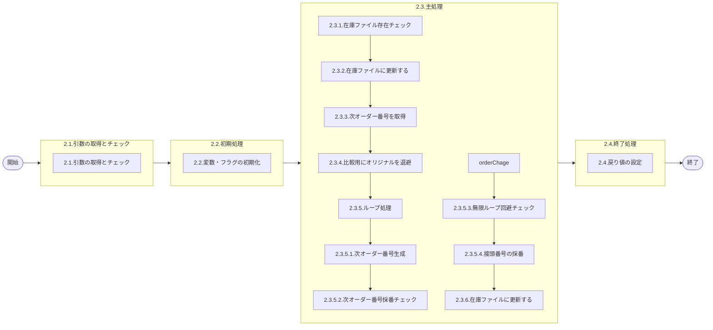

# 0. 表紙

| モジュール名 | プログラムID | プログラム名     |
| ------------ | ------------ | ---------------- |
| IC           | LDYS0003     | オーダー番号採番 |

| RFC | Version | 更新日     | 更新者 | 更新内容 | 確認日     | 確認者 | 承認日     | 承認者 |
| --- | :-----: | ---------- | :----: | -------- | ---------- | :----: | ---------- | :----: |
| -   |  1.0.0  | 2025/09/10 | 李鵬陽 | 初版作成 | 2025/XX/XX |  XXX  | 2025/XX/XX |  XXX  |

## 1. 処理概要

### 1.1. 機能概要

在庫ファイル、オーダー番号、独立所要量明細、オーダー番号明細内示を存在チェックし、オーダ番号を採番して在庫ファイルに更新する。
補足
オーダー番号３桁は廃止になるため、変換処理不要

### 1.2. 処理概要フロー



### 1.3. プログラム入出力パラメータ

#### 1.3.1. 引数

| No. | パラメータ論理名 | パラメータ物理名 | 属性    | 備考 |
| --- | ---------------- | ---------------- | ------- | ---- |
| 1   | ユーザーID       | ps_user_id       | VARCHAR |      |
| 2   | 品目番号         | ps_itemno        | VARCHAR |      |
| 3   | 供給者           | ps_supplier      | VARCHAR |      |
| 4   | 使用者           | ps_usercd        | VARCHAR |      |
| 5   | 入力区分         | ps_input_class   | VARCHAR |      |
| 6   | 生試初品区分     | ps_pilot_class   | VARCHAR |      |
| 7   |                  |                  |         |      |

#### 1.3.2. 戻り値

| No. | パラメータ論理名 | パラメータ物理名 | 属性    | 備考                      |
| --- | ---------------- | ---------------- | ------- | ------------------------- |
| 1   | 処理ステータス   | rn_status        | INTEGER | 0:正常終了,-1,-2:異常終了 |
| 2   | SQLコード        | rs_sql_code      | VARCHAR |                           |
| 3   | エラーコード     | rs_err_code      | VARCHAR |                           |
| 4   | エラーメッセージ | rs_err_msg       | VARCHAR |                           |
| 5   | エラー位置       | rs_err_focus     | VARCHAR |                           |
| 6   | オーダNo.        | rs_order_no      | VARCHAR |                           |

### 1.4. その他制御・要件

| 排他制御 |      |      |
| -------- | ---- | ---- |
| 楽観     | 悲観 | 無し |
| ●       | -    | -    |

| 項目               | 制約・制御・要件など | 記載内容説明                                                     |
| ------------------ | -------------------- | ---------------------------------------------------------------- |
| パフォーマンス要件 | 特になし。           | 特別なパフォーマンス要件がある場合に要件内容とその対処法を記述。 |

### 1.5. 入出力一覧

| No | 入出力対象 | 名称                     | 物理名称              | C | R  | U  | D | 備考 |
| -- | ---------- | ------------------------ | --------------------- | - | -- | -- | - | ---- |
| 1  | テーブル   | 在庫ファイル             | ld_trn_inv            |   | ○ | ○ |   |      |
| 2  | テーブル   | オーダー明細             | le_trn_order          |   | ○ |    |   |      |
| 3  | テーブル   | 独立所要量明細           | le_trn_ird            |   | ○ |    |   |      |
| 4  | テーブル   | オーダー明細内示         | le_trn_order_forecast |   | ○ |    |   |      |
| 5  | テーブル   | 機能オプションパラメータ | lz_function_parameter |   | ○ |    |   |      |

## 2. 詳細処理

### 2.1. 引数の取得とチェック

- 引数.入力区分 が　ブランク　又は　 NULL 　の場合、
  引数.入力区分 = '2'

### 2.2. 初期処理

利用する変数を初期化する。

| No. | 変数論理名                      | 初期化設定値 |
| :-: | ------------------------------- | ------------ |
|  1  | 変数.オーダNo.                  | スペース     |
|  2  | 変数.接頭番号（ｵﾝﾗｲﾝ）     | スペース     |
|  3  | 変数.順序番号（ｵﾝﾗｲﾝ）     | スペース     |
|  4  | 変数.接頭番号（ﾊﾞｯﾁ）       | スペース     |
|  5  | 変数.順序番号（ﾊﾞｯﾁ）       | スペース     |
|  6  | 変数.順序番号MAX                | '9999'       |
|  7  | 変数.初回接頭番号（ｵﾝﾗｲﾝ） | スペース     |
|  8  | 変数.初回順序番号（ｵﾝﾗｲﾝ） | スペース     |
|  9  | 変数.初回接頭番号（ﾊﾞｯﾁ）   | スペース     |
| 10 | 変数.初回順序番号（ﾊﾞｯﾁ）   | スペース     |

利用するフラグを初期化する。

| No. | 変数論理名        | 初期化設定値 |
| :-: | ----------------- | ------------ |
|  1  | 変数.繰越フラグ   | '0'          |
|  2  | 変数.ループフラグ | '0'          |

### 2.3. 主処理

#### 2.3.1. 在庫ファイル存在チェック

在庫ファイルを検索する

```sql
SELECT 1
  FROM 在庫ファイル 
 WHERE 品目番号 = 引数.品目番号
   AND 供給者 = 引数.供給者
   AND 使用者 = 引数.使用者
```

- データが存在しない場合、エラーメッセージを出力し処理終了。
  - エラーコード : 'E.LDP10564'
  - エラーメッセージ : 'No framework for order number assignment remains.'
  - (オーダー採番枠がありません)

#### 2.3.2. 在庫ファイルに更新する

```sql
UPDATE 在庫ファイル 
   SET 更新日時 = システム時間
      ,更新者 = 引数.ユーザーID
      ,更新pgid = 'LDYS0003'
      ,更新カウンター = 更新カウンター + 1
 WHERE 品目番号 = 引数.品目番号
   AND 供給者 = 引数.供給者
   AND 使用者 = 引数.使用者
```

#### 2.3.3. 次オーダー番号を取得

```sql
SELECT 接頭番号（ｵﾝﾗｲﾝ）
      ,順序番号（ｵﾝﾗｲﾝ）
      ,接頭番号（ﾊﾞｯﾁ）
      ,順序番号（ﾊﾞｯﾁ）
    INTO 変数.接頭番号（ｵﾝﾗｲﾝ）
         変数.順序番号（ｵﾝﾗｲﾝ）
         変数.接頭番号（ﾊﾞｯﾁ）
         変数.順序番号（ﾊﾞｯﾁ）
  FROM 在庫ファイル 
 WHERE 品目番号 = 引数.品目番号
   AND 供給者 = 引数.供給者
   AND 使用者 = 引数.使用者
```

#### 2.3.4. 比較用にオリジナルを退避

- 引数.入力区分 が　'1' 　の場合
  変数.初回接頭番号（ｵﾝﾗｲﾝ） = 変数.接頭番号（ｵﾝﾗｲﾝ）
  変数.初回順序番号（ｵﾝﾗｲﾝ） = 変数.順序番号（ｵﾝﾗｲﾝ）
- それ以外の場合
  変数.初回接頭番号（ﾊﾞｯﾁ） = 変数.接頭番号（ﾊﾞｯﾁ）
  変数.初回順序番号（ﾊﾞｯﾁ） = 変数.順序番号（ﾊﾞｯﾁ）

#### 2.3.5. オーダー番号採番 ループ処理

変数.ループフラグ = '0' の場合、　ループ継続

それ以外の場合 、ループ終了

※ループ START

##### 2.3.5.1. 次オーダー番号生成

- 引数.生試初品区分 が '2' または '4' の場合、
  - 引数.入力区分 が　'1' 　の場合、
    変数.オーダNo. = 'M' || 変数.順序番号（ｵﾝﾗｲﾝ）
  - それ以外の場合
    変数.オーダNo. = 'N' || 変数.順序番号（ﾊﾞｯﾁ）
- それ以外の場合
  - 引数.入力区分 が　'1' 　の場合、
    変数.オーダNo. = TRIM（変数.接頭番号（ｵﾝﾗｲﾝ）） || 変数.順序番号（ｵﾝﾗｲﾝ）
  - それ以外の場合
    変数.オーダNo. = TRIM（変数.接頭番号（ﾊﾞｯﾁ）） || 変数.順序番号（ﾊﾞｯﾁ）

##### 2.3.5.2. 次オーダー番号採番チェック

- オーダー明細を検索する

```sql
SELECT 1
  FROM オーダー明細 
 WHERE オーダNo. = 変数.オーダNo.
   AND 品目番号 = 引数.品目番号
   AND 供給者 = 引数.供給者
   AND 使用者 = 引数.使用者
```

- データが存在しない場合（次オーダー番号がオーダー明細に存在しない場合、採番確定）
  変数.ループフラグ = '1'

-変数.ループフラグ = '1'の場合 所要量明細を検索する

```sql
SELECT 1
  FROM 所要量明細 
 WHERE オーダNo. = 変数.オーダNo.
   AND 品目番号 = 引数.品目番号
   AND 供給者 = 引数.供給者
   AND 使用者 = 引数.使用者
```

- データが存在の場合（次オーダー番号が所要量明細に存在した場合、再度採番）、
  変数.ループフラグ = '0'

-変数.ループフラグ = '1'の場合 オーダー明細内示を検索する

```sql
SELECT 1
  FROM オーダー明細内示 
 WHERE オーダNo. = 変数.オーダNo.
   AND 品目番号 = 引数.品目番号
   AND 供給者 = 引数.供給者
   AND 使用者 = 引数.使用者
```

- データが存在の場合（次オーダー番号が所要量明細に存在した場合、再度採番）、
  変数.ループフラグ = '0'
  繰越フラグ= '0'
- 引数.入力区分 が　'1' 　の場合

  - 変数.順序番号（ｵﾝﾗｲﾝ） <> 変数.順序番号MAX　の場合
    変数.順序番号（ｵﾝﾗｲﾝ）= TO_CHAR(TO_NUMBER(変数.順序番号（ｵﾝﾗｲﾝ）, '9999') + 1, 'FM0000')
  - 変数.順序番号（ｵﾝﾗｲﾝ） = 変数.順序番号MAX　の場合
    変数.順序番号（ｵﾝﾗｲﾝ）= '0001'
    変数.繰越フラグ= '1'
- それ外の場合 （引数.入力区分 が　'2' 　の場合）

  - 変数.順序番号（ﾊﾞｯﾁ） <> 変数.順序番号MAX　の場合
    変数.順序番号（ﾊﾞｯﾁ）= TO_CHAR(TO_NUMBER(変数.順序番号（ﾊﾞｯﾁ）, '9999') + 1, 'FM0000')
  - 変数.順序番号（ﾊﾞｯﾁ） = 変数.順序番号MAX　の場合
    変数.順序番号（ﾊﾞｯﾁ）= '0001'
    変数.繰越フラグ= '1'

##### 2.3.5.3. 次オーダー番号採番が１周した場合の無限ループ回避チェック（採番枠チェック）

- 変数.ループフラグ = '0' の場合
  - 引数.入力区分 が　'1' 　の場合、

    - 引数.生試初品区分 が '2' または '4' の場合、

      - 変数.初回順序番号（ｵﾝﾗｲﾝ） = 変数.順序番号（ｵﾝﾗｲﾝ） の場合
        異常終了
        - エラーコード : 'E.LDP10564'
        - エラーメッセージ : 'No framework for order number assignment remains.'
        - (オーダー採番枠がありません)
    - それ以外の場合
      変数.初回接頭番号（ｵﾝﾗｲﾝ）= 変数.接頭番号（ｵﾝﾗｲﾝ）かつ 変数.初回順序番号（ｵﾝﾗｲﾝ） = 変数.順序番号（ｵﾝﾗｲﾝ） の場合
      異常終了

      - エラーコード : 'E.LDP10564'
      - エラーメッセージ : 'No framework for order number assignment remains.'
      - (オーダー採番枠がありません)
  - それ外の場合 （引数.入力区分 が　'2' 　の場合）

    - 引数.生試初品区分 が '2' または '4' の場合、

      - 変数.初回順序番号（ﾊﾞｯﾁ） = 変数.順序番号（ﾊﾞｯﾁ） の場合
        異常終了
        - エラーコード : 'E.LDP10564'
        - エラーメッセージ : 'No framework for order number assignment remains.'
        - (オーダー採番枠がありません)
    - それ以外の場合
      変数.初回接頭番号（ﾊﾞｯﾁ）= 変数.接頭番号（ﾊﾞｯﾁ）かつ 変数.初回順序番号（ﾊﾞｯﾁ） = 変数.順序番号（ﾊﾞｯﾁ） の場合
      異常終了

      - エラーコード : 'E.LDP10564'
      - エラーメッセージ : 'No framework for order number assignment remains.'
      - (オーダー採番枠がありません)

##### 2.3.5.4. 接頭番号の採番

- 繰越フラグ = '1' の場合
  - 引数.入力区分 が　'1' 　の場合、
    変数.順序番号（ｵﾝﾗｲﾝ）= '0001'    （次採番の通常時の初期化）
    - 変数.接頭番号（ｵﾝﾗｲﾝ）= 'H'の場合、
      変数.接頭番号（ｵﾝﾗｲﾝ）= 'A'
    - それ以外の場合
      変数.接頭番号（ｵﾝﾗｲﾝ）= CHR(ASCII(変数.接頭番号（ｵﾝﾗｲﾝ）) + 1);
  - それ以外の場合(引数.入力区分 <>　'1' 　の場合)
    変数.順序番号（ﾊﾞｯﾁ）= '0001'    （次採番の通常時の初期化）
    - 変数.接頭番号（ﾊﾞｯﾁ）= 'V'の場合、
      変数.接頭番号（ﾊﾞｯﾁ）= 'X'
      -変数.接頭番号（ﾊﾞｯﾁ）= 'Z'の場合、
      変数.接頭番号（ﾊﾞｯﾁ）= 'P'
    - それ以外の場合
      変数.接頭番号（ﾊﾞｯﾁ）= CHR(ASCII(変数.接頭番号（ﾊﾞｯﾁ）) + 1);

※ループ END

#### 2.3.6. 在庫ファイルに更新する

- 引数.入力区分 が　'1' 　の場合、

```sql
UPDATE 在庫ファイル 
   SET 接頭番号（ｵﾝﾗｲﾝ） = 変数.接頭番号（ｵﾝﾗｲﾝ）
      ,順序番号（ｵﾝﾗｲﾝ） = 変数.順序番号（ｵﾝﾗｲﾝ）
      ,更新カウンター = 更新カウンター + 1
      ,更新日時 = システム時間
      ,更新者 = 引数.ユーザーID
      ,更新pgid = 'LDYS0003'
 WHERE 品目番号 = 引数.品目番号
   AND 供給者 = 引数.供給者
   AND 使用者 = 引数.使用者
```

- それ以外の場合

```sql
UPDATE 在庫ファイル 
   SET 接頭番号（ﾊﾞｯﾁ） = 変数.接頭番号（ﾊﾞｯﾁ）
      ,順序番号（ﾊﾞｯﾁ） = 変数.順序番号（ﾊﾞｯﾁ）
      ,更新カウンター = 更新カウンター + 1
      ,更新日時 = システム時間
      ,更新者 = 引数.ユーザーID
      ,更新pgid = 'LDYS0003'
 WHERE 品目番号 = 引数.品目番号
   AND 供給者 = 引数.供給者
   AND 使用者 = 引数.使用者
```

### 2.4. 終了処理

取得したオーダNo.を戻り値に設定する。

| 戻り値論理名     | 設定値         |
| ---------------- | -------------- |
| 処理ステータス   | 0              |
| SQL コード       | スペース       |
| エラーコード     | スペース       |
| エラーメッセージ | スペース       |
| エラー位置       | スペース       |
| オーダNo.        | 変数.オーダNo. |

## 3. 補足説明

### 3.1. 戻り値について

- ステータスについて
  - 0 : Normal End
  - -1 : Abnormal End
  - -2 : PGM Error

### 3.2. エラー発生時の対応について

- 戻り値.エラー位置 :'LDYS0003'
- SQLエラーが発生した場合、エラーログを出力して処理終了する
