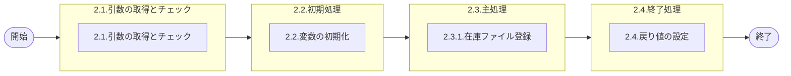

# 0. 表紙

| モジュール名 | プログラムID | プログラム名     |
| ------------ | ------------ | ---------------- |
| IC           | LDYS0004     | 在庫ファイル追加 |

| RFC | Version | 更新日     | 更新者 | 更新内容 | 確認日     | 確認者 | 承認日     | 承認者 |
| --- | :-----: | ---------- | :----: | -------- | ---------- | :----: | ---------- | :----: |
| -   |  1.0.0  | 2025/09/10 | 李鵬陽 | 初版作成 | 2025/XX/XX |  XXX  | 2025/XX/XX |  XXX  |

## 1. 処理概要

### 1.1. 機能概要

引数をもとに在庫ファイルに登録する処理

### 1.2. 処理概要フロー



### 1.3. プログラム入出力パラメータ

#### 1.3.1. 引数

| No. | パラメータ論理名 | パラメータ物理名   | 属性      | 備考 |
| --- | ---------------- | ------------------ | --------- | ---- |
| 1   | 品目番号         | ps_itemno          | VARCHAR   |      |
| 2   | 供給者           | ps_supplier        | VARCHAR   |      |
| 3   | 使用者           | ps_usercd          | VARCHAR   |      |
| 4   | 更新日時         | pd_update_datetime | TIMESTAMP |      |
| 5   | 更新者           | ps_update_author   | VARCHAR   |      |

#### 1.3.2. 戻り値

| No. | パラメータ論理名 | パラメータ物理名 | 属性    | 備考                                          |
| --- | ---------------- | ---------------- | ------- | --------------------------------------------- |
| 1   | 処理ステータス   | rn_status        | INTEGER | 0:NormalEnd,-1:SQLError/-2:PGError,1:警告発生 |
| 2   | SQLコード        | rs_sql_code      | VARCHAR |                                               |
| 3   | エラーコード     | rs_err_code      | VARCHAR |                                               |
| 4   | エラーメッセージ | rs_err_msg       | VARCHAR |                                               |
| 5   | エラー位置       | rs_err_focus     | VARCHAR |                                               |

### 1.4. その他制御・要件

| 排他制御 |      |      |
| -------- | ---- | ---- |
| 楽観     | 悲観 | 無し |
| ●       | -    | -    |

| 項目               | 制約・制御・要件など | 記載内容説明                                                     |
| ------------------ | -------------------- | ---------------------------------------------------------------- |
| パフォーマンス要件 | 特になし。           | 特別なパフォーマンス要件がある場合に要件内容とその対処法を記述。 |

### 1.5. 入出力一覧

| No | 入出力対象 | 名称         | 物理名称   | C  | R | U | D | 備考 |
| -- | ---------- | ------------ | ---------- | -- | - | - | - | ---- |
| 1  | テーブル   | 在庫ファイル | ld_trn_inv | ○ |   |   |   |      |

## 2. 詳細処理

### 2.1. 引数の取得とチェック

- 引数.品目番号が　ブランク　又は　 NULL 　の場合、エラーメッセージを出力し処理終了。

  - エラーコード : 'ld.E.LDP10011'
  - エラーメッセージ : 'Subtraction value error has occurred in the internal processing. Contact the staff in charge of the system.'
  - (処理内部にて引数値エラーが発生しました  システム管理者に連絡してください)
- 引数.供給者 が　ブランク　又は　 NULL 　の場合、エラーメッセージを出力し処理終了。

  - エラーコード : 'ld.E.LDP10011'
  - エラーメッセージ : 'Subtraction value error has occurred in the internal processing. Contact the staff in charge of the system.'
  - (処理内部にて引数値エラーが発生しました  システム管理者に連絡してください)
- 引数.使用者 が　ブランク　又は　 NULLの場合、エラーメッセージを出力し処理終了。

  - エラーコード : 'ld.E.LDP10011'
  - エラーメッセージ : 'Subtraction value error has occurred in the internal processing. Contact the staff in charge of the system.'
  - (処理内部にて引数値エラーが発生しました  システム管理者に連絡してください)
- 引数.更新日時 が NULL の場合、エラーメッセージを出力し処理終了。

  - エラーコード : 'ld.E.LDP10011'
  - エラーメッセージ : 'Subtraction value error has occurred in the internal processing. Contact the staff in charge of the system.'
  - (処理内部にて引数値エラーが発生しました  システム管理者に連絡してください)
- 引数.更新者 が　ブランク　又は　 NULL 　の場合、エラーメッセージを出力し処理終了。

  - エラーコード : 'ld.E.LDP10011'
  - エラーメッセージ : 'Subtraction value error has occurred in the internal processing. Contact the staff in charge of the system.'
  - (処理内部にて引数値エラーが発生しました  システム管理者に連絡してください)

### 2.2. 初期処理

| No. | 変数論理名 | 初期化設定値 |
| :-: | ---------- | ------------ |
|  1  | 変数.PGID  | 'LDYS0004'   |

### 2.3. 主処理

#### 2.3.1. 在庫ファイル登録

在庫ファイル登録

```sql
 INSERT INTO  在庫ファイル 
  (
    品目番号,
    供給者,
    使用者,
    次オーダ番号,
    接頭番号(オンライン),
    順序番号(オンライン),
    接頭番号(バッチ),
    順序番号(バッチ),
    手持在庫数,
    発注済オーダー数,
    発注済所要数(独立所要),
    発注済所要数(従属所要),
    繰越数,
    保留在庫数,
    最新入庫数,
    最新入庫オーダー番号,
    最新入庫日,
    最新出庫数,
    最新出庫オーダー番号,
    最新出庫日,
    前回実施棚卸数,
    前回棚卸実施日,
    実施棚卸サイン,
    入庫数(累計),
    入庫数-返品,
    入庫数-移動,
    在庫調整数,
    出庫数(累計),
    出庫数-SIR,
    出庫数-HAND,
    出庫数-非製造,
    出庫数-仕損(使用中),
    出庫数-仕損(製造中),
    出庫数-仕損(SIR),
    出庫数-サービス,
    出庫数-CKD,
    出庫数-独立需要,
    出庫数-返品,
    出庫数-移動,
    所要量出庫累計,
    使用中仕損累計,
    内示計画存在区分,
    MRP更新日,
    IC更新日時,
    更新カウンター,
    登録日時,
    登録者,
    登録PGID,
    更新日時,
    更新者,
    更新PGID
  )
  VALUES(
    引数.品目番号,                                               --品目番号
    引数.供給者,                                                 --供給者
    引数.使用者,                                                 --使用者
    '00001',                                                    --次オーダ番号
    'A',                                                        --接頭番号(オンライン)
    '0001',                                                     --順序番号(オンライン)
    'P',                                                        --接頭番号(バッチ)
    '0001',                                                     --順序番号(バッチ)
    0,                                                          --手持在庫数
    0,                                                          --発注済オーダー数
    0,                                                          --発注済所要数(独立所要)
    0,                                                          --発注済所要数(従属所要)
    0,                                                          --繰越数
    0,                                                          --保留在庫数
    0,                                                          --最新入庫数
    ' ',                                                         --最新入庫オーダー番号
    ' ',                                                         --最新入庫日
    0,                                                          --最新出庫数
    ' ',                                                         --最新出庫オーダー番号
    ' ',                                                         --最新出庫日
    0,                                                          --前回実施棚卸数
    ' ',                                                         --前回棚卸実施日
    0,                                                          --実施棚卸サイン
    0,                                                          --入庫数(累計)
    0,                                                          --入庫数-返品
    0,                                                          --入庫数-移動
    0,                                                          --在庫調整数
    0,                                                          --出庫数(累計)
    0,                                                          --出庫数-SIR
    0,                                                          --出庫数-HAND
    0,                                                          --出庫数-非製造
    0,                                                          --出庫数-仕損(使用中)
    0,                                                          --出庫数-仕損(製造中)
    0,                                                          --出庫数-仕損(SIR)
    0,                                                          --出庫数-サービス
    0,                                                          --出庫数-CKD
    0,                                                          --出庫数-独立需要
    0,                                                          --出庫数-返品
    0,                                                          --出庫数-移動
    0,                                                          --所要量出庫累計
    0,                                                          --使用中仕損累計
    '0',                                                        --内示計画存在区分
    ' ',                                                         --MRP更新日
    ' ',                                                         --IC更新日時
    0,                                                          --更新カウンター
    引数.更新日時,                                               --登録日時
    引数.更新者,                                                 --登録者
    変数.PGID                                                   --登録PGID
    引数.更新日時,                                               --更新日時
    引数.更新者,                                                 --更新者
    変数.PGID                                                    --更新PGID
  )
```

### 2.4. 終了処理

| 戻り値論理名     | 設定値   |
| ---------------- | -------- |
| 処理ステータス   | 0        |
| SQL コード       | スペース |
| エラーコード     | スペース |
| エラーメッセージ | スペース |
| エラー位置       | スペース |

## 3. 補足説明

### 3.1. 戻り値について

- ステータスについて
  - 0 : Normal End
  - -1 : Abnormal End
  - -2 : PGM Error

### 3.2. エラー発生時の対応について

- 戻り値.エラー位置 :'LDYS0004'
- SQLエラーが発生した場合、エラーログを出力して処理終了する
