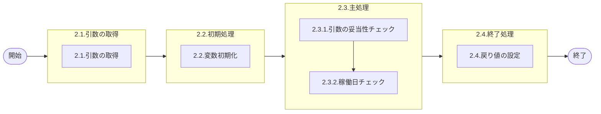

# 0. 表紙

| モジュール名 | プログラムID | プログラム名   |
| ------------ | ------------ | -------------- |
| IC           | LDYS0005     | 稼働日チェック |

| RFC | Version | 更新日     | 更新者 | 更新内容 | 確認日     | 確認者 | 承認日     | 承認者 |
| --- | :-----: | ---------- | :----: | -------- | ---------- | :----: | ---------- | :----: |
| -   |  1.0.0  | 2025/09/10 | 李鵬陽 | 初版作成 | 2025/XX/XX |  XXX  | 2025/XX/XX |  XXX  |

## 1. 処理概要

### 1.1. 機能概要

指定した日付を示す文字列が、稼働日かどうかを検索する。
カレンダが複数種類あるので、カレンダーIDの指定が必要。
①カレンダーテーブルを検索。取得した文字列の特定文字をチェックし、結果を返す。

### 1.2. 処理概要フロー



### 1.3. プログラム入出力パラメータ

#### 1.3.1. 引数

| No. | パラメータ論理名 | パラメータ物理名 | 属性    | 備考                     |
| --- | ---------------- | ---------------- | ------- | ------------------------ |
| 1   | カレンダーコード | ps_calder_cd     | VARCHAR | 使用するカレンダーコード |
| 2   | 指定日           | ps_std_ymd       | VARCHAR | 指定する日にち           |

#### 1.3.2. 戻り値

| No. | パラメータ論理名 | パラメータ物理名   | 属性    | 備考                                          |
| --- | ---------------- | ------------------ | ------- | --------------------------------------------- |
| 1   | 処理ステータス   | rn_status          | INTEGER | 0:NormalEnd,-1:SQLError/-2:PGError,1:警告発生 |
| 2   | SQLコード        | rs_sql_code        | VARCHAR |                                               |
| 3   | エラーコード     | rs_err_code        | VARCHAR |                                               |
| 4   | エラーメッセージ | rs_err_msg         | VARCHAR |                                               |
| 5   | エラー位置       | rs_err_focus       | VARCHAR |                                               |
| 6   | 稼働日かどうか   | rn_is_operationday | INTEGER | 0:稼働日/1:非稼働日/2:不正な日付              |

### 1.4. その他制御・要件

| 排他制御 |      |      |
| -------- | ---- | ---- |
| 楽観     | 悲観 | 無し |
| ●       | -    | -    |

| 項目               | 制約・制御・要件など | 記載内容説明                                                     |
| ------------------ | -------------------- | ---------------------------------------------------------------- |
| パフォーマンス要件 | 特になし。           | 特別なパフォーマンス要件がある場合に要件内容とその対処法を記述。 |

### 1.5. 入出力一覧

| No | 入出力対象 | 名称             | 物理名称        | C | R  | U | D | 備考                        |
| -- | ---------- | ---------------- | --------------- | - | -- | - | - | --------------------------- |
| 1  | テーブル   | カレンダーマスタ | le_mst_calendar |   | ○ |   |   | MRPのカレンダーマスタを使用 |

## 2. 詳細処理

### 2.1. 引数の取得

### 2.2. 初期処理

利用する変数を初期化する。

| No. | 変数論理名          | 初期化設定値              |
| :-: | ------------------- | ------------------------- |
|  1  | 変数.文字数         | LENGTH(TRIM(引数.指定日)) |
|  2  | 変数.カウンタ       | 1                         |
|  3  | 変数.チェック文字   | スペース                  |
|  4  | 変数.稼働日かどうか | スペース                  |
|  5  | 変数.カレンダー内容 | スペース                  |
|  6  | 変数.チェック文字2  | スペース                  |

### 2.3. 主処理

#### 2.3.1. 引数の妥当性チェック

-変数.カウンタ <= 変数.文字数 の場合、ループ継続
  それ以外の場合、ループ終了
  ※ループ START
  　変数.チェック文字 = SUBSTRING(TRIM(引数.指定日) FROM 変数.カウンタ  FOR 1)

- 変数.チェック文字 < '0' または  変数.チェック文字 > '9'の場合
  戻り値.稼働日かどうか = 2
  処理終了
- それ以外の場合
  変数.カウンタ = 変数.カウンタ + 1

※ループ END

-変数.文字数 <> 8
  戻り値.稼働日かどうか = 2
  処理終了

-引数.指定日[5,6] <'01' または 引数.指定日[5,6] >'12' の場合（誤った月）、
  戻り値.稼働日かどうか = 2
  処理終了

-引数.指定日[7,8] <'01' または 引数.指定日[7,8] >'31'  の場合（誤った日付）、
  戻り値.稼働日かどうか = 2
  処理終了

#### 2.3.2. 稼働日チェック

カレンダーマスターを検索する。

```sql
IF EXISTS ( SELECT 1
              FROM カレンダーマスター 
             WHERE カレンダーコード = 引数.カレンダーコード
               AND カレンダー年月 = 引数.指定日[1,6]
    ) THEN
    SELECT カレンダー内容
      INTO 変数.カレンダー内容
      FROM カレンダーマスター 
     WHERE カレンダーコード = 引数.カレンダーコード
       AND カレンダー年月 = 引数.指定日[1,6]
```

- データが存在しない場合、エラーメッセージを出力し処理終了。
  - エラーコード : 'ld.E.10011'
  - エラーメッセージ : 'Target date was not found in the calendar.'
  - (対象日付がカレンダーに見つかりませんでした。)

-データが存在 の場合
  変数.文字数 = LENGTH(引数.指定日)
  変数.カウンタ = 1
  変数.チェック文字  = スペース

- 変数.カウンタ <= 変数.文字数 の場合
  　ループ継続
  それ以外の場合
  　ループ終了
  ※ループ START
  　変数.チェック文字 = SUBSTRING(TRIM(変数.カレンダー内容) FROM 変数.カウンタ  FOR 1)

  - 変数.カウンタ = 引数.指定[7,8] の場合
    変数.チェック文字2 = 変数.チェック文字
    ループ終了
    変数.カウンタ = 変数.カウンタ + 1

  ※ループ END
- 変数.チェック文字2 = ' 'の場合
  変数.稼働日かどうか = 0
- 変数.チェック文字2 = '1'の場合
  変数.稼働日かどうか = 1
- それ以外の場合
  変数.稼働日かどうか = 2

### 2.4. 終了処理

取得した品目情報を戻り値に設定する。

| 戻り値論理名     | 設定値              |
| ---------------- | ------------------- |
| 処理ステータス   | 0                   |
| SQLコード        | スペース            |
| エラーコード     | スペース            |
| エラーメッセージ | スペース            |
| エラー位置       | スペース            |
| 稼働日かどうか   | 変数.稼働日かどうか |

## 3. 補足説明

### 3.1. 戻り値について

- ステータスについて
  - 0 : Normal End
  - -1 : Abnormal End
  - -2 : PGM Error

### 3.2. エラー発生時の対応について

- 戻り値.エラー位置 :'LDYS0005'
- SQLエラーが発生した場合、エラーログを出力して処理終了する
