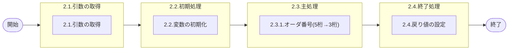

# 0. 表紙

| モジュール名 | プログラムID | プログラム名         |
| ------------ | ------------ | -------------------- |
| IC           | LDYS0006     | オーダ番号(5桁→3桁) |

| RFC | Version | 更新日     | 更新者 | 更新内容 | 確認日     | 確認者 | 承認日     | 承認者 |
| --- | :-----: | ---------- | :----: | -------- | ---------- | :----: | ---------- | :----: |
| -   |  1.0.0  | 2025/09/12 | 李鵬陽 | 初版作成 | 2025/XX/XX |  XXX  | 2025/XX/XX |  XXX  |

## 1. 処理概要

### 1.1. 機能概要

データベース内のオーダー番号５桁を、３桁オーダー番号に変換して返す
この３桁のオーダー番号は、オーダー明細あるいは所要量明細等の照会画面等に使用される。

### 1.2. 処理概要フロー

### 1.3. プログラム入出力パラメータ

#### 1.3.1. 引数

| No. | パラメータ論理名 | パラメータ物理名 | 属性    | 備考 |
| --- | ---------------- | ---------------- | ------- | ---- |
| 1   | ５桁オーダ番号   | ps_orderno       | VARCHAR |      |

#### 1.3.2. 戻り値

| No. | パラメータ論理名 | パラメータ物理名 | 属性    | 備考                      |
| --- | ---------------- | ---------------- | ------- | ------------------------- |
| 1   | 処理ステータス   | rn_status        | INTEGER | 0:正常終了,-1,-2:異常終了 |
| 2   | SQLコード        | rs_sql_code      | VARCHAR |                           |
| 3   | エラーコード     | rs_err_code      | VARCHAR |                           |
| 4   | エラーメッセージ | rs_err_msg       | VARCHAR |                           |
| 5   | エラー位置       | rs_err_focus     | VARCHAR |                           |
| 6   | ３桁オーダ番号   | rs_orderno       | VARCHAR |                           |

### 1.4. その他制御・要件

| 排他制御 |      |      |
| -------- | ---- | ---- |
| 楽観     | 悲観 | 無し |
| ●       | -    | -    |

| 項目               | 制約・制御・要件など | 記載内容説明                                                     |
| ------------------ | -------------------- | ---------------------------------------------------------------- |
| パフォーマンス要件 | 特になし。           | 特別なパフォーマンス要件がある場合に要件内容とその対処法を記述。 |

### 1.5. 入出力一覧

| No | 入出力対象 | 名称 | 物理名称 | C | R | U | D | 備考 |
| -- | ---------- | ---- | -------- | - | - | - | - | ---- |
| 1  | 無し       |      |          |   |   |   |   |      |

## 2. 詳細処理

### 2.1. 引数の取得

### 2.2. 初期処理

利用する変数を初期化する。

| No. | 変数論理名          | 初期化設定値 |
| :-: | ------------------- | ------------ |
|  1  | 変数.３桁オーダ番号 | スペース     |

### 2.3. 主処理

#### 2.3.1.オーダ番号(5桁→3桁)

- １桁目から5桁目まで"0"～"9"の時の場合
  変数.３桁オーダ番号 = 引数.５桁オーダ番号[3,5]
- １桁目から5桁目まで"0"～"9"の時　ではない時
  変数.３桁オーダ番号 = 引数.５桁オーダ番号[1,1] || 引数.５桁オーダ番号[4,5]

### 2.4. 終了処理

取得した３桁オーダ番号を戻り値に設定する。

| 戻り値論理名     | 設定値              |
| ---------------- | ------------------- |
| 処理ステータス   | 0                   |
| SQLコード        | スペース            |
| エラーコード     | スペース            |
| エラーメッセージ | スペース            |
| エラー位置       | スペース            |
| ３桁オーダ番号   | 変数.３桁オーダ番号 |

## 3. 補足説明

### 3.1. 戻り値について

- ステータスについて
  - 0 : Normal End
  - -1 : Abnormal End
  - -2 : PGM Error

### 3.2. エラー発生時の対応について

- 戻り値.エラー位置 :'LDYS0006'
- SQLエラーが発生した場合、エラーログを出力して処理終了する
