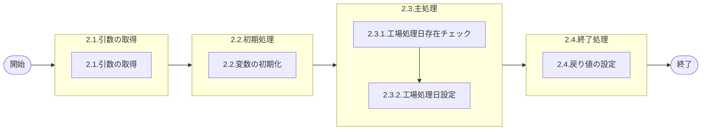

# 0. 表紙

| モジュール名 | プログラムID | プログラム名   |
| ------------ | ------------ | -------------- |
| IC           | LDYS0011     | 工場処理日設定 |

| RFC | Version | 更新日     | 更新者 | 更新内容 | 確認日     | 確認者 | 承認日     | 承認者 |
| --- | :-----: | ---------- | :----: | -------- | ---------- | :----: | ---------- | :----: |
| -   |  1.0.0  | 2025/09/17 | 李鵬陽 | 初版作成 | 2025/XX/XX |  XXX  | 2025/XX/XX |  XXX  |

## 1. 処理概要

### 1.1. 機能概要

工場処理日テーブルの値を変更するサブルーチン
補足
工場処理日テーブルを2直操業と統合させるため、GIMACでは処理IDを引数に追加

### 1.2. 処理概要フロー



### 1.3. プログラム入出力パラメータ

#### 1.3.1. 引数

| No. | パラメータ論理名 | パラメータ物理名 | 属性    | 備考      |
| --- | ---------------- | ---------------- | ------- | --------- |
| 1   | 処理モード       | ps_mode          | VARCHAR |           |
| 2   | 処理ID           | ps_process_id    | VARCHAR | GIMAC追加 |

#### 1.3.2. 戻り値

| No. | パラメータ論理名 | パラメータ物理名 | 属性    | 備考                                              |
| --- | ---------------- | ---------------- | ------- | ------------------------------------------------- |
| 1   | ステータス       | rn_status        | INTEGER | 0:Normal,100:Notfound,-1:SqlError,-2:ProgramError |
| 2   | SQLコード        | rs_sql_code      | VARCHAR |                                                   |
| 3   | エラーコード     | rs_err_code      | VARCHAR |                                                   |
| 4   | エラーメッセージ | rs_err_msg       | VARCHAR |                                                   |
| 5   | エラー位置       | rs_err_focus     | VARCHAR |                                                   |

### 1.4. その他制御・要件

| 排他制御 |      |      |
| -------- | ---- | ---- |
| 楽観     | 悲観 | 無し |
| ●       | -    | -    |

| 項目               | 制約・制御・要件など | 記載内容説明                                                     |
| ------------------ | -------------------- | ---------------------------------------------------------------- |
| パフォーマンス要件 | 特になし。           | 特別なパフォーマンス要件がある場合に要件内容とその対処法を記述。 |

### 1.5. 入出力一覧

| No | 入出力対象 | 名称         | 物理名称         | C | R  | U  | D | 備考 |
| -- | ---------- | ------------ | ---------------- | - | -- | -- | - | ---- |
| 1  | テーブル   | IC工場処理日 | ld_mst_slip_date |   | ○ | ○ |   |      |

## 2. 詳細処理

### 2.1. 引数の取得

### 2.2. 初期処理

利用する変数を初期化する。

| No. | 変数論理名            | 初期化設定値 |
| :-: | --------------------- | ------------ |
|  1  | 変数.基点システム日時 | スペース     |
|  2  | 変数.IC工場処理日     | スペース     |
|  3  | 変数.システム日付     | システム日付 |
|  4  | 変数.new工場処理日    | スペース     |

### 2.3. 主処理

#### 2.3.1. 工場処理日存在チェック

IC工場処理日を検索する

```sql
IF EXISTS (SELECT 1
             FROM ld_mst_slip_date                                 --IC工場処理日
            WHERE operation_type = ps_process_id
  )  THEN
   SELECT ic_slip_date,                               --IC工場処理日
          base_datetime                               --基点システム日時
     INTO ls_ic_slip_date,                            --変数.IC工場処理日
          ld_base_datetime                            --変数.基点システム日時
     FROM ld_mst_slip_date                            --IC工場処理日
    WHERE operation_type = ps_process_id
```

- データが存在しない場合、エラーメッセージを出力し処理終了。
  - エラーコード：'ld.E.LDP10004';
  - エラーメッセージ：'The IC pymac date is not exist.'
    - (IC工場処理日が存在しません。)

#### 2.3.2. 工場処理日設定

- 処理モード = 'A' or 'a'の時  ※基点システム日時を、システム日付にて変更する

  ```sql
  UPDATE ld_mst_slip_date                                            --IC工場処理日 
    SET  base_datetime  = TO_CHAR(ld_system_date,"%Y%m%d"),         --基点システム日時、変数.システム日付
         update_author = 'LDYS0011',                                 --更新者
         update_counter = update_counter + 1,                        --更新カウンター
         update_datetime = ld_system_date,                           --更新日時、変数.システム日付
         update_pgmid = 'LDYS0011'                                   --更新pgmid
   WHERE operation_type = ps_process_id                              
  ```
- 処理モード ='B' or 'b'の時   ※IC工場処理日を１日加算する。
  変数.new工場処理日 = TO_DATE(変数.基点システム日時,"%Y%m%d")
  変数.new工場処理日 = 変数.new工場処理日 + interval(1) day to day

  - 変数.new工場処理日 >= 変数.IC工場処理日の時
    IC工場処理日を更新する

    ```sql
    UPDATE ld_mst_slip_date                                             --IC工場処理日 
      SET  ic_slip_date    = TO_CHAR(ls_new_ic_slip_date),              --IC工場処理日、変数.new工場処理日
           update_author   = 'LDYS0011',                                --更新者
           update_counter  = update_counter + 1,                        --更新カウンター
           update_datetime = ld_system_date,                            --更新日時、変数.システム日付
           update_pgmid    = 'LDYS0011'                                 --更新pgmid
     WHERE operation_type  = ps_process_id                              
    ```
  - それ以外の時、エラーメッセージを出力し処理終了。

    - エラーコード：'ld.E.LDP10135';
    - エラーメッセージ："Specify the date latter than the system date." || "Not Update :: (New gimac_date [" || trim(変数.new工場処理日) || "]) < (Current gimac_date [" || trim(変数.IC工場処理日)   || "])"
    - (工場処理日以降の日付を指定してください)
     
- 処理モード ='C' or 'c'の時

  - 変数.基点システム日時[7,8] > 15 の時     ※工場処理日を翌月１日に変更する。

    - 変数.基点システム日時 = 変数.基点システム日時[1,6] || "01";
      変数.new工場処理日 = TO_DATE(変数.基点システム日時,"%Y%m%d")
      変数.new工場処理日 = 変数.new工場処理日 + interval(1)  month to month
  - それ以外の時 （変数.基点システム日時が15日よりも以前の場合） ※変数.new工場処理日 を当月の1日に設定する

    - 変数.new工場処理日 = TO_DATE(変数.基点システム日時,"%Y%m%d")
      変数.new工場処理日 = TO_DATE(変数.new工場処理日,"%Y%m%01")
  - 変数.new工場処理日 > 変数.IC工場処理日 の時
    IC工場処理日を更新する

    ```sql
    UPDATE ld_mst_slip_date                                             --IC工場処理日 
      SET  ic_slip_date    = TO_CHAR(ls_new_ic_slip_date),              --IC工場処理日、変数.new工場処理日
           update_author   = 'LDYS0011',                                --更新者
           update_counter  = update_counter + 1,                        --更新カウンター
           update_datetime = ld_system_date,                            --更新日時、変数.システム日付
           update_pgmid    = 'LDYS0011'                                 --更新pgmid
     WHERE operation_type  = ps_process_id                              
    ```
  - それ以外の時、エラーメッセージを出力し処理終了。

    - エラーコード：'ld.E.LDP10135';
    - エラーメッセージ："Specify the date latter than the system date." || "Not Update :: (New gimac_date [" || trim(変数.new工場処理日) || "]) < (Current gimac_date [" || trim(変数.IC工場処理日)   || "])"
    - (工場処理日以降の日付を指定してください)
- 処理モード ='D' or 'd'の時   ※工場処理日をシステム日付に変更する。
  変数.new工場処理日 = TO_DATE(変数.システム日付,"%Y%m%d")

  - 変数.new工場処理日 >= 変数.IC工場処理日 の時
    IC工場処理日を更新する
    ```sql
    UPDATE ld_mst_slip_date                                            --IC工場処理日 
      SET  ic_slip_date    = TO_CHAR(ls_new_ic_slip_date),             --IC工場処理日、変数.new工場処理日
           update_author   = 'LDYS0011',                               --更新者
           update_counter  = update_counter + 1,                       --更新カウンター
           update_datetime = ld_system_date,                           --更新日時、変数.システム日付
           update_pgmid    = 'LDYS0011'                                --更新pgmid
     WHERE operation_type  = ps_process_id                             
    ```
  - それ以外の時、エラーメッセージを出力し処理終了。
    - エラーコード：'ld.E.LDP10135';
    - エラーメッセージ："Specify the date latter than the system date." || "Not Update :: (New gimac_date [" || trim(変数.new工場処理日) || "]) < (Current gimac_date [" || trim(変数.IC工場処理日)   || "])"
    - (工場処理日以降の日付を指定してください)
    
  - length(引数.処理モード) = 8の時 (処理モードの桁数が8の時)  ※処理モードのパラメータ日付で更新をする
  変数.new工場処理日 = TO_DATE(引数.処理モード,"%Y%m%d")

  ```sql
    UPDATE ld_mst_slip_date                                            --IC工場処理日 
      SET  ic_slip_date    = TO_CHAR(ls_new_ic_slip_date),             --IC工場処理日、変数.new工場処理日
           base_datetime   = TO_CHAR(ls_new_ic_slip_date),             --基点システム日時、変数.new工場処理日
           update_author   = 'LDYS0011',                               --更新者
           update_counter  = update_counter + 1,                       --更新カウンター
           update_datetime = ld_system_date,                           --更新日時、変数.システム日付
           update_pgmid    = 'LDYS0011'                                --更新pgmid
     WHERE operation_type  = ps_process_id                             
  ```
- それ以外の時、エラーメッセージを出力し処理終了。

  - エラーコード：'ld.E.LDP10011';
  - エラーメッセージ："Subtraction value error has occurred in the internal processing. Contact the staff in charge of the system." || "Argument Error.  : Arg1 = [" || trim(引数.処理モード) || "]"

### 2.4. 終了処理

戻り値に設定する。

| 戻り値論理名     | 設定値   |
| ---------------- | -------- |
| 処理ステータス   | 0        |
| SQL コード       | スペース |
| エラーコード     | スペース |
| エラーメッセージ | スペース |
| エラー位置       | スペース |

## 3. 補足説明

### 3.1. 戻り値について

- ステータスについて
  - 0 : Normal End
  - -1 : Abnormal End
  - -2 : PGM Error

### 3.2. エラー発生時の対応について

- 戻り値.エラー位置 :'LDYS0011'
- SQLエラーが発生した場合、エラーログを出力して処理終了する
