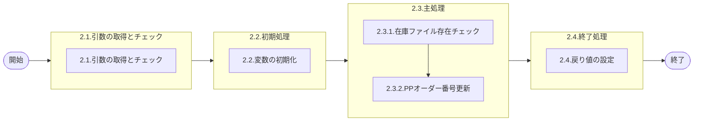

# 0. 表紙

| モジュール名 | プログラムID | プログラム名       |
| ------------ | ------------ | ------------------ |
| IC           | LDYS0013     | PPオーダー番号更新 |

| RFC | Version | 更新日     | 更新者 | 更新内容 | 確認日     | 確認者 | 承認日     | 承認者 |
| --- | :-----: | ---------- | :----: | -------- | ---------- | :----: | ---------- | :----: |
| -   |  1.0.0  | 2025/09/18 | 李鵬陽 | 初版作成 | 2025/XX/XX |  XXX  | 2025/XX/XX |  XXX  |

## 1. 処理概要

### 1.1. 機能概要

在庫ファイルのPP品目に対してオーダ番号を更新する処理

### 1.2. 処理概要フロー



### 1.3. プログラム入出力パラメータ

#### 1.3.1. 引数

| No. | パラメータ論理名     | パラメータ物理名   | 属性    | 備考 |
| --- | -------------------- | ------------------ | ------- | ---- |
| 1   | 品目番号             | ps_itemno          | VARCHAR |      |
| 2   | 供給者               | ps_supplier        | VARCHAR |      |
| 3   | 使用者               | ps_usercd          | VARCHAR |      |
| 4   | 接頭番号(オンライン) | ps_next_ohorder_ic | VARCHAR |      |
| 5   | 順序番号(オンライン) | ps_next_odorder_ic | VARCHAR |      |

#### 1.3.2. 戻り値

| No. | パラメータ論理名 | パラメータ物理名 | 属性    | 備考                      |
| --- | ---------------- | ---------------- | ------- | ------------------------- |
| 1   | 処理ステータス   | rn_status        | INTEGER | 0:正常終了,-1,-2:異常終了 |
| 2   | SQLコード        | rs_sql_code      | VARCHAR |                           |
| 3   | エラーコード     | rs_err_code      | VARCHAR |                           |
| 4   | エラーメッセージ | rs_err_msg       | VARCHAR |                           |
| 5   | エラー位置       | rs_err_focus     | VARCHAR |                           |

### 1.4. その他制御・要件

| 排他制御 |      |      |
| -------- | ---- | ---- |
| 楽観     | 悲観 | 無し |
| ●       | -    | -    |

| 項目               | 制約・制御・要件など | 記載内容説明                                                     |
| ------------------ | -------------------- | ---------------------------------------------------------------- |
| パフォーマンス要件 | 特になし。           | 特別なパフォーマンス要件がある場合に要件内容とその対処法を記述。 |

### 1.5. 入出力一覧

| No | 入出力対象 | 名称         | 物理名称   | C | R | U  | D | 備考 |
| -- | ---------- | ------------ | ---------- | - | - | -- | - | ---- |
| 1  | テーブル   | 在庫ファイル | ld_trn_inv |   |   | ○ |   |      |

## 2. 詳細処理

### 2.1. 引数の取得とチェック

- 引数.品目番号 が　ブランク　又は　 NULL 　の場合、エラーメッセージを出力し処理終了。

  - エラーコード : 'ld.E.LDP10055'
  - エラーメッセージ : 'Enter Item Number.'
  - (品目番号を指定してください)
- 引数.供給者 が　ブランク　又は　 NULL 　の場合、エラーメッセージを出力し処理終了。

  - エラーコード : 'ld.E.LDP10056'
  - エラーメッセージ : 'Specify the Supplier.'
  - (供給者を指定してください。)
- 引数.使用者 が　ブランク　又は　 NULL 　の場合、エラーメッセージを出力し処理終了。

  - エラーコード : 'ld.E.LDP10057'
  - エラーメッセージ : 'Specify the User.'
  - (使用者を指定してください。)
- 引数.接頭番号(オンライン)  が　ブランク　又は　 NULL 　の場合、エラーメッセージを出力し処理終了。

  - エラーコード : 'ld.E.LDP10142'
  - エラーメッセージ : 'ps_next_ohorder_ic is empty or NULL.'
  - (引数.接頭番号(オンライン) が空白またはNULLです)
- 引数.順序番号(オンライン) が　ブランク　又は　 NULL 　の場合、エラーメッセージを出力し処理終了。

  - エラーコード : 'ld.E.LDP10143'
  - エラーメッセージ : 'ps_next_odorder_ic is empty or NULL.'
  - (引数.順序番号(オンライン)が空白またはNULLです)

### 2.2. 初期処理

利用する変数を初期化する。

| No. | 変数論理名 | 初期化設定値 |
| :-: | ---------- | ------------ |
|  1  | 変数.システム日付     | システム日付 |

### 2.3. 主処理

#### 2.3.1. 在庫ファイル存在チェック

在庫ファイルを検索する

```sql
IF EXISTS ( SELECT 1
              FROM ld_trn_inv                    --在庫ファイル 
             WHERE itemno   = ps_itemno
               AND supplier = ps_supplier
               AND usercd   = ps_usercd) THEN
```

- データが存在しない場合  処理終了

  - エラーコード : 'ld.E.10012'
  - エラーメッセージ : 'The item is not exist in inventory.'
  - (指定品目が在庫ファイルに存在しません。)

#### 2.3.2. 在庫ファイルに更新する

```sql
UPDATE ld_trn_inv                                                                 --在庫ファイル 
   SET next_ohorder_ic      = ps_next_ohorder_ic                                  --接頭番号（オンライン)
      ,next_odorder_ic      = ps_next_odorder_ic                                  --順序番号（オンライン）
      ,latest_in_orderno    = CONCAT(ps_next_ohorder_ic, ps_next_odorder_ic)      --最新入庫オーダー番号
      ,update_author        = 'SYSTEM',                                           --更新者
      ,update_counter       = update_counter + 1,                                 --更新カウンター
      ,update_datetime      = ld_system_date,                                     --更新日時、変数.システム日付
      ,update_pgmid         = 'LDYS0013'                                          --更新pgmid
 WHERE itemno   = ps_itemno
   AND supplier = ps_supplier
   AND usercd   = ps_usercd
```

### 2.4. 終了処理

| 戻り値論理名     | 設定値   |
| ---------------- | -------- |
| 処理ステータス   | 0        |
| SQL コード       | スペース |
| エラーコード     | スペース |
| エラーメッセージ | スペース |
| エラー位置       | スペース |

## 3. 補足説明

### 3.1. 戻り値について

- ステータスについて
  - 0 : Normal End
  - -1 : Abnormal End
  - -2 : PGM Error

### 3.2. エラー発生時の対応について

- 戻り値.エラー位置 :'LDYS0013'
- SQLエラーが発生した場合、エラーログを出力して処理終了する
