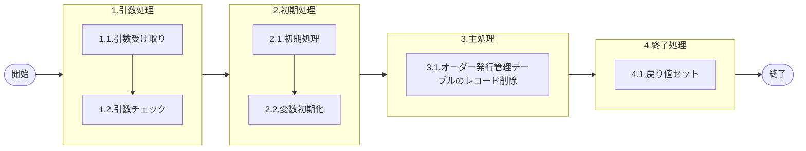

# 0. 表紙

| モジュール名 | プログラムID | プログラム名 |
| --- | --- | --- |
| IC | LDAS0412 | オーダー発行番号管理削除 |


| RFC        | Version | 更新日      | 更新者 | 更新内容 | 確認日 | 確認者 | 承認日     | 承認者 |
| ---------- | :-----: | ----------- | :----: | -------- | ------ | :----: | ---------- | :----: |
| - |  1.0.0  | 2025/09/22 |  オヘダイチロー  | 初版作成   | 2025/XX/XX  |  XXX  | 2025/XX/XX |  XXX  |

## 1. 処理概要

### 1.1. 機能概要

本機能は、以下の手順を通じて、条件に合致するオーダー発行番号管理テーブル（ic_orderno_tbl）のレコードを削除します。

1. 初めに、オーダー発行番号管理テーブル（ic_orderno_tbl）から条件に合致するオーダー発行番号を取得し、戻り値にセットする。該当がなければ戻り値はスペースのままとなる。

2. 続いて、同一の条件に基づき、オーダー発行番号管理テーブル（ic_orderno_tbl）の該当レコードを削除します。


### 1.2. 処理概要フロー

### 1.3. プログラム入出力パラメータ

#### 1.3.1. 引数

| No. | パラメータ論理名 | パラメータ物理名 | 属性 | 備考 |
| --- | --- | --- | --- | --- |
| 1 | オーダー種別 | ps_order_type | VARCHAR | 必須 |
| 2 | 品目番号 | ps_itemno | VARCHAR | 必須 |
| 3 | 供給者 | ps_supplier | VARCHAR | 必須 |
| 4 | 使用者 | ps_usercd | VARCHAR | 必須 |
| 5 | 着手/払出日 | ps_st_db_date | VARCHAR | 必須 |
| 6 | 通算オーダー番号 | ps_total_orderno | VARCHAR | 必須 |

#### 1.3.2. 戻り値

| No. | パラメータ論理名 | パラメータ物理名 | 属性 | 備考 |
| --- | --- | --- | --- | --- |
| 1 | 処理ステータス | rn_sp_status | INTEGER | 0:NormalEnd-1:SQLError |
| 2 | SQLコード | rs_sql_error | VARCHAR |  |
| 3 | エラーコード | rs_isam_error | VARCHAR |  |
| 4 | エラーメッセージ | rs_pg_status | VARCHAR |  |
| 5 | エラー位置 | rs_err_focus | VARCHAR |  |
| 6 | オーダー発行番号 | rs_issued_orderno | VARCHAR |  |

### 1.4. その他制御・要件

| 排他制御 |  |  |
| --- | --- | --- |
| 楽観 | 悲観 | 無し |
| ● | - | - |

| 項目 | 制約・制御・要件など | 記載内容説明 |
| --- | --- | --- |
| パフォーマンス要件 | 特になし。 | 特別なパフォーマンス要件がある場合に要件内容とその対処法を記述。 |

### 1.5. 入出力一覧

| No | 入出力対象 | 名称 | 物理名称 | C | R | U | D | 備考 |
| --- | --- | --- | --- | --- | --- | --- | --- | --- |
| 1 | テーブル | オーダー発行番号管理テーブル | ic_orderno_tbl |  | ○ |  | ○ | ※テーブル不明 |


## 2. 詳細処理

### 2.1. 引数の取得とチェック
特記無し

### 2.2. 初期処理
特記無し

### 2.3. 主処理
- 2.3.1  オーダー発行番号の取得

オーダー発行番号管理テーブル(ic_orderno_tbl)より、オーダー発行番号を取得する
- 1.オーダー発行番号管理テーブルに対して、指定された条件に一致するレコードの件数を探します。
- 2.件数が 1件以上あれば、同じ条件の中でオーダー発行番号を取得する。
- 3.件数が0件であれば、そのまま次の処理に行きます。


```sql
if exists(	select	オーダー発行番号
		from	オーダー発行番号管理テーブル
		where	オーダー種別 = オーダー種別
		and	品目番号 = 引数.品目番号
		and	供給者 = 引数.供給者
		and	使用者 = 引数.使用者
		and	着手/払出日 = 引数.着手/払出日
		and	通算オーダー番号 = 引数.通算オーダー番号 ) then

	select	オーダー発行番号
	into	変数.オーダー発行番号
	from	オーダー発行番号管理テーブル
	where	オーダー種別 = 引数.オーダー種別
	and	品目番号 = 引数.品目番号
	and	供給者 = 引数.供給者
	and	使用者 = 引数.使用者
	and	着手/払出日 = 引数.着手/払出日
	and	通算オーダー番号 = 引数.通算オーダー番号
```
- 2.3.2 オーダー発行番号管理テーブル(ic_orderno_tbl)のレコード削除
```sql
　　delete
	from	オーダー発行番号管理テーブル
	where	オーダー種別 = 引数.オーダー種別
	and	品目番号 = 引数.品目番号
	and	供給者 = 引数.供給者
	and	使用者 = 引数.使用者
	and	着手/払出日 = 引数.着手/払出日
	and	通算オーダー番号 = 引数.通算オーダー番号

    end if
```
- 2.3.1と2.3.2の処理は、1つの IF 文内でまとめて実行されています。

### 2.4. 終了処理
- 正常終了処理を行う

| No.| 戻り値           | 属性 | 設定値   |
| ---| ---------------- | ------ |-------- |
| 1 | 処理ステータス   | INTEGER | 0 |
| 2 | SQL コード       | VARCHAR | スペース |
| 3 | エラーコード     |  VARCHAR | スペース |
| 4 | エラーメッセージ |  VARCHAR | スペース |  
| 5 | エラー位置      |  VARCHAR | スペース |
| 6 | オーダー発行番号 |  VARCHAR | 変数.オーダー発行番号 or スペース |

- オーダー発行番号について
  - 削除処理を行った場合、削除対象のオーダー発行番号を戻り値として返すものとする。
  - 削除処理を行わなかった場合、戻り値のオーダー発行番号にはスペースを返すものとする。

## 3. 補足説明

### 3.1. 戻り値について
- ステータスについて
  - 0 : Normal End
  -1 : Abnormal End
  -2 : PGM エラー

### 3.2. エラー発生時の対応について
- SQL エラーが発生した場合、エラーログを出力して処理終了